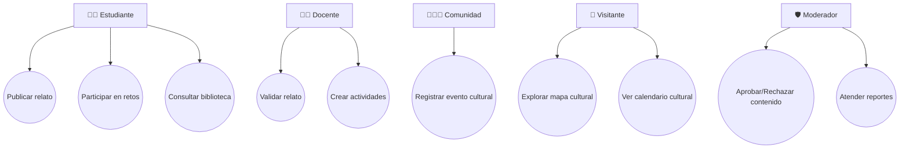

# TÉRMINOS DE REFERENCIA (TDR)

**Proyecto:** Memoria Viva Nicaragua – Aplicación Educativa PWA

---

## 1. Antecedentes

Nicaragua posee un rico patrimonio cultural e histórico que se transmite oralmente y a través de prácticas comunitarias. Sin embargo, gran parte de este conocimiento se encuentra en riesgo de perderse. La digitalización de saberes, relatos y tradiciones permite involucrar a estudiantes, familias y comunidades en la preservación cultural.

Este proyecto surge para desarrollar una **aplicación educativa**, de carácter colaborativo, que permita **registrar, compartir y aprender sobre la identidad cultural de Nicaragua**, integrando elementos gamificados para motivar la participación.

---

## 2. Objetivo General

Desarrollar una **aplicación educativa tipo PWA** que permita a los usuarios registrar, compartir y consultar saberes populares, relatos comunitarios, eventos culturales y participar en retos educativos, preservando el patrimonio cultural e histórico de Nicaragua.

---

## 3. Objetivos Específicos

1. Permitir la publicación colaborativa de relatos y contenidos multimedia.
    
2. Implementar un **mapa interactivo** con geolocalización de relatos y eventos.
    
3. Crear un **calendario cultural** con ferias, festividades y actividades comunitarias.
    
4. Desarrollar una **biblioteca colaborativa** de saberes populares, recetas y costumbres.
    
5. Implementar **retos educativos y juegos didácticos**, incluyendo logros y ranking de usuarios.
    
6. Gestionar la **moderación de contenidos** para asegurar la calidad y veracidad.
    
7. Enviar **notificaciones** para logros, nuevos contenidos y eventos.
    

---

## 4. Alcance del proyecto y limitantes 

### 4.1 Alcances

- Aplicación **multiplataforma (PWA)** accesible desde móviles (android y iOS) Y Web
    
- Base de datos **SQL para datos relacionales** y **Storage externo para multimedia**.
    
- Sistema de **usuarios con roles y permisos**: Estudiantes, Docentes, Comunidad, Moderadores y Visitantes.
    
- Integración de **ranking y logros** gamificados.
    
- Interacción con **mapa y calendario cultural**.
    
- Generación de **reportes de participación y estadísticas**.
    

### 4.2 Limitantes

- Desarrollo de versiones nativas iOS/Android.

- Inteligencia artificial para recomendación de contenidos (solo gamificación básica).

- Solo soporte para español (es-NI) en primera versión.

- No hay **streaming en vivo**.

## 5. Requerimientos

### 5.1 Funcionales

1. Publicación colaborativa de relatos (texto, imagen, audio, video).
    
2. Moderación de relatos (docentes, líderes, moderadores).
    
3. Mapa interactivo de memorias geo-localizadas.
    
4. Calendario cultural (eventos, ferias, festividades).
    
5. Biblioteca colaborativa (saberes, recetas, costumbres).
    
6. Retos/juegos didácticos con retroalimentación y ranking.
    
7. Perfiles de usuario (estudiante, docente, comunidad, visitante).
    
8. Notificaciones push (eventos, retos nuevos, comentarios).
    
9. Comentarios y reacciones en relatos.
    
10. Reportes de moderación.
    

### 5.2 No Funcionales

- PWA accesible offline con sincronización.
    
- Autenticación con JWT + 2FA opcional.
    
- Escalabilidad modular.
    
- Tiempo de respuesta < 1s para operaciones simples.
    
- Seguridad de datos y consentimiento para menores.
    
- Cumplimiento WCAG 2.1 AA.

### 5.3 Usuarios y Roles

|Rol|Funciones principales|
|---|---|
|Estudiante|Publicar relatos, participar en juegos, consultar biblioteca, interactuar con logros y ranking.|
|Docente|Validar relatos, crear actividades educativas, supervisar contenido.|
|Comunidad|Registrar eventos culturales, compartir saberes.|
|Moderador|Aprobar/rechazar contenidos, atender reportes, mantener calidad de la información.|
|Visitante|Explorar contenidos, mapas y calendario, interactuar con juegos básicos.|

## 6. Valores Agregados

- **Gamificación:** insignias, rankings, retos.
    
- **Geoaprendizaje:** mapa vivo con tradiciones ligadas a territorio.
    
- **Inclusión:** soporte multiformato (texto, audio, video, imágenes).
    
- **Educación:** integración de docentes en validación y actividades.
    
- **Identidad cultural:** repositorio nacional vivo accesible a futuras generaciones.
    
- **Participación comunitaria:** cada comunidad es protagonista.

## 7. Arquitectura del Sistema

### 7.1 Stack de tecnologías

####  7.1.1 Frontend (PWA)

- **Tecnologías:**
    
    - React.js + Vite (rapidez en hackathon).
        
    - Tailwind CSS (UI rápida y moderna).
        
    - Workbox (soporte offline, caché de PWA).

#### 7.1.2 Backend (API REST)

    
- **Opción 2:** Django REST Framework (más robusto, pero más tiempo de setup).

#### 7.1.3. Base de Datos

- **Base de datos relacional:** PostgreSQL (cloud) o SQLite 
- **Multimedia:** no guardar en BD, solo **URL de almacenamiento externo**.

####  7.2.4. Servicios de Terceros

- **Mapas:**
    
    - [Leaflet.js](https://leafletjs.com/) + OpenStreetMap (gratis).
        
    - Opción: Google Maps API (pero tiene costo).
        
- **Autenticación:**
    
    - Firebase Auth 
        
    - JWT manual en backend.
        
- **Almacenamiento Multimedia:**
    
    - Firebase Storage 
        
    - Supabase Storage 
        
- **Hosting y despliegue:**
    
    - **Frontend (PWA):** Netlify / Vercel.
        
    - **Backend:** Render / Railway / Heroku
        
    - **BD:** Supabase (Postgres en la nube) o Railway (Postgres).
        
- **Notificaciones Push:**
    
    - Firebase Cloud Messaging.

### 7.2 Contexto

[[vista_general_del_sistema_HK]]

![[vista_general_del_sistema_HK]]

### 7.3 Casos de uso

### 7.3 Estructura interna

[[ESTRUCTURA_INTERNA_HK]]

![[ESTRUCTURA_INTERNA_HK]]

### 7.4 Explicación de los módulos

#### **7.4.1 Frontend (PWA / App móvil)**

- Interfaz para usuarios finales (estudiantes, docentes, comunidad).
    
- Funciones:
    
    - Login / registro con roles.
        
    - Subida y consulta de relatos.
        
    - Biblioteca colaborativa.
        
    - Calendario cultural.
        
    - Juegos y retos.
        
    - Mapa interactivo de relatos.
        
    - Recibir notificaciones push.
        

#### 7.4.2. **Backend (API REST)**

- **Autenticación & Roles:** gestión de usuarios y permisos.
    
- **Relatos Multimedia:** CRUD, subida de archivos, geolocalización.
    
- **Biblioteca:** almacenamiento de recetas, saberes populares, documentos culturales.
    
- **Calendario:** CRUD de eventos, ferias, festividades.
    
- **Juegos/Retos:** quizzes, trivias, seguimiento de progreso.
    
- **Moderación:** revisión y aprobación de contenidos antes de publicar.
    
- **Notificaciones:** envío de alertas y recordatorios a usuarios.
    

#### 7.4.3 **Base de Datos**

- PostgreSQL / PostGIS para geolocalización.
    
- Tablas principales: Usuarios, Relatos, Biblioteca, Eventos, Juegos, Moderación.
    

#### 7.4.4 **Almacenamiento Multimedia**

- Firebase Storagepara imágenes, videos y audios.

#### 7.4.5 **Servicios de terceros**

- Leaflet / OpenStreetMap → mapas interactivos.
    
- Firebase Cloud Messaging → notificaciones push.
    

---

#### 7.4.6 Flujo de ejemplo: Publicación de relato

1. Usuario envía relato desde el **Frontend**.
    
2. **Backend - Relatos** valida y guarda metadatos en **DB**.
    
3. Archivos multimedia se suben a **FS** y se guarda la URL en la **DB**.
    
4. El relato pasa a **Moderación**.
    
5. Una vez aprobado, el relato aparece en **Mapa**, **Biblioteca** y feeds del **Frontend**.
    
6. Se envían notificaciones push a los usuarios interesados.
    