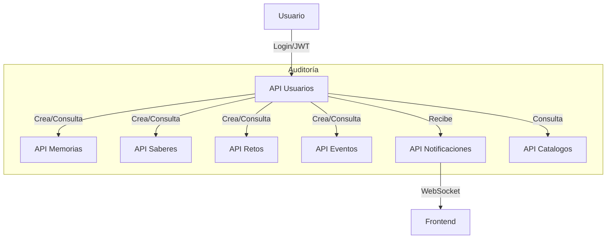

# Memoria Viva Backend


## 🚀 Descripción
Memoria Viva es una API modular en Django 5.x + Django REST Framework, diseñada para gestionar usuarios, memorias, saberes, retos, eventos, notificaciones y catálogos. Incluye autenticación JWT, auditoría de acciones, documentación Swagger y está lista para producción.

## 🏗️ Arquitectura
- **Django Modular Apps:**
  - `Usuarios`: Gestión de usuarios, roles y permisos.
  - `Memorias`: CRUD de memorias históricas.
  - `Saberes`: Registro y consulta de saberes.
  - `Retos`: Creación y seguimiento de retos.
  - `Eventos`: Gestión de eventos y actividades.
  - `Notificaciones`: Sistema de notificaciones (WebSockets listo).
  - `Catalogos`: Catálogos de roles, localizaciones y categorías.
- **Auditoría:** Logging de todas las acciones importantes.
- **Autenticación:** JWT con permisos granulares.
- **Swagger:** Documentación interactiva y detallada.
- **Optimización:** Uso de `select_related` y `prefetch_related` en vistas.
- **Notificaciones en tiempo real:** Integración con Django Channels (pendiente).

## 📦 Estructura de Carpetas
```
Memoria_Viva/
├── Usuarios/
├── Memorias/
├── Saberes/
├── Retos/
├── Eventos/
├── Notificaciones/
├── Catalogos/
├── Memoria_Viva/
│   ├── settings.py
│   ├── urls.py
│   ├── logging_config.py
│   └── ...
├── db.sqlite3
├── manage.py
└── memoria_viva_auditoria.log
```

## 📝 Diagrama de Flujo de Procesos



## 📚 Documentación Swagger
- Accede a `/swagger/` para la documentación interactiva.
- Todos los endpoints principales incluyen ejemplos, tags y descripciones.

## 🔒 Seguridad y Permisos
- Autenticación JWT (`djangorestframework-simplejwt`).
- Permisos por rol: Admin, Moderador, Usuario.
- Auditoría de acciones y errores en `memoria_viva_auditoria.log`.

## ⚡ Instalación Rápida
```bash
# Clona el repositorio
$ git clone https://github.com/hack4memoria/memoria-viva-backend.git
$ cd memoria-viva-backend

# Instala dependencias
$ pip install -r requirements.txt

# Migraciones
$ python manage.py migrate

# Corre el servidor
$ python manage.py runserver
```

## 🛠️ Tecnologías
- Django 5.x
- Django REST Framework
- drf-yasg (Swagger)
- djangorestframework-simplejwt (JWT)
- Django Channels (WebSockets)
- Python 3.13

## 💡 Contribuciones
¡Las contribuciones son bienvenidas! Revisa el código, abre issues y envía tus PRs.

## 📞 Contacto
- [hack4memoria@gmail.com](mailto:hack4memoria@gmail.com)
- [GitHub: hack4memoria](https://github.com/hack4memoria)

---

> Memoria Viva: preservando historias, saberes y retos para el futuro.
