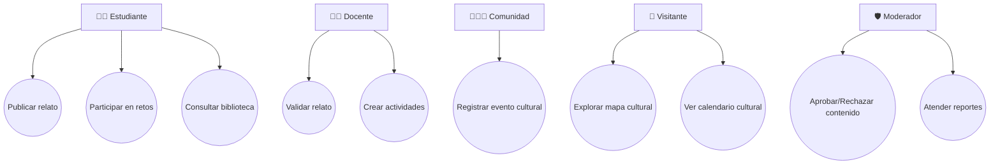

# TÉRMINOS DE REFERENCIA (TDR)

**Proyecto:** Memoria Viva Nicaragua – Aplicación Educativa PWA

---

## 1. Antecedentes

Nicaragua posee un rico patrimonio cultural e histórico que se transmite oralmente y a través de prácticas comunitarias. Sin embargo, gran parte de este conocimiento se encuentra en riesgo de perderse. La digitalización de saberes, relatos y tradiciones permite involucrar a estudiantes, familias y comunidades en la preservación cultural.

Este proyecto surge para desarrollar una **aplicación educativa**, de carácter colaborativo, que permita **registrar, compartir y aprender sobre la identidad cultural de Nicaragua**, integrando elementos gamificados para motivar la participación.

---

## 2. Objetivo General

Desarrollar una **aplicación educativa tipo PWA** que permita a los usuarios registrar, compartir y consultar saberes populares, relatos comunitarios, eventos culturales y participar en retos educativos, preservando el patrimonio cultural e histórico de Nicaragua.

---

## 3. Objetivos Específicos

1. Permitir la publicación colaborativa de relatos y contenidos multimedia.
    
2. Implementar un **mapa interactivo** con geolocalización de relatos y eventos.
    
3. Crear un **calendario cultural** con ferias, festividades y actividades comunitarias.
    
4. Desarrollar una **biblioteca colaborativa** de saberes populares, recetas y costumbres.
    
5. Implementar **retos educativos y juegos didácticos**, incluyendo logros y ranking de usuarios.
    
6. Gestionar la **moderación de contenidos** para asegurar la calidad y veracidad.
    
7. Enviar **notificaciones** para logros, nuevos contenidos y eventos.
    

---

## 4. Alcance del proyecto y limitantes 

### 4.1 Alcances

- Aplicación **multiplataforma (PWA)** accesible desde móviles (android y iOS) Y Web
    
- Base de datos **SQL para datos relacionales** y **Storage externo para multimedia**.
    
- Sistema de **usuarios con roles y permisos**: Estudiantes, Docentes, Comunidad, Moderadores y Visitantes.
    
- Integración de **ranking y logros** gamificados.
    
- Interacción con **mapa y calendario cultural**.
    
- Generación de **reportes de participación y estadísticas**.
    

### 4.2 Limitantes

- Desarrollo de versiones nativas iOS/Android.

- Inteligencia artificial para recomendación de contenidos (solo gamificación básica).

- Solo soporte para español (es-NI) en primera versión.

- No hay **streaming en vivo**.

## 5. Requerimientos

### 5.1 Funcionales

1. Publicación colaborativa de relatos (texto, imagen, audio, video).
    
2. Moderación de relatos (docentes, líderes, moderadores).
    
3. Mapa interactivo de memorias geo-localizadas.
    
4. Calendario cultural (eventos, ferias, festividades).
    
5. Biblioteca colaborativa (saberes, recetas, costumbres).
    
6. Retos/juegos didácticos con retroalimentación y ranking.
    
7. Perfiles de usuario (estudiante, docente, comunidad, visitante).
    
8. Notificaciones push (eventos, retos nuevos, comentarios).
    
9. Comentarios y reacciones en relatos.
    
10. Reportes de moderación.
    

### 5.2 No Funcionales

- PWA accesible offline con sincronización.
    
- Autenticación con JWT + 2FA opcional.
    
- Escalabilidad modular.
    
- Tiempo de respuesta < 1s para operaciones simples.
    
- Seguridad de datos y consentimiento para menores.
    
- Cumplimiento WCAG 2.1 AA.

### 5.3 Usuarios y Roles

|Rol|Funciones principales|
|---|---|
|Estudiante|Publicar relatos, participar en juegos, consultar biblioteca, interactuar con logros y ranking.|
|Docente|Validar relatos, crear actividades educativas, supervisar contenido.|
|Comunidad|Registrar eventos culturales, compartir saberes.|
|Moderador|Aprobar/rechazar contenidos, atender reportes, mantener calidad de la información.|
|Visitante|Explorar contenidos, mapas y calendario, interactuar con juegos básicos.|

## 6. Valores Agregados

- **Gamificación:** insignias, rankings, retos.
    
- **Geoaprendizaje:** mapa vivo con tradiciones ligadas a territorio.
    
- **Inclusión:** soporte multiformato (texto, audio, video, imágenes).
    
- **Educación:** integración de docentes en validación y actividades.
    
- **Identidad cultural:** repositorio nacional vivo accesible a futuras generaciones.
    
- **Participación comunitaria:** cada comunidad es protagonista.

## 7. Arquitectura del Sistema

### 7.1 Stack de tecnologías

####  7.1.1 Frontend (PWA)

- **Tecnologías:**
    
    - React.js + Vite (rapidez en hackathon).
        
    - Tailwind CSS (UI rápida y moderna).
        
    - Workbox (soporte offline, caché de PWA).

#### 7.1.2 Backend (API REST)

- **Opción 1 (recomendada en hackathon):** **Node.js (Express)** → rápido de montar.
    
- **Opción 2:** Django REST Framework (más robusto, pero más tiempo de setup).

#### 7.1.3. Base de Datos

- **Base de datos relacional:** PostgreSQL (cloud) o SQLite 
- **Multimedia:** no guardar en BD, solo **URL de almacenamiento externo**.

####  7.2.4. Servicios de Terceros

- **Mapas:**
    
    - [Leaflet.js](https://leafletjs.com/) + OpenStreetMap (gratis).
        
    - Opción: Google Maps API (pero tiene costo).
        
- **Autenticación:**
    
    - Firebase Auth 
        
    - JWT manual en backend.
        
- **Almacenamiento Multimedia:**
    
    - Firebase Storage 
        
    - Supabase Storage 
        
- **Hosting y despliegue:**
    
    - **Frontend (PWA):** Netlify / Vercel.
        
    - **Backend:** Render / Railway / Heroku
        
    - **BD:** Supabase (Postgres en la nube) o Railway (Postgres).
        
- **Notificaciones Push:**
    
    - Firebase Cloud Messaging.

### 7.2 Contexto

[[vista_general_del_sistema_HK]]

<svg version="1.1" xmlns="http://www.w3.org/2000/svg" viewBox="0 0 8235.802054860145 4263.7608562449395" width="8235.802054860145" height="4263.7608562449395" class="excalidraw-svg"><!-- svg-source:excalidraw --><metadata></metadata><defs></defs><rect x="0" y="0" width="8235.802054860145" height="4263.7608562449395" fill="#1e1e1e"></rect><g stroke-linecap="round" transform="translate(3401.032223742909 25.586842096855577) rotate(0 377.59644248995585 414.81600222709017)"><path d="M32 0 C268.45 -1.44, 503.37 -2.73, 723.19 0 C742.05 -0.97, 757.29 13.37, 755.19 32 C751.37 187.46, 750.37 343.38, 755.19 797.63 C758.13 821.35, 745 833.21, 723.19 829.63 C503.87 833.17, 282.92 834.11, 32 829.63 C7.2 833.12, -2.6 816.72, 0 797.63 C3.8 605.48, 5.2 410.46, 0 32 C-0.26 9.73, 12.98 -2.25, 32 0" stroke="none" stroke-width="0" fill="#ffd8a8"></path><path d="M32 0 C280.65 2.79, 528.37 2.6, 723.19 0 M32 0 C180.84 -2.46, 329.58 -1.88, 723.19 0 M723.19 0 C743.4 1.61, 753.19 9.96, 755.19 32 M723.19 0 C744.46 -0.38, 756.64 8.59, 755.19 32 M755.19 32 C755.69 319.57, 756.08 608.84, 755.19 797.63 M755.19 32 C753.95 307.83, 753.9 584.22, 755.19 797.63 M755.19 797.63 C754.92 818.83, 744.73 830.37, 723.19 829.63 M755.19 797.63 C753.32 817.69, 744.79 828.92, 723.19 829.63 M723.19 829.63 C474.6 828.73, 226.08 829.23, 32 829.63 M723.19 829.63 C583.41 832.15, 443.26 832.36, 32 829.63 M32 829.63 C11.87 827.93, -0.78 819, 0 797.63 M32 829.63 C12.44 829.92, 0.44 821.04, 0 797.63 M0 797.63 C-1.15 496.91, -0.65 195.47, 0 32 M0 797.63 C-0.31 631.7, -0.85 465.92, 0 32 M0 32 C0.33 8.96, 10.41 -0.32, 32 0 M0 32 C0.83 10.02, 11.29 0.48, 32 0" stroke="#2f9e44" stroke-width="2" fill="none"></path></g><g stroke-linecap="round" transform="translate(1226.6064341238882 9.999999999999972) rotate(0 377.59644248995585 414.81600222709017)"><path d="M32 0 C203.7 0.6, 375.43 1.86, 723.19 0 C741.27 1.71, 752.21 7.7, 755.19 32 C751.92 291.4, 752.03 548.43, 755.19 797.63 C752.89 820.73, 744.99 827.01, 723.19 829.63 C491.42 826.91, 257.59 825.19, 32 829.63 C11.79 830.04, -1.32 819.3, 0 797.63 C0.03 534.7, -0.21 271.98, 0 32 C-0.75 13.51, 11.5 -2.44, 32 0" stroke="none" stroke-width="0" fill="#ffd8a8"></path><path d="M32 0 C231.83 -0.81, 433.25 -0.03, 723.19 0 M32 0 C173.77 -0.07, 316.02 -0.28, 723.19 0 M723.19 0 C744.53 0.97, 755.4 10.17, 755.19 32 M723.19 0 C744.77 -1.45, 754.06 9.09, 755.19 32 M755.19 32 C758.14 277.97, 757.55 522.63, 755.19 797.63 M755.19 32 C755.53 251.59, 755.37 471.83, 755.19 797.63 M755.19 797.63 C753.44 817.1, 744.59 828.8, 723.19 829.63 M755.19 797.63 C756.38 819.43, 746.05 828.61, 723.19 829.63 M723.19 829.63 C500.63 828.9, 277 828.57, 32 829.63 M723.19 829.63 C486.01 829.06, 249.24 829.09, 32 829.63 M32 829.63 C11.83 828.12, 0.61 817.21, 0 797.63 M32 829.63 C8.77 829.72, 2.23 818.2, 0 797.63 M0 797.63 C-1.98 614.89, -1.4 431.28, 0 32 M0 797.63 C-3.04 623.04, -2.54 447.35, 0 32 M0 32 C-0.84 10.55, 11.09 -0.86, 32 0 M0 32 C1.17 10.23, 10.69 1.83, 32 0" stroke="#2f9e44" stroke-width="2" fill="none"></path></g><g transform="translate(1401.755628485741 76.10225898693038) rotate(0 205.55487060546875 36.12947446656578)"><text x="0" y="50.928107208071125" font-family="Excalifont, Xiaolai, Segoe UI Emoji" font-size="57.80715914650525px" fill="#2f9e44" text-anchor="start" style="white-space: pre;" direction="ltr" dominant-baseline="alphabetic">ESTUDIANTE</text></g><g stroke-linecap="round"><g transform="translate(1600.644058326592 449.54144166437527) rotate(0 0 -68.11889464019296)" fill-rule="evenodd"><path d="M-1.99 -0.58 C10.51 -0.03, 63.21 14.51, 75.86 0.88 C88.51 -12.75, 77.7 -62.85, 73.91 -82.36 C70.11 -101.88, 64.51 -106.83, 53.07 -116.2 C41.62 -125.58, 22.89 -139.27, 5.24 -138.6 C-12.4 -137.94, -40.02 -122.01, -52.79 -112.19 C-65.57 -102.38, -67.48 -98.16, -71.4 -79.69 C-75.33 -61.23, -88.26 -14.7, -76.33 -1.4 C-64.41 11.9, -12.82 -0.23, 0.15 0.12" stroke="none" stroke-width="0" fill="#12b886" fill-rule="evenodd"></path><path d="M-0.74 -0.23 C11.95 -0.34, 63.69 13.45, 76.52 -0.45 C89.34 -14.36, 80.07 -64.35, 76.23 -83.67 C72.39 -102.98, 65.54 -107.67, 53.47 -116.32 C41.39 -124.98, 21.63 -135.78, 3.78 -135.58 C-14.08 -135.38, -40.89 -124.63, -53.66 -115.13 C-66.43 -105.63, -69.21 -97.57, -72.84 -78.57 C-76.47 -59.58, -87.74 -14.17, -75.45 -1.16 C-63.17 11.86, -11.89 -0.53, 0.88 -0.48 M1.08 -1.4 C13.67 -1.36, 63.72 14.44, 76.19 0.85 C88.67 -12.74, 79.68 -63.03, 75.94 -82.94 C72.2 -102.86, 66.03 -109.97, 53.76 -118.62 C41.49 -127.27, 19.97 -135.81, 2.32 -134.85 C-15.33 -133.88, -39.77 -122, -52.15 -112.82 C-64.52 -103.64, -67.86 -98.86, -71.93 -79.79 C-76 -60.73, -88.48 -12, -76.55 1.56 C-64.61 15.11, -12.9 2.1, -0.33 1.55" stroke="#000000" stroke-width="2" fill="none"></path></g></g><mask></mask><g stroke-linecap="round" transform="translate(1498.9921786999344 370.57963526112246) rotate(0 101.20072659026357 67.46715106017572)"><path d="M-0.31 0.75 L202.19 1.28 L203.24 136.78 L0.55 136.49" stroke="none" stroke-width="0" fill="#ced4da"></path><path d="M0 0 C47.62 -0.45, 94.9 -1.66, 202.4 0 M0 0 C69.2 -1.43, 138.47 -0.81, 202.4 0 M202.4 0 C200.31 40.97, 199.7 78.75, 202.4 134.93 M202.4 0 C201.52 27.51, 200.73 54.36, 202.4 134.93 M202.4 134.93 C142.45 136.83, 87.68 137.46, 0 134.93 M202.4 134.93 C149 133.94, 96.04 134.15, 0 134.93 M0 134.93 C0.81 101.15, 0.72 62.98, 0 0 M0 134.93 C0.65 94.43, 1.37 55.02, 0 0" stroke="#000000" stroke-width="2" fill="none"></path></g><g stroke-linecap="round" transform="translate(1588.9567874275533 426.81066845865337) rotate(0 11.23611786264479 11.23611786264479)"><path d="M12.34 0.36 C14.62 0.38, 17.67 1.4, 19.35 2.99 C21.02 4.59, 22.2 7.47, 22.38 9.94 C22.56 12.41, 21.71 15.85, 20.43 17.82 C19.16 19.79, 17.02 21.08, 14.72 21.76 C12.41 22.45, 8.87 22.9, 6.58 21.93 C4.3 20.96, 2.06 18.16, 0.99 15.96 C-0.07 13.76, -0.36 11.11, 0.17 8.73 C0.71 6.36, 2.07 3.13, 4.21 1.68 C6.35 0.24, 11.44 0.19, 13.01 0.07 C14.58 -0.05, 13.65 0.79, 13.61 0.95 M9.83 0.27 C12.23 -0.15, 15.64 0.53, 17.68 1.72 C19.72 2.91, 21.43 5.22, 22.09 7.4 C22.75 9.59, 22.52 12.64, 21.66 14.83 C20.79 17.02, 18.95 19.31, 16.91 20.56 C14.87 21.81, 11.9 22.65, 9.42 22.33 C6.94 22, 3.71 20.52, 2.03 18.59 C0.35 16.66, -0.85 13.26, -0.67 10.73 C-0.49 8.19, 1.43 5.11, 3.13 3.4 C4.83 1.69, 8.48 0.98, 9.55 0.46 C10.61 -0.06, 9.39 0.08, 9.51 0.28" stroke="none" stroke-width="0" fill="#ffffff"></path><path d="M11.73 0.09 C13.94 0.02, 16.6 1.42, 18.38 2.98 C20.17 4.54, 22.11 7.04, 22.44 9.45 C22.77 11.85, 21.67 15.26, 20.37 17.41 C19.08 19.56, 16.93 21.61, 14.67 22.35 C12.41 23.1, 9.13 22.91, 6.83 21.89 C4.54 20.87, 2.03 18.37, 0.9 16.26 C-0.22 14.14, -0.48 11.52, 0.09 9.18 C0.67 6.83, 2.43 3.74, 4.37 2.2 C6.3 0.66, 10.43 0.22, 11.71 -0.05 C12.98 -0.33, 12.09 0.32, 12 0.55 M13.59 -0.11 C15.76 0.35, 18.79 2.58, 20.34 4.62 C21.89 6.67, 23.11 9.7, 22.9 12.17 C22.69 14.64, 20.88 17.64, 19.06 19.44 C17.24 21.25, 14.21 22.72, 11.95 23 C9.7 23.29, 7.53 22.59, 5.51 21.15 C3.49 19.71, 0.63 16.73, -0.17 14.35 C-0.98 11.98, -0.42 9.16, 0.67 6.89 C1.76 4.61, 4.06 1.81, 6.37 0.7 C8.69 -0.42, 13.33 0.19, 14.55 0.21 C15.78 0.23, 13.9 0.54, 13.73 0.82" stroke="#000000" stroke-width="2" fill="none"></path></g><g stroke-linecap="round"><g transform="translate(1498.3076471689888 494.2166588640499) rotate(0 101.32754857612326 7.822519351916242)" fill-rule="evenodd"><path d="M0.53 0.88 C-1.66 1.89, -15.8 3.16, -15.16 5.48 C-14.52 7.79, -31.41 13.07, 4.35 14.79 C40.11 16.5, 163.85 16.59, 199.37 15.76 C234.89 14.92, 216.73 12.96, 217.47 9.78 C218.2 6.59, 240.21 -1.49, 203.79 -3.36 C167.38 -5.22, 32.93 -1.98, -1.01 -1.4" stroke="none" stroke-width="0" fill="#ced4da" fill-rule="evenodd"></path><path d="M0.09 0.49 C-2.34 1.68, -14.5 3.78, -13.71 5.96 C-12.92 8.14, -30.49 11.52, 4.85 13.58 C40.2 15.65, 163.14 19.58, 198.38 18.36 C233.61 17.14, 215.54 9.83, 216.27 6.28 C216.99 2.72, 238.59 -1.77, 202.74 -2.96 C166.89 -4.14, 34.88 -1.14, 1.16 -0.84 M-1.31 -0.29 C-3.99 0.64, -15.56 1.7, -14.64 4.18 C-13.72 6.66, -31.4 12.02, 4.19 14.59 C39.78 17.16, 163.8 21.01, 198.89 19.59 C233.98 18.17, 214.38 10.03, 214.73 6.06 C215.07 2.09, 236.95 -3.41, 200.95 -4.25 C164.96 -5.08, 32.31 0.07, -1.24 1.03" stroke="#000000" stroke-width="2" fill="none"></path></g></g><mask></mask><g stroke-linecap="round" transform="translate(1533.9324123538051 189.54309561953917) rotate(0 67.46715106017575 67.46715106017572)"><path d="M98.74 7.46 C107.28 11.05, 115.74 19.88, 121.62 27.97 C127.5 36.06, 132.2 46.4, 134.03 55.99 C135.86 65.58, 135.28 76.23, 132.59 85.52 C129.91 94.81, 124.49 104.33, 117.95 111.73 C111.41 119.13, 102.38 125.96, 93.35 129.93 C84.33 133.89, 73.41 136.09, 63.81 135.5 C54.21 134.92, 44.13 131.29, 35.74 126.43 C27.36 121.57, 19.31 114.07, 13.5 106.34 C7.69 98.6, 2.82 89.49, 0.89 80.03 C-1.04 70.56, -0.77 59.06, 1.92 49.55 C4.61 40.05, 10.55 30.23, 17.02 22.99 C23.49 15.75, 31.75 10.08, 40.74 6.09 C49.73 2.11, 60.19 -1.95, 70.94 -0.9 C81.68 0.15, 98.79 9.31, 105.21 12.37 C111.62 15.43, 110.04 16.76, 109.41 17.46 M57.81 -0.23 C66.6 -2.53, 78.91 0.66, 88.38 3.89 C97.84 7.12, 107.71 12.43, 114.59 19.12 C121.48 25.82, 126.39 34.96, 129.72 44.05 C133.05 53.14, 135.2 63.87, 134.57 73.68 C133.95 83.49, 131.05 94.74, 125.97 102.92 C120.9 111.09, 112.61 117.26, 104.11 122.73 C95.62 128.2, 84.87 134.35, 74.98 135.73 C65.1 137.11, 53.68 134.13, 44.79 131.03 C35.9 127.92, 28.51 123.99, 21.65 117.09 C14.79 110.19, 6.99 99.07, 3.65 89.64 C0.31 80.22, 0.61 69.86, 1.63 60.53 C2.65 51.21, 5.18 42.21, 9.79 33.72 C14.4 25.23, 21.28 15.24, 29.31 9.59 C37.35 3.95, 53.2 1.35, 58.01 -0.15 C62.82 -1.66, 58.03 -0.59, 58.17 0.56" stroke="none" stroke-width="0" fill="#ffffff"></path><path d="M73.29 0.13 C82.54 -0.06, 92.44 4.94, 100.74 10.07 C109.05 15.2, 117.67 22.87, 123.14 30.92 C128.61 38.96, 132.29 48.98, 133.56 58.34 C134.84 67.7, 133.65 77.82, 130.77 87.1 C127.89 96.38, 122.76 106.87, 116.28 114 C109.81 121.14, 100.99 126.47, 91.93 129.9 C82.87 133.33, 71.65 135.19, 61.91 134.58 C52.17 133.96, 42.06 131.07, 33.48 126.21 C24.9 121.35, 15.74 113.5, 10.43 105.42 C5.12 97.34, 2.9 87.54, 1.63 77.73 C0.36 67.93, 0.11 56.03, 2.81 46.61 C5.52 37.19, 11.07 28.14, 17.84 21.21 C24.61 14.28, 32.74 8.4, 43.41 5.05 C54.09 1.7, 74.13 1.21, 81.9 1.11 C89.67 1, 90.21 3.16, 90.06 4.44 M91.79 5.09 C101.02 7.43, 110.39 13.74, 117.31 20.82 C124.23 27.91, 130.55 38, 133.31 47.59 C136.08 57.17, 135.65 68.48, 133.92 78.33 C132.18 88.17, 128.3 98.45, 122.91 106.63 C117.53 114.81, 109.99 122.52, 101.62 127.4 C93.24 132.29, 82.61 135.3, 72.68 135.93 C62.74 136.57, 50.96 134.82, 41.99 131.19 C33.02 127.56, 25.42 121.49, 18.84 114.14 C12.25 106.78, 5.54 96.6, 2.48 87.04 C-0.58 77.48, -1.25 66.23, 0.47 56.79 C2.19 47.34, 7.36 38.39, 12.8 30.36 C18.25 22.33, 24.61 13.73, 33.13 8.62 C41.65 3.51, 54.18 0.44, 63.93 -0.28 C73.69 -1, 86.93 3.44, 91.68 4.28 C96.43 5.13, 92.98 3.55, 92.44 4.79" stroke="#000000" stroke-width="2" fill="none"></path></g><g stroke-linecap="round"><g transform="translate(1569.547472850196 282.57713180624467) rotate(0 27.813561051503882 5.354486204261065)"><path d="M0.2 -0.59 C4.7 1.12, 17.79 10.5, 27.01 10.95 C36.22 11.39, 50.58 3.44, 55.5 2.07 M-1.15 1.71 C3.23 2.99, 17.02 8.77, 26.32 8.95 C35.63 9.13, 49.52 3.67, 54.66 2.78" stroke="#000000" stroke-width="2" fill="none"></path></g></g><mask></mask><g stroke-linecap="round"><g transform="translate(1598.8136718212654 184.16002200557793) rotate(0 -11.735259239974027 -5.440261396923653)"><path d="M0.23 0.11 C-3.71 -1.75, -19.65 -9.54, -23.53 -11.41 M-0.31 -0.31 C-4.34 -2.1, -20.18 -9.27, -23.99 -10.98" stroke="#000000" stroke-width="2" fill="none"></path></g></g><mask></mask><g stroke-linecap="round"><g transform="translate(1603.500878088172 182.65206728379653) rotate(0 20.712940918390984 -2.009937857049273)"><path d="M-0.06 -0.53 C2.8 -1.23, 10.37 -3.43, 17.37 -4.08 C24.37 -4.72, 37.92 -4.32, 41.96 -4.41 M-0.75 0.39 C2.05 -0.25, 10.04 -2.76, 17.15 -3.49 C24.25 -4.22, 37.77 -3.86, 41.88 -4" stroke="#000000" stroke-width="2" fill="none"></path></g></g><mask></mask><g stroke-linecap="round"><g transform="translate(1595.0776501925388 186.74205399185732) rotate(0 -22.101134309402994 0.008653957192990447)"><path d="M0.4 -0.22 C-3.82 -0.49, -17.97 -2.41, -25.38 -2.17 C-32.78 -1.92, -40.8 0.62, -44.01 1.26 M-0.05 -0.81 C-4.29 -0.98, -18.17 -2.06, -25.53 -1.67 C-32.9 -1.27, -41.06 0.95, -44.26 1.58" stroke="#000000" stroke-width="2" fill="none"></path></g></g><mask></mask><g stroke-linecap="round"><g transform="translate(1556.2326353332792 241.0502339284102) rotate(0 19.501772790371035 -2.5541564418583818)"><path d="M1.16 -0.84 C2.29 -2.46, 4.66 -8.13, 7.64 -10.18 C10.63 -12.24, 14.88 -13.19, 19.08 -13.15 C23.28 -13.11, 29.62 -12.19, 32.82 -9.95 C36.03 -7.7, 40.18 -2.68, 38.31 0.32 C36.43 3.32, 26.46 7.27, 21.58 8.06 C16.7 8.85, 12.55 6.24, 9.04 5.09 C5.53 3.94, 1.87 2.07, 0.52 1.15 M0.31 1.33 C1.24 -0.14, 3.39 -7.05, 6.91 -9.27 C10.44 -11.49, 17.08 -12.09, 21.46 -11.98 C25.84 -11.88, 30.09 -10.74, 33.21 -8.61 C36.32 -6.49, 41.85 -1.87, 40.13 0.76 C38.42 3.39, 27.93 6.17, 22.92 7.18 C17.91 8.18, 13.92 7.75, 10.06 6.79 C6.21 5.83, 1.49 2.27, -0.23 1.41" stroke="#000000" stroke-width="1" fill="none"></path></g></g><mask></mask><g stroke-linecap="round" transform="translate(1571.2137595356949 231.7212728149489) rotate(0 5.800819227598652 6.739600684766785)"><path d="M4.81 -0.15 C5.98 -0.54, 7.51 -0.04, 8.59 0.75 C9.68 1.53, 10.95 3.17, 11.32 4.56 C11.69 5.95, 11.16 7.7, 10.82 9.08 C10.49 10.47, 10.33 12.19, 9.32 12.87 C8.31 13.56, 6.13 13.47, 4.78 13.2 C3.42 12.93, 1.97 12.24, 1.18 11.25 C0.39 10.25, -0.01 8.71, 0.03 7.23 C0.06 5.75, 0.56 3.6, 1.39 2.36 C2.23 1.12, 4.38 0.07, 5.03 -0.23 C5.67 -0.52, 5.22 0.47, 5.25 0.57 M5.85 -0.47 C7.18 -0.61, 9.21 0.38, 10.13 1.42 C11.06 2.46, 11.28 4.26, 11.39 5.78 C11.49 7.29, 11.31 9.2, 10.78 10.52 C10.24 11.85, 9.27 13.21, 8.16 13.74 C7.04 14.27, 5.36 14.19, 4.08 13.68 C2.81 13.17, 1.09 11.94, 0.51 10.68 C-0.08 9.42, 0.36 7.64, 0.57 6.12 C0.79 4.61, 0.97 2.64, 1.8 1.58 C2.64 0.53, 4.84 -0.04, 5.58 -0.19 C6.31 -0.34, 6.25 0.56, 6.21 0.68" stroke="#000000" stroke-width="1" fill="none"></path></g><g transform="translate(1578.1363212404328 236.36194184873537) rotate(293.147309700539 -0.05912552071833943 0.024905888433991663)" stroke="none"><path fill="#000000" d="M 0.80,2.09 Q 0.80,2.09 0.44,2.17 0.09,2.26 -0.26,2.22 -0.62,2.19 -0.95,2.05 -1.28,1.90 -1.55,1.66 -1.82,1.41 -1.99,1.10 -2.17,0.78 -2.24,0.42 -2.30,0.07 -2.25,-0.28 -2.20,-0.64 -2.03,-0.96 -1.87,-1.29 -1.61,-1.54 -1.35,-1.79 -1.03,-1.95 -0.70,-2.11 -0.34,-2.16 0.00,-2.20 0.36,-2.13 0.72,-2.06 1.03,-1.88 1.34,-1.70 1.58,-1.43 1.82,-1.16 1.96,-0.82 2.10,-0.49 2.13,-0.13 2.16,0.22 2.07,0.57 1.98,0.92 1.78,1.23 1.58,1.53 1.30,1.76 1.01,1.98 0.67,2.10 0.33,2.23 -0.02,2.23 -0.38,2.24 -0.73,2.13 -1.07,2.02 -1.37,1.81 -1.66,1.59 -1.87,1.30 -2.08,1.00 -2.18,0.66 -2.28,0.31 -2.27,-0.04 -2.26,-0.41 -2.13,-0.74 -2.00,-1.08 -1.77,-1.36 -1.54,-1.64 -1.24,-1.84 -0.93,-2.03 -0.93,-2.03 -0.93,-2.03 -0.67,-2.11 -0.42,-2.19 -0.15,-2.21 0.11,-2.23 0.38,-2.19 0.64,-2.14 0.89,-2.03 1.14,-1.92 1.35,-1.76 1.56,-1.59 1.73,-1.38 1.90,-1.17 2.01,-0.93 2.13,-0.68 2.18,-0.41 2.23,-0.15 2.22,0.11 2.20,0.38 2.12,0.64 2.05,0.90 1.91,1.13 1.77,1.36 1.58,1.55 1.39,1.75 1.16,1.89 0.93,2.03 0.86,2.06 L 0.80,2.09 Z"></path></g><g stroke-linecap="round"><g transform="translate(1608.1980618838718 240.11475159511895) rotate(0 19.501772790371035 -2.5541564418583818)"><path d="M0.26 0.43 C1.51 -1.01, 3.26 -6.75, 6.53 -8.92 C9.8 -11.08, 15.44 -12.13, 19.91 -12.57 C24.37 -13, 30.02 -13.86, 33.29 -11.54 C36.57 -9.21, 41.3 -1.75, 39.53 1.39 C37.76 4.53, 27.97 6.63, 22.68 7.33 C17.39 8.02, 11.58 6.77, 7.81 5.56 C4.04 4.35, 1.25 0.93, 0.07 0.06 M-1.06 -0.39 C0.67 -1.59, 5.52 -5.55, 8.88 -7.33 C12.23 -9.12, 14.89 -10.47, 19.06 -11.09 C23.24 -11.71, 30.72 -12.68, 33.93 -11.04 C37.14 -9.41, 40.5 -4.13, 38.33 -1.28 C36.17 1.57, 25.95 4.6, 20.93 6.06 C15.91 7.53, 11.83 8.57, 8.19 7.51 C4.55 6.46, 0.55 1.15, -0.91 -0.25" stroke="#000000" stroke-width="1" fill="none"></path></g></g><mask></mask><g stroke-linecap="round" transform="translate(1623.5580735275496 229.43855320129725) rotate(0 5.800819227598652 6.739600684766785)"><path d="M5.14 0.22 C6.38 0.11, 8.84 1.02, 9.87 1.84 C10.9 2.66, 11.17 3.81, 11.3 5.16 C11.43 6.51, 11.18 8.6, 10.63 9.96 C10.07 11.31, 9.06 12.8, 7.98 13.3 C6.89 13.8, 5.26 13.5, 4.12 12.94 C2.99 12.38, 1.77 11.09, 1.16 9.95 C0.55 8.81, 0.27 7.56, 0.46 6.12 C0.65 4.67, 1.43 2.35, 2.31 1.3 C3.2 0.25, 5.16 0, 5.79 -0.18 C6.42 -0.36, 6.16 0, 6.11 0.21 M5.5 0.48 C6.75 0.41, 8.64 1.21, 9.67 2.11 C10.7 3.01, 11.52 4.53, 11.68 5.91 C11.84 7.29, 11.16 9.13, 10.63 10.39 C10.1 11.65, 9.62 13.01, 8.48 13.46 C7.35 13.91, 5.09 13.67, 3.8 13.11 C2.51 12.56, 1.28 11.26, 0.73 10.13 C0.18 9.01, 0.4 7.79, 0.53 6.37 C0.65 4.94, 0.55 2.69, 1.5 1.59 C2.45 0.5, 5.59 0.06, 6.22 -0.22 C6.84 -0.5, 5.31 -0.14, 5.26 -0.1" stroke="#000000" stroke-width="1" fill="none"></path></g><g transform="translate(1630.4806352322694 234.07922223509297) rotate(293.147309700539 -0.05912552071833943 0.024905888433991663)" stroke="none"><path fill="#000000" d="M 0.80,2.09 Q 0.80,2.09 0.44,2.17 0.09,2.26 -0.26,2.22 -0.62,2.19 -0.95,2.05 -1.28,1.90 -1.55,1.66 -1.82,1.41 -1.99,1.10 -2.17,0.78 -2.24,0.42 -2.30,0.07 -2.25,-0.28 -2.20,-0.64 -2.03,-0.96 -1.87,-1.29 -1.61,-1.54 -1.35,-1.79 -1.03,-1.95 -0.70,-2.11 -0.34,-2.16 0.00,-2.20 0.36,-2.13 0.72,-2.06 1.03,-1.88 1.34,-1.70 1.58,-1.43 1.82,-1.16 1.96,-0.82 2.10,-0.49 2.13,-0.13 2.16,0.22 2.07,0.57 1.98,0.92 1.78,1.23 1.58,1.53 1.30,1.76 1.01,1.98 0.67,2.10 0.33,2.23 -0.02,2.23 -0.38,2.24 -0.73,2.13 -1.07,2.02 -1.37,1.81 -1.66,1.59 -1.87,1.30 -2.08,1.00 -2.18,0.66 -2.28,0.31 -2.27,-0.04 -2.26,-0.41 -2.13,-0.74 -2.00,-1.08 -1.77,-1.36 -1.54,-1.64 -1.24,-1.84 -0.93,-2.03 -0.93,-2.03 -0.93,-2.03 -0.67,-2.11 -0.42,-2.19 -0.15,-2.21 0.11,-2.23 0.38,-2.19 0.64,-2.14 0.89,-2.03 1.14,-1.92 1.35,-1.76 1.56,-1.59 1.73,-1.38 1.90,-1.17 2.01,-0.93 2.13,-0.68 2.18,-0.41 2.23,-0.15 2.22,0.11 2.20,0.38 2.12,0.64 2.05,0.90 1.91,1.13 1.77,1.36 1.58,1.55 1.39,1.75 1.16,1.89 0.93,2.03 0.86,2.06 L 0.80,2.09 Z"></path></g><g stroke-linecap="round"><g transform="translate(3799.942482209365 543.8259969988565) rotate(0 0 -68.11889464019296)" fill-rule="evenodd"><path d="M0.26 2.21 C12.47 2.97, 62.17 16.54, 74.74 2.22 C87.3 -12.1, 79.31 -64.19, 75.65 -83.7 C71.98 -103.21, 64.43 -105.78, 52.74 -114.82 C41.06 -123.87, 23.51 -137.91, 5.53 -137.97 C-12.45 -138.02, -42.12 -125.05, -55.14 -115.15 C-68.17 -105.24, -69.28 -97.43, -72.61 -78.53 C-75.95 -59.63, -87.22 -14.83, -75.15 -1.76 C-63.09 11.32, -12.67 -0.59, -0.23 -0.08" stroke="none" stroke-width="0" fill="#fa5252" fill-rule="evenodd"></path><path d="M0.06 0.29 C12.49 0.15, 62.43 13.68, 74.82 -0.03 C87.21 -13.74, 78.14 -62.62, 74.41 -81.96 C70.68 -101.3, 64.2 -106.91, 52.45 -116.06 C40.69 -125.21, 21.5 -136.93, 3.89 -136.85 C-13.72 -136.78, -40.31 -125.37, -53.23 -115.62 C-66.14 -105.87, -69.83 -97.61, -73.61 -78.37 C-77.39 -59.12, -88.26 -13.15, -75.9 -0.12 C-63.54 12.9, -12.08 -0.38, 0.55 -0.23 M-1.36 -0.6 C10.84 -0.62, 60.57 15.4, 73.6 1.5 C86.64 -12.4, 80.39 -64.05, 76.83 -84 C73.26 -103.95, 64.6 -109.42, 52.21 -118.22 C39.82 -127.02, 20.38 -137.56, 2.49 -136.79 C-15.4 -136.01, -42.54 -123.12, -55.14 -113.57 C-67.74 -104.01, -70.04 -98.32, -73.11 -79.48 C-76.18 -60.64, -85.61 -13.49, -73.56 -0.53 C-61.52 12.43, -13.2 -1.94, -0.83 -1.74" stroke="#000000" stroke-width="2" fill="none"></path></g></g><mask></mask><g stroke-linecap="round" transform="translate(3698.2906025827015 464.86419059560353) rotate(0 101.20072659026357 67.46715106017572)"><path d="M1.67 -1.83 L200.65 -1.14 L201.47 133.78 L-1.78 133.74" stroke="none" stroke-width="0" fill="#ced4da"></path><path d="M0 0 C61.76 -0.6, 124.45 -0.61, 202.4 0 M0 0 C73.97 0.12, 146.78 1.26, 202.4 0 M202.4 0 C201.87 33.91, 203.48 69.31, 202.4 134.93 M202.4 0 C202.3 28.43, 202.67 54.58, 202.4 134.93 M202.4 134.93 C145.59 135.32, 90.87 136.79, 0 134.93 M202.4 134.93 C139.25 133.61, 76.09 134.13, 0 134.93 M0 134.93 C-1.33 92.17, -1.73 45.19, 0 0 M0 134.93 C-1.79 85.1, -1.34 33.51, 0 0" stroke="#000000" stroke-width="2" fill="none"></path></g><g stroke-linecap="round" transform="translate(3788.2552113103197 521.0952237931346) rotate(0 11.236117862644733 11.23611786264479)"><path d="M8.51 0 C10.8 -0.63, 14.47 -0.07, 16.61 1.13 C18.75 2.33, 20.53 5.01, 21.35 7.2 C22.17 9.39, 22.29 11.98, 21.55 14.29 C20.81 16.59, 18.92 19.63, 16.9 21.03 C14.89 22.42, 11.68 22.96, 9.44 22.64 C7.2 22.31, 4.98 20.89, 3.45 19.08 C1.91 17.27, 0.38 14.18, 0.24 11.77 C0.1 9.37, 1.18 6.63, 2.61 4.63 C4.05 2.63, 7.65 0.51, 8.84 -0.22 C10.03 -0.96, 9.7 -0.05, 9.74 0.22 M9.66 -0.32 C12.04 -0.75, 15.43 0.66, 17.4 2.16 C19.36 3.65, 20.81 6.35, 21.46 8.65 C22.11 10.95, 22.06 13.79, 21.32 15.95 C20.57 18.12, 19.09 20.66, 16.97 21.65 C14.85 22.63, 11.11 22.41, 8.6 21.89 C6.1 21.37, 3.32 20.36, 1.92 18.54 C0.52 16.72, -0.04 13.39, 0.21 10.97 C0.47 8.56, 1.73 5.95, 3.45 4.06 C5.17 2.17, 9.44 0.18, 10.53 -0.35 C11.62 -0.87, 10.15 0.67, 9.99 0.91" stroke="none" stroke-width="0" fill="#ffffff"></path><path d="M8.83 0.47 C10.92 -0.13, 14.05 0.21, 16.23 1.29 C18.41 2.37, 20.98 4.66, 21.91 6.96 C22.84 9.27, 22.64 12.8, 21.81 15.11 C20.98 17.42, 18.94 19.57, 16.93 20.82 C14.93 22.08, 12.23 22.99, 9.79 22.63 C7.35 22.27, 3.84 20.55, 2.28 18.67 C0.73 16.78, 0.34 13.73, 0.45 11.32 C0.56 8.92, 1.49 6.12, 2.95 4.24 C4.42 2.35, 8.01 0.61, 9.23 0.01 C10.46 -0.58, 10.28 0.51, 10.3 0.67 M10.59 -0.52 C12.82 -0.82, 15.94 0.59, 17.84 2.17 C19.75 3.76, 21.4 6.68, 22.01 9.02 C22.63 11.35, 22.68 14.18, 21.52 16.17 C20.37 18.17, 17.21 20.14, 15.08 20.99 C12.95 21.85, 10.97 21.81, 8.73 21.32 C6.49 20.82, 2.99 19.95, 1.64 18.01 C0.3 16.08, 0.44 12.11, 0.66 9.73 C0.88 7.35, 1.33 5.37, 2.95 3.75 C4.56 2.13, 8.95 0.72, 10.33 0.02 C11.7 -0.68, 11.24 -0.55, 11.18 -0.44" stroke="#000000" stroke-width="2" fill="none"></path></g><g stroke-linecap="round"><g transform="translate(3697.606071051762 588.5012141985303) rotate(0 101.32754857612326 7.822519351916242)" fill-rule="evenodd"><path d="M-0.59 2.22 C-2.87 2.54, -14.19 1.81, -13.42 4.14 C-12.65 6.46, -31.49 14.13, 4.03 16.17 C39.54 18.21, 164.48 17.95, 199.66 16.39 C234.84 14.84, 214.63 9.92, 215.12 6.83 C215.6 3.73, 238.41 -0.76, 202.58 -2.19 C166.76 -3.62, 33.97 -2.11, 0.17 -1.76" stroke="none" stroke-width="0" fill="#ced4da" fill-rule="evenodd"></path><path d="M-0.93 0.76 C-3.04 1.44, -14.63 2.64, -13.6 4.69 C-12.56 6.75, -29.91 10.78, 5.29 13.09 C40.49 15.41, 162.52 19.53, 197.61 18.57 C232.69 17.6, 215.03 10.85, 215.83 7.31 C216.63 3.76, 238.39 -1.61, 202.41 -2.71 C166.42 -3.81, 33.52 0.47, -0.09 0.73 M0.79 0.11 C-1.39 0.9, -15.15 3.62, -14.47 5.91 C-13.79 8.19, -30.5 11.51, 4.86 13.84 C40.22 16.18, 162.24 20.94, 197.71 19.91 C233.19 18.87, 217.26 11.6, 217.72 7.63 C218.17 3.67, 236.65 -2.56, 200.45 -3.87 C164.24 -5.19, 33.9 -1.14, 0.5 -0.23" stroke="#000000" stroke-width="2" fill="none"></path></g></g><mask></mask><g stroke-linecap="round" transform="translate(3733.2308362365784 283.8276509540194) rotate(0 67.46715106017575 67.46715106017574)"><path d="M55.4 0.03 C64.5 -2.65, 77.03 -0.62, 86.41 2.19 C95.79 5.01, 104.38 10.53, 111.66 16.94 C118.94 23.35, 126.09 31.69, 130.09 40.64 C134.1 49.59, 136.21 60.61, 135.69 70.62 C135.18 80.64, 131.76 92.15, 127.02 100.75 C122.28 109.36, 115.31 116.79, 107.25 122.25 C99.2 127.72, 88.26 131.79, 78.7 133.52 C69.13 135.26, 59.11 135.15, 49.87 132.64 C40.64 130.14, 30.58 124.87, 23.26 118.49 C15.94 112.11, 9.92 103.44, 5.97 94.37 C2.01 85.29, -0.99 74.02, -0.48 64.04 C0.04 54.06, 4.33 42.94, 9.08 34.49 C13.83 26.05, 19.16 18.99, 28 13.37 C36.84 7.76, 55.57 2.73, 62.11 0.78 C68.64 -1.17, 67.22 0.58, 67.21 1.69 M77.53 0.31 C86.9 0.41, 98.92 5.16, 106.88 10.54 C114.85 15.92, 120.63 24.03, 125.32 32.6 C130.02 41.17, 134.07 51.85, 135.03 61.95 C135.99 72.06, 134.46 83.86, 131.08 93.21 C127.69 102.56, 122.11 111.81, 114.74 118.04 C107.37 124.26, 96.46 127.88, 86.84 130.57 C77.22 133.26, 66.45 135.55, 57.02 134.16 C47.59 132.77, 38.16 127.57, 30.26 122.23 C22.37 116.9, 14.56 110.51, 9.65 102.13 C4.73 93.75, 1.39 81.73, 0.76 71.95 C0.14 62.17, 2.66 52.41, 5.9 43.45 C9.13 34.49, 13.2 24.74, 20.16 18.17 C27.13 11.61, 38.09 6.97, 47.67 4.07 C57.25 1.17, 72.88 1.27, 77.66 0.79 C82.45 0.3, 76.64 -0.1, 76.38 1.16" stroke="none" stroke-width="0" fill="#ffffff"></path><path d="M85.55 1.89 C94.9 3.46, 104.29 10.5, 111.57 16.96 C118.85 23.42, 125.23 31.67, 129.21 40.65 C133.2 49.63, 136.02 61.06, 135.48 70.84 C134.95 80.62, 130.58 90.86, 126.03 99.33 C121.49 107.8, 115.78 115.9, 108.22 121.67 C100.66 127.44, 90.48 132.16, 80.66 133.94 C70.83 135.71, 58.7 134.77, 49.27 132.31 C39.84 129.85, 31.48 125.6, 24.08 119.16 C16.67 112.72, 8.86 102.71, 4.82 93.68 C0.77 84.65, -0.73 74.63, -0.19 64.98 C0.35 55.33, 3.54 44.45, 8.06 35.78 C12.57 27.11, 19.05 18.74, 26.9 12.93 C34.75 7.13, 44.73 2.46, 55.15 0.93 C65.57 -0.59, 83.3 3.08, 89.43 3.79 C95.55 4.5, 92.48 4.04, 91.91 5.21 M38.46 6.64 C46.19 1.62, 55.86 1.39, 65.35 1.32 C74.84 1.26, 86.15 2.6, 95.39 6.25 C104.64 9.9, 114.77 15.85, 120.82 23.24 C126.87 30.64, 129.7 41.05, 131.69 50.61 C133.68 60.17, 134.79 71.08, 132.76 80.62 C130.73 90.16, 125.44 100.1, 119.51 107.84 C113.58 115.58, 105.81 122.42, 97.17 127.05 C88.53 131.68, 77.41 135.46, 67.67 135.6 C57.93 135.75, 47.31 132.35, 38.75 127.93 C30.18 123.51, 22.55 116.7, 16.27 109.08 C9.98 101.47, 3.36 91.72, 1.06 82.26 C-1.24 72.8, 0.18 61.44, 2.48 52.33 C4.78 43.22, 8.94 35.02, 14.85 27.6 C20.76 20.18, 34.11 10.87, 37.95 7.82 C41.79 4.77, 37.41 8.49, 37.91 9.29" stroke="#000000" stroke-width="2" fill="none"></path></g><g stroke-linecap="round"><g transform="translate(3754.7740646541183 348.7854856051973) rotate(356.85899504108176 14.679063097210928 -9.436459369408482)"><path d="M0.64 -1.08 C1.36 -2.83, 2 -8.14, 4.5 -11.12 C7 -14.11, 12.17 -18.73, 15.62 -19 C19.07 -19.26, 22.93 -15.62, 25.2 -12.72 C27.48 -9.81, 28.45 -3.12, 29.26 -1.58 M-0.49 0.97 C0.05 -1.1, 0.9 -9.89, 3.41 -13.01 C5.92 -16.13, 10.83 -17.96, 14.55 -17.74 C18.27 -17.53, 23.54 -14.56, 25.74 -11.74 C27.94 -8.91, 27.34 -2.52, 27.74 -0.81" stroke="#000000" stroke-width="2" fill="none"></path></g></g><mask></mask><g stroke-linecap="round"><g transform="translate(3811.9022883336033 349.2930362343337) rotate(356.85899504108176 14.679063097210928 -9.436459369408482)"><path d="M-0.27 0.45 C0.32 -1.32, 1.36 -8.43, 4.2 -11.69 C7.03 -14.95, 13.34 -19.1, 16.73 -19.11 C20.13 -19.12, 22.34 -14.36, 24.56 -11.75 C26.78 -9.15, 29.24 -5.22, 30.06 -3.46 M1.79 -0.37 C2.12 -1.85, 0.54 -7.3, 2.95 -10.22 C5.36 -13.15, 12.62 -17.29, 16.26 -17.91 C19.89 -18.53, 22.64 -16.3, 24.76 -13.93 C26.88 -11.55, 27.93 -5.71, 28.96 -3.68" stroke="#000000" stroke-width="2" fill="none"></path></g></g><mask></mask><g stroke-linecap="round"><g transform="translate(3768.8458967329684 376.86168714072494) rotate(0 27.813561051503825 5.354486204261065)"><path d="M-0.57 -0.12 C3.98 1.55, 17.7 9.79, 27.05 10.48 C36.4 11.16, 50.65 5.36, 55.53 3.96 M1.33 -1.23 C5.8 0.58, 17.5 11.35, 26.39 11.89 C35.29 12.43, 49.62 3.55, 54.72 2" stroke="#000000" stroke-width="2" fill="none"></path></g></g><mask></mask><g stroke-linecap="round"><g transform="translate(3798.112095704032 278.44457734005834) rotate(0 -11.735259239974084 -5.44026139692366)"><path d="M0.25 -0.11 C-3.62 -1.86, -19.61 -8.66, -23.51 -10.55 M-0.28 -0.64 C-4.21 -2.54, -20.13 -9.6, -23.97 -11.34" stroke="#000000" stroke-width="2" fill="none"></path></g></g><mask></mask><g stroke-linecap="round"><g transform="translate(3802.7993019709393 276.9366226182775) rotate(0 20.712940918390927 -2.0099378570492803)"><path d="M-0.04 0.33 C2.8 -0.38, 10.37 -3.74, 17.29 -4.39 C24.21 -5.03, 37.48 -3.67, 41.48 -3.52 M-0.73 0.03 C2.04 -0.63, 10.04 -3.23, 17.02 -3.96 C24.01 -4.69, 37.11 -4.26, 41.16 -4.33" stroke="#000000" stroke-width="2" fill="none"></path></g></g><mask></mask><g stroke-linecap="round"><g transform="translate(3794.3760740753055 281.0266093263376) rotate(0 -22.101134309402937 0.008653957192990447)"><path d="M0.32 -0.53 C-3.98 -0.8, -18.41 -1.76, -25.85 -1.29 C-33.29 -0.82, -41.29 1.83, -44.33 2.3 M-0.18 0.39 C-4.54 -0.05, -18.82 -2.18, -26.25 -2 C-33.68 -1.81, -41.8 0.84, -44.75 1.49" stroke="#000000" stroke-width="2" fill="none"></path></g></g><mask></mask><g stroke-linecap="round"><g transform="translate(3694.78601600981 288.4571681205347) rotate(0 1.6229427970064307 -23.01894256918827)" fill-rule="evenodd"><path d="M-0.48 1.35 C-3.23 -1.08, -13.9 -7.13, -16.75 -14.62 C-19.6 -22.12, -21.4 -38, -17.58 -43.61 C-13.75 -49.23, 0.08 -49.93, 6.22 -48.31 C12.35 -46.69, 16.52 -40.37, 19.26 -33.9 C22 -27.44, 26.16 -15.53, 22.65 -9.53 C19.14 -3.52, 2.1 0.56, -1.8 2.15" stroke="none" stroke-width="0" fill="#fad905" fill-rule="evenodd"></path><path d="M0.13 1.08 C-2.95 -0.94, -15.21 -6.06, -17.78 -13.31 C-20.35 -20.56, -18.89 -37.12, -15.31 -42.41 C-11.72 -47.7, -2.33 -46.03, 3.71 -45.06 C9.74 -44.09, 18.16 -42.61, 20.89 -36.61 C23.63 -30.6, 23.53 -15.15, 20.11 -9.02 C16.69 -2.9, 3.69 -1.22, 0.36 0.14 M-1.27 0.61 C-4.59 -1.63, -16.42 -7.86, -18.88 -14.86 C-21.33 -21.86, -19.77 -36.02, -15.99 -41.4 C-12.21 -46.77, -2.18 -47.89, 3.79 -47.1 C9.77 -46.31, 16.98 -42.81, 19.88 -36.66 C22.78 -30.51, 24.31 -16.14, 21.19 -10.22 C18.08 -4.3, 4.87 -2.56, 1.19 -1.13" stroke="#fab005" stroke-width="2" fill="none"></path></g></g><mask></mask><g stroke-linecap="round"><g transform="translate(3704.400447982862 294.6355982749527) rotate(0 9.972459057947958 -4.581415561827754)"><path d="M-0.13 0.5 C3.19 -1.15, 16.69 -7.89, 20.02 -9.43 M0.8 0.28 C4.06 -1.07, 16.53 -7.22, 19.62 -8.86" stroke="#fab005" stroke-width="2" fill="none"></path></g></g><mask></mask><g stroke-linecap="round"><g transform="translate(3711.0230692181945 300.17645316454775) rotate(0 6.4176854737454505 -3.2821802919765446)"><path d="M0.07 -0.26 C2.21 -1.36, 10.5 -5, 12.69 -6.12 M-0.55 0.79 C1.51 -0.22, 9.92 -5.63, 12.19 -6.85" stroke="#fab005" stroke-width="2" fill="none"></path></g></g><mask></mask><g stroke-linecap="round"><g transform="translate(3716.08799910725 306.267953207946) rotate(0 6.4176854737454505 -3.2821802919765446)"><path d="M-0.14 0.45 C2.05 -0.67, 11.12 -5.76, 13.24 -6.95 M0.79 0.2 C2.94 -0.83, 11.13 -5.39, 13.01 -6.45" stroke="#fab005" stroke-width="2" fill="none"></path></g></g><mask></mask><g stroke-linecap="round"><g transform="translate(3684.477148674527 231.59460478432564) rotate(0 3.695798596310283 -16.50453507712247)"><path d="M0.4 -0.39 C1.61 -5.99, 5.91 -27.72, 7.1 -33.15 M-0.06 0.6 C1.34 -4.95, 6.97 -27.03, 8.19 -32.52" stroke="#fab005" stroke-width="2" fill="none"></path></g></g><mask></mask><g stroke-linecap="round"><g transform="translate(3714.4569642205925 241.40377361307665) rotate(20.406720150847715 3.695798596310283 -16.50453507712247)"><path d="M-0.29 -0.14 C0.9 -5.56, 6.27 -27.4, 7.56 -32.95 M0.57 -0.68 C1.67 -5.98, 6.12 -26.83, 7.21 -32.21" stroke="#fab005" stroke-width="2" fill="none"></path></g></g><mask></mask><g stroke-linecap="round"><g transform="translate(3738.4862089709964 262.1058527565457) rotate(75.02510094756782 3.695798596310283 -16.50453507712247)"><path d="M0.16 0.06 C1.45 -5.48, 6.23 -27.89, 7.43 -33.4 M-0.42 -0.38 C0.83 -5.85, 5.79 -27.56, 7.02 -32.91" stroke="#fab005" stroke-width="2" fill="none"></path></g></g><mask></mask><g stroke-linecap="round"><g transform="translate(3670.8570964123214 314.6525072594345) rotate(20.406720150847715 3.695798596310283 -16.50453507712247)"><path d="M0.04 -0.39 C1.23 -5.91, 6.13 -27.64, 7.34 -33.03 M-0.61 0.59 C0.5 -4.84, 5.64 -26.63, 6.88 -32.34" stroke="#fab005" stroke-width="2" fill="none"></path></g></g><mask></mask><g stroke-linecap="round"><g transform="translate(3645.0458921209292 284.65958396459894) rotate(66.91404318211352 3.695798596310283 -16.50453507712247)"><path d="M-0.05 -0.02 C1.16 -5.4, 6.02 -27.2, 7.28 -32.71 M-0.74 -0.5 C0.38 -6.01, 5.46 -28.19, 6.8 -33.52" stroke="#fab005" stroke-width="2" fill="none"></path></g></g><mask></mask><g stroke-linecap="round"><g transform="translate(3643.6088040338823 256.1038445211882) rotate(96.22846988960272 3.695798596310283 -16.50453507712247)"><path d="M-0.11 0.3 C1.16 -5.2, 6.39 -27.44, 7.56 -33.06 M-0.83 -0.02 C0.39 -5.43, 5.74 -26.89, 7.21 -32.39" stroke="#fab005" stroke-width="2" fill="none"></path></g></g><mask></mask><g transform="translate(1248.6466666408285 639.3516174316063) rotate(0 343.844482421875 21.61776444402085)"><text x="0" y="30.472400760291816" font-family="Excalifont, Xiaolai, Segoe UI Emoji" font-size="34.58842311043339px" fill="#2f9e44" text-anchor="start" style="white-space: pre;" direction="ltr" dominant-baseline="alphabetic">PÚBLICA RETOS Y JUEGA LOS RETOS</text></g><g stroke-linecap="round" transform="translate(2284.3733296358428 14.751742727314152) rotate(0 377.59644248995585 414.81600222709017)"><path d="M32 0 C204.55 -2.53, 378.04 -3.18, 723.19 0 C747.9 1.55, 754.22 10.68, 755.19 32 C751.5 323.78, 752.09 618.21, 755.19 797.63 C755.9 816.49, 746.13 829.99, 723.19 829.63 C509.24 832.99, 295.05 833.06, 32 829.63 C10.55 826.88, -3.47 815.67, 0 797.63 C0.82 497.9, 2.62 195.5, 0 32 C-3.43 8.98, 9.67 -2.92, 32 0" stroke="none" stroke-width="0" fill="#ffd8a8"></path><path d="M32 0 C241.57 2.94, 451.25 2.46, 723.19 0 M32 0 C276.09 1.6, 519.69 1.38, 723.19 0 M723.19 0 C743.64 -1.94, 756.09 12.23, 755.19 32 M723.19 0 C744.02 -1.49, 754.95 9.94, 755.19 32 M755.19 32 C757.99 329.78, 758.08 626.52, 755.19 797.63 M755.19 32 C755.14 239.76, 755.44 447.29, 755.19 797.63 M755.19 797.63 C755.86 819.75, 745.84 828.67, 723.19 829.63 M755.19 797.63 C754.9 819.84, 744.6 828.35, 723.19 829.63 M723.19 829.63 C501.15 828.16, 277.43 827.98, 32 829.63 M723.19 829.63 C451.71 832.63, 179.87 832.06, 32 829.63 M32 829.63 C12.05 831.5, 1.75 819.85, 0 797.63 M32 829.63 C12.24 828.24, 2.24 819.42, 0 797.63 M0 797.63 C-2.32 574.48, -2.36 352.67, 0 32 M0 797.63 C-2.24 539.58, -2.87 281.62, 0 32 M0 32 C-1.71 12.11, 10.34 -0.49, 32 0 M0 32 C0.46 11.16, 10.61 -0.35, 32 0" stroke="#2f9e44" stroke-width="2" fill="none"></path></g><g transform="translate(2516.937057517772 76.4374991357771) rotate(0 146.77536010742188 36.129474466565775)"><text x="0" y="50.92810720807111" font-family="Excalifont, Xiaolai, Segoe UI Emoji" font-size="57.80715914650524px" fill="#2f9e44" text-anchor="start" style="white-space: pre;" direction="ltr" dominant-baseline="alphabetic">DOCENTE</text></g><g stroke-linecap="round"><g transform="translate(2658.4109538385464 454.29318439168946) rotate(0 0 -68.11889464019296)" fill-rule="evenodd"><path d="M0.11 -0.71 C12.42 -0.97, 63.26 14.31, 75.51 0.8 C87.76 -12.71, 77.27 -62.19, 73.6 -81.78 C69.93 -101.37, 65 -107.84, 53.49 -116.76 C41.98 -125.68, 22.18 -135.46, 4.56 -135.28 C-13.07 -135.11, -39.22 -125.28, -52.26 -115.71 C-65.29 -106.15, -69.82 -96.94, -73.65 -77.88 C-77.48 -58.83, -87.61 -14.49, -75.24 -1.36 C-62.88 11.76, -11.76 0.41, 0.54 0.87" stroke="none" stroke-width="0" fill="#12b886" fill-rule="evenodd"></path><path d="M-0.21 0.63 C12.21 0.39, 62.35 13.14, 75.03 -0.53 C87.72 -14.2, 79.55 -62.09, 75.87 -81.39 C72.2 -100.68, 65.09 -106.97, 52.98 -116.31 C40.87 -125.64, 20.93 -137.85, 3.21 -137.4 C-14.51 -136.95, -40.52 -123.23, -53.33 -113.6 C-66.13 -103.96, -69.92 -98.46, -73.6 -79.59 C-77.29 -60.72, -87.89 -13.78, -75.45 -0.38 C-63.01 13.03, -11.6 0.59, 1.06 0.82 M-1.78 -0.08 C10.41 -0.25, 61.07 14.58, 73.93 0.73 C86.8 -13.11, 78.88 -63.24, 75.4 -83.13 C71.91 -103.02, 64.74 -109.51, 53.03 -118.59 C41.32 -127.67, 23.17 -138.37, 5.12 -137.62 C-12.93 -136.88, -42.26 -124.14, -55.29 -114.15 C-68.33 -104.16, -69.56 -96.56, -73.1 -77.68 C-76.64 -58.81, -88.72 -13.84, -76.54 -0.92 C-64.37 12.01, -13.07 -0.47, -0.06 -0.13" stroke="#000000" stroke-width="2" fill="none"></path></g></g><mask></mask><g stroke-linecap="round" transform="translate(2556.759074211888 375.33137798843666) rotate(0 101.20072659026359 67.46715106017572)"><path d="M1.37 -1.21 L204.35 0.39 L202.21 136.23 L1.62 134.09" stroke="none" stroke-width="0" fill="#ced4da"></path><path d="M0 0 C56.33 1.26, 115.94 -0.14, 202.4 0 M0 0 C69.76 2.46, 138.53 1.18, 202.4 0 M202.4 0 C203.35 39.94, 203.7 79.51, 202.4 134.93 M202.4 0 C202.54 53.97, 201.76 107.6, 202.4 134.93 M202.4 134.93 C141.41 136.71, 78.15 135.31, 0 134.93 M202.4 134.93 C134.22 134.24, 65.1 134.45, 0 134.93 M0 134.93 C3.09 91.94, 3.22 47.92, 0 0 M0 134.93 C1.02 87.21, 1.21 38.06, 0 0" stroke="#000000" stroke-width="2" fill="none"></path></g><g stroke-linecap="round" transform="translate(2646.7236829395074 431.56241118596756) rotate(0 11.236117862644775 11.23611786264479)"><path d="M13.26 0.1 C15.6 0.57, 18.7 2.71, 20.23 4.67 C21.77 6.64, 22.57 9.63, 22.48 11.9 C22.38 14.16, 21.23 16.59, 19.65 18.26 C18.08 19.93, 15.35 21.51, 13.03 21.92 C10.7 22.33, 7.8 21.9, 5.7 20.72 C3.61 19.55, 1.25 17.15, 0.45 14.88 C-0.35 12.6, 0 9.38, 0.9 7.08 C1.79 4.79, 3.71 2.17, 5.82 1.1 C7.93 0.03, 12.17 0.7, 13.56 0.66 C14.96 0.63, 14.22 0.77, 14.19 0.89 M13.85 0.93 C15.96 1.48, 18.22 3.56, 19.7 5.28 C21.17 7.01, 22.65 8.98, 22.69 11.28 C22.73 13.58, 21.62 17.32, 19.95 19.08 C18.28 20.85, 15.1 21.62, 12.67 21.88 C10.24 22.15, 7.4 21.82, 5.38 20.69 C3.36 19.55, 1.22 17.35, 0.54 15.07 C-0.14 12.78, 0.29 9.26, 1.31 7 C2.32 4.74, 4.47 2.64, 6.64 1.52 C8.81 0.4, 13.22 0.57, 14.32 0.28 C15.41 0, 13.46 -0.5, 13.22 -0.2" stroke="none" stroke-width="0" fill="#ffffff"></path><path d="M9.85 0.26 C12.14 -0.05, 16.15 0.62, 18.13 1.97 C20.12 3.32, 21.27 5.93, 21.78 8.35 C22.3 10.77, 22.15 14.28, 21.23 16.49 C20.31 18.71, 18.35 20.68, 16.26 21.67 C14.17 22.65, 10.98 23.08, 8.69 22.41 C6.39 21.74, 3.94 19.67, 2.48 17.64 C1.01 15.61, -0.27 12.68, -0.09 10.22 C0.08 7.76, 1.61 4.58, 3.51 2.89 C5.41 1.19, 9.89 0.44, 11.29 0.02 C12.7 -0.39, 11.93 0.17, 11.94 0.41 M9.92 -0.34 C12.21 -0.76, 15.61 0.64, 17.54 2.09 C19.48 3.55, 20.83 6.27, 21.53 8.42 C22.24 10.56, 22.62 12.71, 21.75 14.96 C20.89 17.22, 18.47 20.63, 16.34 21.96 C14.21 23.28, 11.3 23.51, 8.99 22.93 C6.69 22.34, 4.01 20.58, 2.48 18.43 C0.96 16.28, -0.35 12.38, -0.17 10.01 C0.01 7.65, 1.77 5.85, 3.55 4.25 C5.34 2.65, 9.4 1.15, 10.55 0.41 C11.69 -0.32, 10.4 -0.31, 10.43 -0.15" stroke="#000000" stroke-width="2" fill="none"></path></g><g stroke-linecap="round"><g transform="translate(2556.0745426809426 498.9684015913641) rotate(0 101.32754857612329 7.822519351916242)" fill-rule="evenodd"><path d="M0.18 0.8 C-2.41 1.93, -16.23 3.82, -15.46 6.06 C-14.7 8.3, -30.92 12.06, 4.77 14.23 C40.46 16.4, 163.15 20.41, 198.69 19.08 C234.23 17.75, 217.52 9.7, 218 6.26 C218.48 2.82, 237.87 -0.28, 201.55 -1.55 C165.23 -2.82, 33.58 -1.77, 0.08 -1.36" stroke="none" stroke-width="0" fill="#ced4da" fill-rule="evenodd"></path><path d="M-0.39 0.51 C-2.86 1.01, -15.2 1.71, -14.27 4.14 C-13.35 6.57, -30.13 12.91, 5.19 15.11 C40.5 17.31, 162.43 18.69, 197.61 17.34 C232.79 16, 215.39 10.22, 216.27 7.05 C217.15 3.89, 238.87 -0.65, 202.92 -1.65 C166.96 -2.66, 34.2 0.56, 0.52 1.03 M1.61 -0.26 C-1.11 0.85, -16.02 2.81, -15.5 5.07 C-14.99 7.32, -30.83 11.1, 4.71 13.26 C40.24 15.43, 162.72 19.04, 197.72 18.04 C232.73 17.04, 214.15 10.63, 214.73 7.25 C215.32 3.86, 236.77 -1.09, 201.22 -2.26 C165.67 -3.43, 34.94 -0.39, 1.43 0.23" stroke="#000000" stroke-width="2" fill="none"></path></g></g><mask></mask><g stroke-linecap="round" transform="translate(2591.6993078657592 194.29483834685337) rotate(0 67.46715106017572 67.46715106017572)"><path d="M79.04 1.27 C88.44 1.76, 97.69 6.69, 105.69 12.06 C113.68 17.43, 122 24.95, 127.01 33.49 C132.03 42.04, 135.41 53.35, 135.77 63.33 C136.14 73.32, 132.99 84.37, 129.21 93.4 C125.43 102.43, 120.27 110.99, 113.09 117.52 C105.9 124.05, 95.46 129.78, 86.1 132.55 C76.74 135.33, 66.31 135.72, 56.93 134.19 C47.55 132.66, 37.79 128.87, 29.81 123.39 C21.83 117.9, 13.92 109.74, 9.06 101.26 C4.19 92.79, 1.29 82.51, 0.59 72.55 C-0.11 62.59, 1.44 50.82, 4.85 41.51 C8.26 32.2, 13.68 23.18, 21.05 16.7 C28.42 10.21, 38.92 5.2, 49.07 2.61 C59.22 0.02, 75.99 0.86, 81.94 1.17 C87.9 1.48, 85.2 3.48, 84.79 4.46 M50.33 0.7 C59.16 -2.47, 71.85 -2.23, 81.69 0.14 C91.53 2.5, 101.77 8.65, 109.36 14.88 C116.96 21.11, 122.79 29.08, 127.27 37.52 C131.75 45.97, 136.11 55.6, 136.25 65.56 C136.39 75.52, 132.55 88.15, 128.11 97.31 C123.67 106.47, 117.21 114.65, 109.62 120.52 C102.02 126.4, 92.2 130.18, 82.54 132.55 C72.89 134.91, 61.26 136.49, 51.7 134.7 C42.13 132.91, 32.62 128.15, 25.13 121.82 C17.64 115.49, 11.02 105.74, 6.73 96.71 C2.45 87.69, -0.65 77.46, -0.57 67.68 C-0.49 57.9, 3.09 46.83, 7.2 38.06 C11.3 29.29, 16.58 21.06, 24.06 15.08 C31.55 9.1, 47.32 4.08, 52.11 2.18 C56.9 0.28, 52.7 2.41, 52.78 3.69" stroke="none" stroke-width="0" fill="#ffffff"></path><path d="M81.78 1.58 C90.86 2.83, 101.32 9.4, 109.18 15.57 C117.03 21.74, 124.48 29.83, 128.92 38.58 C133.35 47.34, 135.74 58.4, 135.8 68.1 C135.85 77.79, 133.67 88.05, 129.25 96.74 C124.83 105.43, 117.02 114.29, 109.28 120.26 C101.55 126.22, 92.27 130.35, 82.86 132.53 C73.44 134.7, 62.38 135.29, 52.81 133.3 C43.24 131.31, 33.08 126.56, 25.46 120.58 C17.85 114.6, 11.42 106.31, 7.09 97.44 C2.77 88.58, -0.47 77.25, -0.48 67.39 C-0.49 57.53, 2.82 47.01, 7.04 38.27 C11.25 29.54, 17.19 21.17, 24.81 14.97 C32.43 8.77, 42.8 3.21, 52.76 1.1 C62.73 -1.01, 79.34 1.85, 84.59 2.31 C89.85 2.76, 84.51 2.69, 84.29 3.8 M99.3 6.97 C108.03 10.58, 117.26 21.2, 123.24 29.43 C129.23 37.66, 133.51 47.12, 135.21 56.35 C136.91 65.57, 136.07 75.43, 133.46 84.77 C130.85 94.1, 126.2 104.72, 119.55 112.36 C112.91 119.99, 102.62 126.94, 93.59 130.58 C84.56 134.22, 75.35 134.98, 65.39 134.22 C55.42 133.46, 42.64 130.49, 33.8 126.03 C24.96 121.57, 17.59 115.25, 12.34 107.46 C7.08 99.67, 3.74 88.97, 2.27 79.28 C0.8 69.59, 1.32 58.64, 3.53 49.32 C5.74 40, 9.45 30.5, 15.52 23.35 C21.58 16.2, 30.75 10.34, 39.91 6.4 C49.08 2.46, 60.51 -0.64, 70.52 -0.29 C80.53 0.06, 95.23 6.93, 99.97 8.51 C104.72 10.08, 99.7 8.46, 98.99 9.14" stroke="#000000" stroke-width="2" fill="none"></path></g><g stroke-linecap="round"><g transform="translate(2627.3143683621506 287.32887453355875) rotate(0 27.813561051503854 5.354486204261065)"><path d="M0.54 0.94 C5 2.79, 17.08 9.61, 26.24 9.93 C35.4 10.25, 50.43 3.83, 55.5 2.85 M-0.64 0.39 C3.69 2.48, 15.94 10.46, 25.16 11.06 C34.38 11.66, 49.89 5.49, 54.67 3.97" stroke="#000000" stroke-width="2" fill="none"></path></g></g><mask></mask><g stroke-linecap="round"><g transform="translate(2656.5805673332193 188.91176473289212) rotate(0 -11.735259239974049 -5.440261396923653)"><path d="M-0.12 -0.36 C-4.08 -2.27, -19.72 -9.36, -23.53 -11.05 M0.82 0.65 C-3.24 -1.22, -20 -8.44, -23.99 -10.44" stroke="#000000" stroke-width="2" fill="none"></path></g></g><mask></mask><g stroke-linecap="round"><g transform="translate(2661.267773600126 187.40381001111072) rotate(0 20.71294091839097 -2.009937857049273)"><path d="M-0.06 -0.17 C2.87 -0.69, 10.5 -2.92, 17.45 -3.48 C24.41 -4.04, 37.61 -3.55, 41.66 -3.55 M-0.75 -0.74 C2.16 -1.38, 10.24 -3.65, 17.27 -4.25 C24.3 -4.86, 37.3 -4.35, 41.44 -4.37" stroke="#000000" stroke-width="2" fill="none"></path></g></g><mask></mask><g stroke-linecap="round"><g transform="translate(2652.844545704493 191.4937967191715) rotate(0 -22.101134309402987 0.008653957192990447)"><path d="M0.49 0.38 C-3.78 0.19, -18.29 -1.64, -25.67 -1.31 C-33.06 -0.98, -40.74 1.85, -43.83 2.34 M0.07 0.1 C-4.24 -0.22, -18.64 -2.27, -25.98 -2.03 C-33.32 -1.79, -40.97 0.86, -43.98 1.55" stroke="#000000" stroke-width="2" fill="none"></path></g></g><mask></mask><g stroke-linecap="round"><g transform="translate(2613.9995308452335 245.8019766557244) rotate(0 19.501772790371064 -2.5541564418583818)"><path d="M0.52 1.03 C1.68 -0.41, 4.78 -5.45, 8.04 -7.83 C11.31 -10.2, 16.01 -12.85, 20.11 -13.21 C24.21 -13.57, 29.64 -12.29, 32.65 -9.99 C35.66 -7.68, 39.97 -2.35, 38.16 0.61 C36.35 3.57, 26.7 6.77, 21.79 7.79 C16.88 8.81, 12.2 8.11, 8.7 6.72 C5.2 5.32, 2.26 0.47, 0.79 -0.58 M-0.67 0.53 C0.32 -1.29, 4.18 -7.23, 7.52 -9.33 C10.86 -11.44, 15.13 -12.19, 19.37 -12.08 C23.61 -11.97, 29.52 -10.89, 32.95 -8.68 C36.37 -6.46, 41.52 -1.38, 39.91 1.19 C38.29 3.77, 28.29 6.02, 23.23 6.76 C18.17 7.5, 13.4 6.95, 9.55 5.62 C5.71 4.29, 1.47 -0.17, 0.17 -1.22" stroke="#000000" stroke-width="1" fill="none"></path></g></g><mask></mask><g stroke-linecap="round" transform="translate(2628.980655047649 236.47301554226306) rotate(0 5.800819227598659 6.739600684766785)"><path d="M6.03 -0.35 C7.26 -0.42, 8.81 0.62, 9.73 1.65 C10.65 2.68, 11.33 4.33, 11.54 5.81 C11.75 7.28, 11.66 9.3, 10.99 10.5 C10.31 11.71, 8.66 12.61, 7.48 13.03 C6.31 13.46, 5.12 13.54, 3.95 13.06 C2.78 12.58, 1.08 11.47, 0.47 10.15 C-0.14 8.84, -0.05 6.61, 0.28 5.19 C0.6 3.78, 1.49 2.51, 2.42 1.65 C3.35 0.79, 5.06 0.25, 5.86 0.04 C6.66 -0.16, 7.06 0.3, 7.21 0.43 M7.19 0.78 C8.51 1.05, 9.99 1.73, 10.81 2.62 C11.63 3.51, 12.07 4.72, 12.11 6.13 C12.15 7.54, 11.93 9.82, 11.06 11.1 C10.18 12.38, 8.11 13.63, 6.87 13.83 C5.63 14.04, 4.83 13.17, 3.63 12.34 C2.43 11.5, 0.26 10.08, -0.33 8.83 C-0.92 7.59, -0.51 6.16, 0.11 4.86 C0.73 3.55, 2.22 1.79, 3.4 1 C4.58 0.21, 6.76 0.2, 7.19 0.11 C7.62 0.02, 6.21 0.25, 6 0.45" stroke="#000000" stroke-width="1" fill="none"></path></g><g transform="translate(2635.9032167523874 241.11368457604956) rotate(293.147309700539 -0.05912552071836075 0.024905888433991663)" stroke="none"><path fill="#000000" d="M 0.80,2.09 Q 0.80,2.09 0.44,2.17 0.09,2.26 -0.26,2.22 -0.62,2.19 -0.95,2.05 -1.28,1.90 -1.55,1.66 -1.82,1.41 -1.99,1.10 -2.17,0.78 -2.24,0.42 -2.30,0.07 -2.25,-0.28 -2.20,-0.64 -2.03,-0.96 -1.87,-1.29 -1.61,-1.54 -1.35,-1.79 -1.03,-1.95 -0.70,-2.11 -0.34,-2.16 0.00,-2.20 0.36,-2.13 0.72,-2.06 1.03,-1.88 1.34,-1.70 1.58,-1.43 1.82,-1.16 1.96,-0.82 2.10,-0.49 2.13,-0.13 2.16,0.22 2.07,0.57 1.98,0.92 1.78,1.23 1.58,1.53 1.30,1.76 1.01,1.98 0.67,2.10 0.33,2.23 -0.02,2.23 -0.38,2.24 -0.73,2.13 -1.07,2.02 -1.37,1.81 -1.66,1.59 -1.87,1.30 -2.08,1.00 -2.18,0.66 -2.28,0.31 -2.27,-0.04 -2.26,-0.41 -2.13,-0.74 -2.00,-1.08 -1.77,-1.36 -1.54,-1.64 -1.24,-1.84 -0.93,-2.03 -0.93,-2.03 -0.93,-2.03 -0.67,-2.11 -0.42,-2.19 -0.15,-2.21 0.11,-2.23 0.38,-2.19 0.64,-2.14 0.89,-2.03 1.14,-1.92 1.35,-1.76 1.56,-1.59 1.73,-1.38 1.90,-1.17 2.01,-0.93 2.13,-0.68 2.18,-0.41 2.23,-0.15 2.22,0.11 2.20,0.38 2.12,0.64 2.05,0.90 1.91,1.13 1.77,1.36 1.58,1.55 1.39,1.75 1.16,1.89 0.93,2.03 0.86,2.06 L 0.80,2.09 Z"></path></g><g stroke-linecap="round"><g transform="translate(2665.964957395826 244.86649432243314) rotate(0 19.501772790371064 -2.5541564418583818)"><path d="M0.09 0.39 C1.15 -0.99, 3.04 -6.42, 6.38 -8.63 C9.72 -10.83, 15.68 -12.62, 20.11 -12.84 C24.54 -13.05, 29.68 -11.99, 32.96 -9.91 C36.24 -7.83, 41.69 -3.36, 39.79 -0.34 C37.89 2.68, 26.82 7.23, 21.58 8.21 C16.34 9.2, 11.89 6.88, 8.34 5.58 C4.79 4.28, 1.77 1.24, 0.26 0.43 M-1.32 -0.45 C0.11 -2.17, 5.2 -8.72, 8.65 -10.56 C12.1 -12.4, 15.25 -11.84, 19.38 -11.51 C23.5 -11.17, 30.19 -10.44, 33.42 -8.56 C36.64 -6.68, 40.48 -2.91, 38.73 -0.25 C36.98 2.41, 27.87 6.11, 22.91 7.41 C17.96 8.71, 12.93 8.73, 9.01 7.54 C5.08 6.36, 0.73 1.62, -0.62 0.31" stroke="#000000" stroke-width="1" fill="none"></path></g></g><mask></mask><g stroke-linecap="round" transform="translate(2681.324969039504 234.19029592861142) rotate(0 5.800819227598652 6.739600684766785)"><path d="M6.07 0.33 C7.21 0.22, 8.4 0.68, 9.34 1.57 C10.28 2.46, 11.52 4.21, 11.71 5.67 C11.91 7.12, 11.15 9.1, 10.51 10.29 C9.87 11.48, 8.97 12.32, 7.9 12.8 C6.82 13.28, 5.31 13.63, 4.05 13.17 C2.78 12.71, 0.87 11.3, 0.29 10.05 C-0.29 8.81, 0.18 7.09, 0.57 5.7 C0.96 4.3, 1.66 2.65, 2.62 1.68 C3.59 0.71, 5.83 0.08, 6.37 -0.12 C6.91 -0.31, 5.83 0.3, 5.85 0.5 M7.17 0.19 C8.25 0.41, 9.09 1.6, 9.92 2.57 C10.76 3.54, 12.23 4.69, 12.2 5.99 C12.17 7.29, 10.62 9.11, 9.75 10.37 C8.88 11.63, 7.96 13.16, 6.98 13.57 C6 13.97, 4.84 13.48, 3.85 12.8 C2.85 12.12, 1.71 10.76, 1 9.48 C0.29 8.19, -0.58 6.39, -0.43 5.08 C-0.27 3.78, 0.82 2.54, 1.94 1.67 C3.06 0.8, 5.54 0.08, 6.32 -0.14 C7.09 -0.37, 6.57 0.21, 6.57 0.34" stroke="#000000" stroke-width="1" fill="none"></path></g><g transform="translate(2688.2475307442237 238.8309649624072) rotate(293.147309700539 -0.05912552071835364 0.024905888433991663)" stroke="none"><path fill="#000000" d="M 0.80,2.09 Q 0.80,2.09 0.44,2.17 0.09,2.26 -0.26,2.22 -0.62,2.19 -0.95,2.05 -1.28,1.90 -1.55,1.66 -1.82,1.41 -1.99,1.10 -2.17,0.78 -2.24,0.42 -2.30,0.07 -2.25,-0.28 -2.20,-0.64 -2.03,-0.96 -1.87,-1.29 -1.61,-1.54 -1.35,-1.79 -1.03,-1.95 -0.70,-2.11 -0.34,-2.16 0.00,-2.20 0.36,-2.13 0.72,-2.06 1.03,-1.88 1.34,-1.70 1.58,-1.43 1.82,-1.16 1.96,-0.82 2.10,-0.49 2.13,-0.13 2.16,0.22 2.07,0.57 1.98,0.92 1.78,1.23 1.58,1.53 1.30,1.76 1.01,1.98 0.67,2.10 0.33,2.23 -0.02,2.23 -0.38,2.24 -0.73,2.13 -1.07,2.02 -1.37,1.81 -1.66,1.59 -1.87,1.30 -2.08,1.00 -2.18,0.66 -2.28,0.31 -2.27,-0.04 -2.26,-0.41 -2.13,-0.74 -2.00,-1.08 -1.77,-1.36 -1.54,-1.64 -1.24,-1.84 -0.93,-2.03 -0.93,-2.03 -0.93,-2.03 -0.67,-2.11 -0.42,-2.19 -0.15,-2.21 0.11,-2.23 0.38,-2.19 0.64,-2.14 0.89,-2.03 1.14,-1.92 1.35,-1.76 1.56,-1.59 1.73,-1.38 1.90,-1.17 2.01,-0.93 2.13,-0.68 2.18,-0.41 2.23,-0.15 2.22,0.11 2.20,0.38 2.12,0.64 2.05,0.90 1.91,1.13 1.77,1.36 1.58,1.55 1.39,1.75 1.16,1.89 0.93,2.03 0.86,2.06 L 0.80,2.09 Z"></path></g><g transform="translate(2306.413562152783 644.1033601589206) rotate(0 354.47113037109375 23.288576884206236)"><text x="0" y="32.827577975977114" font-family="Excalifont, Xiaolai, Segoe UI Emoji" font-size="37.26172301472998px" fill="#2f9e44" text-anchor="start" style="white-space: pre;" direction="ltr" dominant-baseline="alphabetic">Valida publicaciones, guía a estudiantes</text></g><g transform="translate(3506.9860052507306 712.3529930485382) rotate(0 260.3404846191406 23.288576884206236)"><text x="0" y="32.827577975977114" font-family="Excalifont, Xiaolai, Segoe UI Emoji" font-size="37.26172301472998px" fill="#2f9e44" text-anchor="start" style="white-space: pre;" direction="ltr" dominant-baseline="alphabetic">Aporta relatos y costumbres</text></g><g transform="translate(3571.0530450448964 73.83313031115031) rotate(0 216.51417541503906 32.88431208932933)"><text x="0" y="46.353726321118614" font-family="Excalifont, Xiaolai, Segoe UI Emoji" font-size="52.614899342926925px" fill="#2f9e44" text-anchor="start" style="white-space: pre;" direction="ltr" dominant-baseline="alphabetic">Líder comunitario</text></g><g stroke-linecap="round" transform="translate(11.061757664618199 15.409258611831191) rotate(0 377.59644248995585 414.81600222709017)"><path d="M32 0 C260.65 -3.7, 490.2 -1.43, 723.19 0 C742.34 -1.29, 755.89 10.73, 755.19 32 C759.38 192.2, 758.75 351.47, 755.19 797.63 C753.84 819.94, 741.17 830.93, 723.19 829.63 C546.06 829.04, 365.36 828.79, 32 829.63 C9.38 828.22, 0.33 819.94, 0 797.63 C0.12 506.6, 1.39 216.06, 0 32 C-1.48 13.6, 12.97 1.42, 32 0" stroke="none" stroke-width="0" fill="#ffd8a8"></path><path d="M32 0 C294.65 -0.38, 556.3 -1.2, 723.19 0 M32 0 C240.72 0.17, 449.78 0.04, 723.19 0 M723.19 0 C745.2 0.06, 755.36 10.4, 755.19 32 M723.19 0 C742.69 -1.11, 753.02 11.27, 755.19 32 M755.19 32 C757.56 246.72, 757.7 460.08, 755.19 797.63 M755.19 32 C753.61 277.35, 753.47 522.41, 755.19 797.63 M755.19 797.63 C754.8 819.47, 744.52 831.44, 723.19 829.63 M755.19 797.63 C753.04 818.24, 745.51 830.91, 723.19 829.63 M723.19 829.63 C476.48 832.58, 230 832.39, 32 829.63 M723.19 829.63 C567.63 830.45, 412.86 830.68, 32 829.63 M32 829.63 C11.84 828.3, -1.73 818.59, 0 797.63 M32 829.63 C8.64 827.91, 0.26 818.3, 0 797.63 M0 797.63 C0.38 566.09, -0.72 334.73, 0 32 M0 797.63 C-2.51 617.94, -1.88 437.66, 0 32 M0 32 C-1.18 12.61, 10.73 0.67, 32 0 M0 32 C-0.6 11.79, 9.18 -0.07, 32 0" stroke="#2f9e44" stroke-width="2" fill="none"></path></g><g transform="translate(226.46957640123946 78.63590157199243) rotate(0 169.72052001953125 36.12947446656578)"><text x="0" y="50.928107208071125" font-family="Excalifont, Xiaolai, Segoe UI Emoji" font-size="57.80715914650525px" fill="#2f9e44" text-anchor="start" style="white-space: pre;" direction="ltr" dominant-baseline="alphabetic">VISITANTE</text></g><g stroke-linecap="round"><g transform="translate(385.0993818673219 454.9507002762066) rotate(0 0 -68.11889464019296)" fill-rule="evenodd"><path d="M-1.4 0.49 C10.73 0.14, 61.55 11.61, 74.18 -1.93 C86.81 -15.47, 78.16 -61.89, 74.4 -80.74 C70.64 -99.58, 63.47 -105.83, 51.62 -114.98 C39.76 -124.13, 20.84 -136.06, 3.26 -135.62 C-14.32 -135.18, -40.72 -121.67, -53.87 -112.33 C-67.02 -102.99, -72.23 -98.54, -75.63 -79.59 C-79.03 -60.64, -87.12 -11.55, -74.28 1.36 C-61.44 14.26, -11.35 -2.04, 1.4 -2.16" stroke="none" stroke-width="0" fill="#12b886" fill-rule="evenodd"></path><path d="M-0.07 0.03 C12.23 0.1, 62.53 13.66, 74.97 0.07 C87.4 -13.53, 78.23 -62.17, 74.54 -81.55 C70.85 -100.93, 64.54 -107.13, 52.81 -116.23 C41.08 -125.34, 21.91 -136.46, 4.15 -136.2 C-13.61 -135.94, -40.69 -124.17, -53.76 -114.7 C-66.84 -105.23, -70.52 -98.56, -74.3 -79.39 C-78.08 -60.22, -88.8 -13.08, -76.46 0.31 C-64.12 13.7, -12.83 1.03, -0.24 0.96 M-1.57 -1 C10.44 -0.68, 60.73 15.37, 73.83 1.64 C86.93 -12.09, 80.53 -63.36, 77.02 -83.38 C73.51 -103.4, 65.12 -109.75, 52.76 -118.48 C40.41 -127.22, 20.4 -136.23, 2.89 -135.79 C-14.62 -135.35, -39.45 -125.56, -52.3 -115.82 C-65.14 -106.09, -70.47 -96.71, -74.16 -77.38 C-77.85 -58.06, -87.05 -12.77, -74.42 0.14 C-61.79 13.05, -10.67 0.21, 1.62 0.08" stroke="#000000" stroke-width="2" fill="none"></path></g></g><mask></mask><g stroke-linecap="round" transform="translate(283.44750224066456 375.9888938729538) rotate(0 101.20072659026357 67.46715106017572)"><path d="M-1.76 -1.49 L202.62 -0.58 L202.45 135.1 L-0.05 136.51" stroke="none" stroke-width="0" fill="#ced4da"></path><path d="M0 0 C59.61 -0.63, 120.49 -0.29, 202.4 0 M0 0 C70.65 -0.18, 140.43 -0.49, 202.4 0 M202.4 0 C204.35 26.16, 202.56 56.58, 202.4 134.93 M202.4 0 C201.16 40.69, 201.25 83.7, 202.4 134.93 M202.4 134.93 C156.65 134.57, 111.6 132.9, 0 134.93 M202.4 134.93 C148.62 135.15, 94.62 136.17, 0 134.93 M0 134.93 C-2.62 85.51, -0.63 36.96, 0 0 M0 134.93 C0.03 88.2, -1.42 42.6, 0 0" stroke="#000000" stroke-width="2" fill="none"></path></g><g stroke-linecap="round" transform="translate(373.4121109682833 432.2199270704847) rotate(0 11.236117862644733 11.23611786264479)"><path d="M10.87 0.22 C13.03 0.11, 16.22 1.5, 18.08 2.94 C19.94 4.38, 21.48 6.48, 22.04 8.86 C22.6 11.24, 22.56 15.12, 21.44 17.22 C20.31 19.32, 17.53 20.7, 15.29 21.47 C13.04 22.24, 10.21 22.62, 7.95 21.83 C5.69 21.05, 2.97 18.92, 1.71 16.79 C0.45 14.66, 0.03 11.36, 0.4 9.03 C0.77 6.71, 2.04 4.29, 3.94 2.83 C5.85 1.37, 10.46 0.76, 11.83 0.26 C13.19 -0.23, 12.1 -0.35, 12.13 -0.14 M9.55 -0.55 C11.94 -1.08, 15.7 0.18, 17.71 1.57 C19.72 2.95, 21.04 5.51, 21.6 7.76 C22.16 10.01, 21.97 12.82, 21.1 15.08 C20.23 17.34, 18.48 20.05, 16.35 21.29 C14.23 22.53, 10.7 22.94, 8.34 22.52 C5.97 22.11, 3.55 20.59, 2.16 18.78 C0.76 16.98, -0.08 14.26, -0.01 11.7 C0.05 9.13, 1.01 5.36, 2.54 3.38 C4.07 1.41, 8.03 0.36, 9.15 -0.14 C10.28 -0.63, 9.15 0.09, 9.27 0.42" stroke="none" stroke-width="0" fill="#ffffff"></path><path d="M9.94 0.12 C12.15 -0.38, 15.37 0.21, 17.34 1.45 C19.31 2.68, 21.03 5.18, 21.76 7.54 C22.48 9.89, 22.53 13.36, 21.69 15.58 C20.84 17.81, 18.86 19.74, 16.68 20.88 C14.5 22.03, 11 22.99, 8.6 22.45 C6.2 21.92, 3.68 19.68, 2.26 17.66 C0.85 15.65, 0.05 12.74, 0.12 10.35 C0.19 7.96, 0.89 5.12, 2.67 3.34 C4.44 1.56, 9.33 0.21, 10.76 -0.33 C12.19 -0.86, 11.27 -0.11, 11.24 0.13 M14.07 0.7 C16.52 1, 19.12 1.92, 20.63 3.8 C22.14 5.69, 23.26 9.39, 23.13 12.01 C23.01 14.62, 21.6 17.87, 19.89 19.51 C18.18 21.14, 15.41 21.6, 12.87 21.82 C10.33 22.04, 6.83 22.01, 4.67 20.84 C2.5 19.68, 0.48 17.05, -0.1 14.84 C-0.68 12.63, 0.09 9.94, 1.2 7.59 C2.31 5.23, 4.58 1.97, 6.57 0.73 C8.55 -0.51, 12.02 0.28, 13.1 0.14 C14.18 0.01, 12.96 -0.23, 13.04 -0.06" stroke="#000000" stroke-width="2" fill="none"></path></g><g stroke-linecap="round"><g transform="translate(282.7629707097185 499.62591747588124) rotate(0 101.32754857612326 7.822519351916242)" fill-rule="evenodd"><path d="M-1.15 -1.93 C-3.36 -0.83, -15.34 4.11, -14.67 7.1 C-14 10.09, -32.45 14.07, 2.9 16.01 C38.24 17.95, 161.81 19.8, 197.39 18.74 C232.97 17.68, 216.03 13.31, 216.39 9.64 C216.75 5.98, 235.46 -1.87, 199.57 -3.25 C163.68 -4.64, 34.07 1.17, 1.04 1.36" stroke="none" stroke-width="0" fill="#ced4da" fill-rule="evenodd"></path><path d="M-0.56 0.58 C-2.65 1.31, -14.22 3.11, -13.34 5.34 C-12.45 7.58, -30.29 11.98, 4.75 14.01 C39.8 16.05, 161.83 18.59, 196.92 17.54 C232 16.5, 214.48 10.92, 215.26 7.75 C216.04 4.57, 237.65 -0.21, 201.61 -1.52 C165.58 -2.83, 32.55 -0.38, -0.94 -0.12 M1.35 -0.15 C-0.8 0.69, -14.52 4.33, -14.07 6.9 C-13.62 9.47, -31.08 13.34, 4.04 15.25 C39.16 17.15, 161.19 19.5, 196.66 18.34 C232.13 17.18, 215.81 11.7, 216.85 8.3 C217.89 4.9, 239.17 -0.42, 202.9 -2.06 C166.63 -3.69, 33.03 -1.83, -0.79 -1.52" stroke="#000000" stroke-width="2" fill="none"></path></g></g><mask></mask><g stroke-linecap="round" transform="translate(318.38773589453467 194.95235423137038) rotate(0 67.46715106017564 67.46715106017572)"><path d="M40.97 4.81 C49.03 0.19, 61.68 -0.62, 71.37 0.12 C81.06 0.86, 90.63 4.59, 99.12 9.24 C107.62 13.88, 116.52 20.32, 122.36 27.99 C128.2 35.67, 132.53 45.67, 134.14 55.28 C135.75 64.9, 134.68 76.34, 132.01 85.69 C129.33 95.05, 124.48 104.16, 118.09 111.43 C111.71 118.71, 102.66 125.46, 93.72 129.35 C84.78 133.25, 74.1 135.33, 64.45 134.81 C54.81 134.29, 44.61 131.01, 35.85 126.22 C27.09 121.43, 17.78 114.03, 11.9 106.07 C6.03 98.1, 2.14 87.94, 0.61 78.45 C-0.93 68.96, -0.18 58.49, 2.71 49.13 C5.59 39.77, 10.35 30.21, 17.91 22.29 C25.47 14.37, 41.56 4.97, 48.06 1.6 C54.55 -1.76, 56.37 0.93, 56.88 2.11 M93.94 5.9 C102.69 8.5, 111.75 15.83, 118.37 22.97 C124.98 30.11, 130.93 39.38, 133.63 48.72 C136.32 58.06, 136.68 69.18, 134.54 79 C132.41 88.82, 126.59 99.62, 120.82 107.65 C115.05 115.69, 108.41 122.83, 99.9 127.21 C91.38 131.59, 79.43 133.79, 69.73 133.93 C60.02 134.08, 50.51 131.7, 41.65 128.07 C32.78 124.44, 23.25 119.45, 16.54 112.16 C9.83 104.86, 4.04 93.58, 1.39 84.29 C-1.26 74.99, -1.19 65.66, 0.65 56.4 C2.48 47.13, 6.58 36.85, 12.41 28.71 C18.25 20.57, 26.99 12.21, 35.66 7.55 C44.34 2.89, 54.89 1.03, 64.47 0.74 C74.06 0.45, 88.51 4.66, 93.19 5.82 C97.87 6.98, 92.77 6.61, 92.56 7.7" stroke="none" stroke-width="0" fill="#ffffff"></path><path d="M69.86 -0.88 C79.23 -1.4, 90.74 3.15, 99.56 7.78 C108.38 12.41, 117.06 18.89, 122.76 26.9 C128.45 34.91, 132.08 46.2, 133.72 55.84 C135.37 65.47, 135.14 75.46, 132.62 84.69 C130.09 93.93, 125.12 103.88, 118.58 111.27 C112.03 118.67, 102.21 125.25, 93.34 129.06 C84.46 132.88, 74.82 134.54, 65.33 134.16 C55.84 133.77, 45.07 131.24, 36.38 126.75 C27.7 122.27, 18.96 115.25, 13.23 107.25 C7.5 99.24, 3.87 88.26, 2.02 78.73 C0.16 69.21, -0.44 59.26, 2.07 50.1 C4.59 40.93, 10.8 31.05, 17.11 23.77 C23.42 16.48, 29.85 10.14, 39.92 6.39 C50 2.65, 70.1 1.73, 77.55 1.29 C85 0.85, 84.96 2.82, 84.63 3.73 M76.06 1.93 C85.73 1.75, 96.69 4.62, 104.6 9.57 C112.51 14.52, 118.75 23.37, 123.52 31.64 C128.29 39.92, 131.96 49.53, 133.24 59.21 C134.51 68.88, 134.23 80.31, 131.18 89.71 C128.12 99.1, 121.89 108.46, 114.92 115.59 C107.94 122.72, 98.53 129.47, 89.32 132.47 C80.11 135.47, 69.22 135.09, 59.65 133.58 C50.08 132.07, 39.95 128.62, 31.87 123.4 C23.8 118.18, 16.64 110.17, 11.21 102.25 C5.79 94.34, 0.32 85.41, -0.68 75.9 C-1.68 66.4, 1.9 54.36, 5.21 45.2 C8.52 36.03, 12.44 27.77, 19.17 20.93 C25.91 14.09, 36.31 7.44, 45.62 4.16 C54.94 0.87, 70.27 1.6, 75.05 1.21 C79.83 0.81, 74.3 0.67, 74.3 1.77" stroke="#000000" stroke-width="2" fill="none"></path></g><g stroke-linecap="round"><g transform="translate(354.00279639092605 287.98639041807576) rotate(0 27.81356105150394 5.354486204261065)"><path d="M0.1 -0.16 C4.29 1.52, 16.48 9.51, 25.55 10.13 C34.61 10.75, 49.52 4.53, 54.49 3.54 M-1.3 -1.29 C3.22 0.54, 18.07 10.31, 27.75 11.36 C37.44 12.41, 52.17 6.56, 56.79 5.02" stroke="#000000" stroke-width="2" fill="none"></path></g></g><mask></mask><g stroke-linecap="round"><g transform="translate(383.2689953619947 189.56928061740916) rotate(0 -11.735259239974084 -5.440261396923653)"><path d="M-0.44 -0.27 C-4.45 -2.04, -20.13 -9.04, -23.99 -10.74 M0.34 0.79 C-3.51 -1.16, -18.97 -9.62, -23.02 -11.63" stroke="#000000" stroke-width="2" fill="none"></path></g></g><mask></mask><g stroke-linecap="round"><g transform="translate(387.9562016289019 188.0613258956278) rotate(0 20.71294091839104 -2.009937857049273)"><path d="M-0.52 0.14 C2.36 -0.38, 9.94 -2.72, 16.86 -3.42 C23.77 -4.12, 36.85 -3.98, 41 -4.07 M0.21 -0.26 C3.05 -0.91, 9.39 -3.62, 16.37 -4.16 C23.35 -4.7, 37.82 -3.62, 42.09 -3.5" stroke="#000000" stroke-width="2" fill="none"></path></g></g><mask></mask><g stroke-linecap="round"><g transform="translate(379.53297373326905 192.15131260368855) rotate(0 -22.10113430940305 0.008653957192990447)"><path d="M-0.11 0.44 C-4.41 0.11, -19.04 -2.07, -26.34 -1.84 C-33.64 -1.6, -40.86 1.22, -43.89 1.84 M-0.83 0.19 C-4.92 -0.06, -18.12 -1.54, -25.33 -1.16 C-32.53 -0.79, -40.87 1.86, -44.08 2.46" stroke="#000000" stroke-width="2" fill="none"></path></g></g><mask></mask><g stroke-linecap="round"><g transform="translate(340.6879588740089 246.4594925402414) rotate(0 19.50177279037098 -2.5541564418583818)"><path d="M-0.94 -0.12 C0.42 -1.76, 4.52 -6.82, 7.91 -8.91 C11.29 -10.99, 15.35 -12.22, 19.37 -12.63 C23.38 -13.03, 28.8 -13.62, 32 -11.32 C35.2 -9.03, 40.4 -2.21, 38.55 1.12 C36.69 4.45, 25.95 7.75, 20.87 8.66 C15.79 9.56, 11.54 7.81, 8.06 6.55 C4.59 5.29, 1.53 2.24, 0 1.08 M0.77 -1.22 C2.05 -2.74, 4.41 -5.66, 7.32 -7.32 C10.23 -8.98, 14.14 -10.62, 18.24 -11.18 C22.35 -11.75, 28.24 -12.91, 31.95 -10.72 C35.66 -8.53, 42.18 -1.16, 40.5 1.97 C38.81 5.11, 27.15 7.53, 21.83 8.09 C16.51 8.66, 12.39 6.5, 8.58 5.37 C4.77 4.24, 0.35 1.92, -1.03 1.31" stroke="#000000" stroke-width="1" fill="none"></path></g></g><mask></mask><g stroke-linecap="round" transform="translate(355.6690830764246 237.13053142678015) rotate(0 5.800819227598595 6.739600684766785)"><path d="M4.58 -0.12 C5.78 -0.42, 8.04 -0.12, 9.23 0.65 C10.41 1.43, 11.34 3.11, 11.69 4.54 C12.03 5.97, 11.76 7.96, 11.31 9.24 C10.86 10.52, 10.14 11.49, 8.99 12.21 C7.85 12.93, 5.7 13.72, 4.45 13.55 C3.21 13.38, 2.33 12.29, 1.52 11.19 C0.7 10.1, -0.45 8.42, -0.44 6.98 C-0.42 5.53, 0.59 3.66, 1.61 2.53 C2.62 1.4, 5.07 0.65, 5.67 0.2 C6.26 -0.25, 5.21 -0.18, 5.17 -0.17 M6.84 -0.46 C7.86 -0.55, 8.64 0.88, 9.32 1.91 C10 2.94, 10.72 4.27, 10.93 5.7 C11.14 7.13, 11.2 9.2, 10.58 10.48 C9.96 11.75, 8.45 12.85, 7.23 13.34 C6.01 13.82, 4.35 14.11, 3.24 13.39 C2.14 12.68, 1.03 10.54, 0.58 9.05 C0.13 7.55, 0.13 5.78, 0.55 4.4 C0.97 3.03, 2.21 1.4, 3.1 0.78 C3.98 0.16, 5.21 0.75, 5.87 0.69 C6.53 0.62, 7.03 0.25, 7.03 0.37" stroke="#000000" stroke-width="1" fill="none"></path></g><g transform="translate(362.5916447811628 241.7712004605666) rotate(293.147309700539 -0.05912552071845312 0.024905888433991663)" stroke="none"><path fill="#000000" d="M 0.80,2.09 Q 0.80,2.09 0.44,2.17 0.09,2.26 -0.26,2.22 -0.62,2.19 -0.95,2.05 -1.28,1.90 -1.55,1.66 -1.82,1.41 -1.99,1.10 -2.17,0.78 -2.24,0.42 -2.30,0.07 -2.25,-0.28 -2.20,-0.64 -2.03,-0.96 -1.87,-1.29 -1.61,-1.54 -1.35,-1.79 -1.03,-1.95 -0.70,-2.11 -0.34,-2.16 0.00,-2.20 0.36,-2.13 0.72,-2.06 1.03,-1.88 1.34,-1.70 1.58,-1.43 1.82,-1.16 1.96,-0.82 2.10,-0.49 2.13,-0.13 2.16,0.22 2.07,0.57 1.98,0.92 1.78,1.23 1.58,1.53 1.30,1.76 1.01,1.98 0.67,2.10 0.33,2.23 -0.02,2.23 -0.38,2.24 -0.73,2.13 -1.07,2.02 -1.37,1.81 -1.66,1.59 -1.87,1.30 -2.08,1.00 -2.18,0.66 -2.28,0.31 -2.27,-0.04 -2.26,-0.41 -2.13,-0.74 -2.00,-1.08 -1.77,-1.36 -1.54,-1.64 -1.24,-1.84 -0.93,-2.03 -0.93,-2.03 -0.93,-2.03 -0.67,-2.11 -0.42,-2.19 -0.15,-2.21 0.11,-2.23 0.38,-2.19 0.64,-2.14 0.89,-2.03 1.14,-1.92 1.35,-1.76 1.56,-1.59 1.73,-1.38 1.90,-1.17 2.01,-0.93 2.13,-0.68 2.18,-0.41 2.23,-0.15 2.22,0.11 2.20,0.38 2.12,0.64 2.05,0.90 1.91,1.13 1.77,1.36 1.58,1.55 1.39,1.75 1.16,1.89 0.93,2.03 0.86,2.06 L 0.80,2.09 Z"></path></g><g stroke-linecap="round"><g transform="translate(392.65338542460086 245.5240102069502) rotate(0 19.50177279037098 -2.5541564418583818)"><path d="M-0.56 -0.95 C0.68 -2.34, 3.48 -6.28, 6.77 -8.12 C10.06 -9.95, 14.93 -11.64, 19.19 -11.97 C23.45 -12.29, 29.02 -12.29, 32.32 -10.07 C35.62 -7.86, 40.95 -1.58, 39 1.32 C37.05 4.23, 25.64 6.45, 20.61 7.38 C15.58 8.31, 12.13 8.32, 8.81 6.91 C5.49 5.51, 1.98 0.04, 0.69 -1.06 M1.34 1.17 C2.45 -0.57, 2.2 -7.28, 5.58 -9.78 C8.96 -12.28, 17.16 -14, 21.64 -13.84 C26.11 -13.68, 29.8 -10.89, 32.45 -8.81 C35.09 -6.73, 39.36 -3.87, 37.53 -1.38 C35.69 1.12, 26.07 4.92, 21.43 6.14 C16.8 7.35, 13.29 6.66, 9.72 5.92 C6.16 5.18, 1.65 2.84, 0.02 1.7" stroke="#000000" stroke-width="1" fill="none"></path></g></g><mask></mask><g stroke-linecap="round" transform="translate(408.0133970682796 234.84781181312846) rotate(0 5.800819227598595 6.739600684766785)"><path d="M4.89 0.11 C6.05 -0.28, 8.1 -0.33, 9.13 0.42 C10.16 1.17, 10.68 3.14, 11.08 4.62 C11.49 6.1, 12 7.9, 11.54 9.3 C11.07 10.7, 9.38 12.28, 8.28 13.01 C7.19 13.74, 6.03 13.96, 4.95 13.67 C3.87 13.38, 2.67 12.46, 1.79 11.26 C0.9 10.06, -0.32 8, -0.38 6.46 C-0.43 4.93, 0.52 3.07, 1.46 2.04 C2.39 1, 4.52 0.53, 5.24 0.27 C5.96 0, 5.88 0.45, 5.8 0.45 M5.61 -0.21 C6.9 -0.26, 8.36 0.43, 9.34 1.44 C10.31 2.45, 11.16 4.53, 11.44 5.85 C11.72 7.18, 11.54 8.29, 11.03 9.39 C10.52 10.49, 9.43 11.9, 8.37 12.47 C7.3 13.04, 5.95 13.04, 4.62 12.8 C3.29 12.56, 1.04 12.15, 0.39 11.03 C-0.27 9.91, 0.52 7.5, 0.69 6.09 C0.86 4.67, 0.62 3.49, 1.43 2.52 C2.24 1.55, 4.9 0.6, 5.55 0.26 C6.2 -0.07, 5.42 0.44, 5.34 0.51" stroke="#000000" stroke-width="1" fill="none"></path></g><g transform="translate(414.93595877299913 239.4884808469242) rotate(293.147309700539 -0.05912552071845312 0.024905888433991663)" stroke="none"><path fill="#000000" d="M 0.80,2.09 Q 0.80,2.09 0.44,2.17 0.09,2.26 -0.26,2.22 -0.62,2.19 -0.95,2.05 -1.28,1.90 -1.55,1.66 -1.82,1.41 -1.99,1.10 -2.17,0.78 -2.24,0.42 -2.30,0.07 -2.25,-0.28 -2.20,-0.64 -2.03,-0.96 -1.87,-1.29 -1.61,-1.54 -1.35,-1.79 -1.03,-1.95 -0.70,-2.11 -0.34,-2.16 0.00,-2.20 0.36,-2.13 0.72,-2.06 1.03,-1.88 1.34,-1.70 1.58,-1.43 1.82,-1.16 1.96,-0.82 2.10,-0.49 2.13,-0.13 2.16,0.22 2.07,0.57 1.98,0.92 1.78,1.23 1.58,1.53 1.30,1.76 1.01,1.98 0.67,2.10 0.33,2.23 -0.02,2.23 -0.38,2.24 -0.73,2.13 -1.07,2.02 -1.37,1.81 -1.66,1.59 -1.87,1.30 -2.08,1.00 -2.18,0.66 -2.28,0.31 -2.27,-0.04 -2.26,-0.41 -2.13,-0.74 -2.00,-1.08 -1.77,-1.36 -1.54,-1.64 -1.24,-1.84 -0.93,-2.03 -0.93,-2.03 -0.93,-2.03 -0.67,-2.11 -0.42,-2.19 -0.15,-2.21 0.11,-2.23 0.38,-2.19 0.64,-2.14 0.89,-2.03 1.14,-1.92 1.35,-1.76 1.56,-1.59 1.73,-1.38 1.90,-1.17 2.01,-0.93 2.13,-0.68 2.18,-0.41 2.23,-0.15 2.22,0.11 2.20,0.38 2.12,0.64 2.05,0.90 1.91,1.13 1.77,1.36 1.58,1.55 1.39,1.75 1.16,1.89 0.93,2.03 0.86,2.06 L 0.80,2.09 Z"></path></g><g transform="translate(10 641.8852600166684) rotate(0 376.4766540527344 26.615421228836453)"><text x="0" y="37.51709776416783" font-family="Excalifont, Xiaolai, Segoe UI Emoji" font-size="42.58467396613828px" fill="#2f9e44" text-anchor="start" style="white-space: pre;" direction="ltr" dominant-baseline="alphabetic">Consulta mapa, calendario, biblioteca</text></g><g stroke-linecap="round" transform="translate(4517.152071611938 41.28980285275399) rotate(0 377.59644248995573 414.81600222709017)"><path d="M32 0 C203.12 -1.48, 375.65 -2.33, 723.19 0 C747.75 2.93, 751.78 10.62, 755.19 32 C761.31 218.17, 759.26 401.61, 755.19 797.63 C758.77 816.35, 745.76 826.38, 723.19 829.63 C491.69 835.09, 260.97 833.02, 32 829.63 C7.97 827.17, -1.41 815.86, 0 797.63 C-3.26 547.52, -2.94 299.65, 0 32 C3.18 9.56, 11.85 -3.4, 32 0" stroke="none" stroke-width="0" fill="#ffd8a8"></path><path d="M32 0 C305.29 2.6, 578.74 2.03, 723.19 0 M32 0 C218.22 0.5, 404.65 0.77, 723.19 0 M723.19 0 C745.11 -0.93, 756.33 10.25, 755.19 32 M723.19 0 C746.27 -1.51, 756.4 8.62, 755.19 32 M755.19 32 C751.92 200.6, 752.98 369.89, 755.19 797.63 M755.19 32 C756.79 251.24, 756.59 470.83, 755.19 797.63 M755.19 797.63 C754.86 819.05, 744.1 830.54, 723.19 829.63 M755.19 797.63 C753.19 817.01, 745.77 830.23, 723.19 829.63 M723.19 829.63 C538.5 830.08, 353.54 828.93, 32 829.63 M723.19 829.63 C495.81 828.32, 269.09 828.18, 32 829.63 M32 829.63 C11.47 831.13, -0.23 818.83, 0 797.63 M32 829.63 C12.85 829.05, 0.89 818.84, 0 797.63 M0 797.63 C-1.9 548.79, -2.22 299.83, 0 32 M0 797.63 C-0.1 643.29, -0.13 488.9, 0 32 M0 32 C0.46 11.36, 10.92 -1.52, 32 0 M0 32 C-1.05 10.54, 9.48 -1.75, 32 0" stroke="#2f9e44" stroke-width="2" fill="none"></path></g><g stroke-linecap="round"><g transform="translate(4916.062330078395 559.5289577547549) rotate(0 0 -68.11889464019296)" fill-rule="evenodd"><path d="M-1.88 2.41 C10.52 2.49, 60.58 13.48, 73.65 -0.33 C86.72 -14.15, 79.82 -60.95, 76.53 -80.47 C73.24 -99.99, 66.16 -108.29, 53.92 -117.44 C41.69 -126.59, 21.13 -135.88, 3.1 -135.38 C-14.94 -134.88, -41.44 -124.05, -54.27 -114.44 C-67.09 -104.83, -70 -96.43, -73.87 -77.7 C-77.73 -58.97, -89.99 -15.14, -77.46 -2.08 C-64.92 10.98, -11.45 0.23, 1.33 0.64" stroke="none" stroke-width="0" fill="#fa5252" fill-rule="evenodd"></path><path d="M0.07 -0.53 C12.68 -0.52, 62.17 13.36, 74.54 -0.36 C86.91 -14.09, 77.96 -63.32, 74.3 -82.86 C70.63 -102.4, 64.46 -108.71, 52.53 -117.6 C40.6 -126.49, 20.38 -136.64, 2.71 -136.23 C-14.97 -135.81, -40.95 -124.62, -53.51 -115.1 C-66.07 -105.57, -69.18 -98.11, -72.66 -79.06 C-76.14 -60.01, -86.63 -13.79, -74.41 -0.79 C-62.2 12.21, -11.61 -1.01, 0.63 -1.07 M-1.35 1.81 C11.74 2.02, 63.84 14.91, 76.84 0.99 C89.84 -12.94, 80.73 -62.07, 76.65 -81.72 C72.56 -101.37, 64.38 -107.89, 52.33 -116.91 C40.28 -125.93, 22.34 -136.52, 4.35 -135.83 C-13.63 -135.14, -42.91 -121.98, -55.57 -112.77 C-68.24 -103.55, -68.43 -99.08, -71.66 -80.54 C-74.89 -62, -86.79 -15.07, -74.96 -1.54 C-63.13 11.99, -13.09 0.15, -0.71 0.64" stroke="#000000" stroke-width="2" fill="none"></path></g></g><mask></mask><g stroke-linecap="round" transform="translate(4814.41045045173 480.56715135150205) rotate(0 101.20072659026368 67.46715106017575)"><path d="M-0.23 -0.14 L204.3 -0.51 L203.18 134.82 L0.5 136.38" stroke="none" stroke-width="0" fill="#ced4da"></path><path d="M0 0 C61.43 -0.35, 123.44 -0.07, 202.4 0 M0 0 C47.78 -0.43, 95.55 -0.21, 202.4 0 M202.4 0 C199.73 49.16, 199.55 100.86, 202.4 134.93 M202.4 0 C200.68 35.91, 201.86 72.92, 202.4 134.93 M202.4 134.93 C137.73 134.16, 71.87 134.07, 0 134.93 M202.4 134.93 C132.97 133.63, 62.28 133.52, 0 134.93 M0 134.93 C-0.53 92.99, 0.5 53.67, 0 0 M0 134.93 C1.15 102.26, 1.43 69.86, 0 0" stroke="#000000" stroke-width="2" fill="none"></path></g><g stroke-linecap="round" transform="translate(4904.375059179349 536.798184549033) rotate(0 11.236117862644733 11.23611786264479)"><path d="M12.12 -0.1 C14.35 -0.13, 17.34 1.09, 18.97 2.77 C20.6 4.45, 21.64 7.55, 21.91 9.96 C22.18 12.38, 21.84 15.28, 20.61 17.25 C19.39 19.22, 16.84 21.05, 14.57 21.79 C12.3 22.52, 9.2 22.57, 7 21.65 C4.8 20.74, 2.53 18.52, 1.35 16.31 C0.17 14.09, -0.6 10.77, -0.07 8.38 C0.46 5.98, 2.52 3.37, 4.53 1.94 C6.55 0.51, 10.68 0.03, 12.03 -0.2 C13.38 -0.43, 12.62 0.3, 12.64 0.57 M12.77 -0.67 C15.06 -0.81, 17.4 1.1, 19.13 2.81 C20.86 4.52, 22.84 7.02, 23.14 9.61 C23.44 12.19, 22.53 16.25, 20.94 18.32 C19.34 20.39, 15.87 21.61, 13.59 22.04 C11.32 22.47, 9.33 22.01, 7.29 20.9 C5.24 19.79, 2.44 17.51, 1.33 15.36 C0.23 13.21, -0.04 10.21, 0.63 8.02 C1.3 5.82, 3.3 3.4, 5.35 2.17 C7.4 0.95, 11.83 1.07, 12.91 0.66 C13.98 0.25, 12.03 -0.33, 11.81 -0.3" stroke="none" stroke-width="0" fill="#ffffff"></path><path d="M9.28 0.32 C11.52 -0.1, 14.55 0.54, 16.61 1.78 C18.68 3.03, 20.88 5.51, 21.69 7.76 C22.5 10.02, 22.35 13.2, 21.47 15.33 C20.59 17.47, 18.53 19.43, 16.42 20.57 C14.3 21.7, 11.13 22.56, 8.8 22.15 C6.48 21.73, 3.85 19.96, 2.47 18.08 C1.08 16.21, 0.48 13.2, 0.49 10.9 C0.51 8.6, 0.98 6.04, 2.56 4.27 C4.14 2.49, 8.78 0.92, 9.98 0.24 C11.17 -0.44, 9.75 0.03, 9.73 0.18 M10.7 -0.64 C13.08 -0.78, 17.06 1.21, 18.95 2.9 C20.85 4.59, 21.75 7.16, 22.08 9.51 C22.4 11.86, 22.01 14.97, 20.9 16.99 C19.79 19.02, 17.8 20.83, 15.43 21.66 C13.06 22.49, 9.04 22.86, 6.67 21.97 C4.29 21.08, 2.37 18.39, 1.19 16.33 C0.02 14.27, -0.88 11.88, -0.38 9.61 C0.12 7.34, 2.19 4.24, 4.2 2.74 C6.2 1.23, 10.47 0.99, 11.65 0.56 C12.83 0.13, 11.19 0.11, 11.26 0.17" stroke="#000000" stroke-width="2" fill="none"></path></g><g stroke-linecap="round"><g transform="translate(4813.725918920791 604.2041749544289) rotate(0 101.32754857612326 7.822519351916242)" fill-rule="evenodd"><path d="M-1.68 -0.33 C-3.45 0.49, -13.68 5.05, -12.54 7.37 C-11.39 9.68, -29.75 11.61, 5.21 13.55 C40.17 15.49, 162.1 19.99, 197.23 18.98 C232.36 17.98, 215.31 10.92, 215.99 7.53 C216.68 4.14, 237.68 0.24, 201.33 -1.37 C164.98 -2.97, 31.2 -2.41, -2.13 -2.08" stroke="none" stroke-width="0" fill="#ced4da" fill-rule="evenodd"></path><path d="M-0.84 -0.78 C-3.13 0.16, -15.75 2.92, -14.78 5.32 C-13.8 7.72, -30.55 11.52, 5 13.62 C40.56 15.71, 163.17 19.03, 198.55 17.87 C233.94 16.71, 216.65 10.21, 217.31 6.64 C217.96 3.07, 238.86 -2.24, 202.49 -3.55 C166.11 -4.85, 32.86 -1.7, -0.95 -1.18 M0.92 1.42 C-0.92 2.6, -13.19 4.66, -12.61 6.86 C-12.02 9.07, -30.87 12.64, 4.42 14.64 C39.72 16.64, 163.84 20.18, 199.16 18.85 C234.47 17.51, 216.08 10.01, 216.32 6.62 C216.55 3.23, 236.76 -0.47, 200.57 -1.49 C164.39 -2.51, 32.89 0.43, -0.8 0.52" stroke="#000000" stroke-width="2" fill="none"></path></g></g><mask></mask><g stroke-linecap="round" transform="translate(4849.350684105607 299.5306117099178) rotate(0 67.46715106017564 67.46715106017574)"><path d="M83.04 1.7 C92.5 2.86, 103.22 9.57, 110.61 15.68 C118.01 21.8, 123.45 29.57, 127.41 38.4 C131.36 47.23, 134.36 58.79, 134.35 68.66 C134.34 78.52, 131.37 89.09, 127.36 97.57 C123.34 106.05, 117.79 113.43, 110.27 119.55 C102.74 125.67, 91.99 131.96, 82.2 134.29 C72.4 136.62, 61.14 135.84, 51.5 133.53 C41.85 131.22, 31.88 126.45, 24.31 120.42 C16.74 114.39, 10.11 106.03, 6.09 97.33 C2.06 88.63, -0.11 78.19, 0.14 68.23 C0.4 58.26, 3.5 46.59, 7.61 37.54 C11.73 28.48, 17.39 20.01, 24.84 13.89 C32.29 7.76, 42.06 2.53, 52.29 0.78 C62.53 -0.98, 80.11 2.57, 86.27 3.37 C92.42 4.17, 89.62 4.47, 89.22 5.57 M97.77 5.53 C106.08 8.58, 113.27 16.71, 119.15 24.6 C125.02 32.48, 130.68 42.97, 133.01 52.86 C135.33 62.75, 135.07 74.24, 133.12 83.92 C131.16 93.6, 127.61 103.71, 121.27 110.94 C114.92 118.16, 104.16 123.33, 95.04 127.25 C85.91 131.18, 76.17 134.41, 66.53 134.48 C56.89 134.55, 46.13 131.98, 37.23 127.67 C28.32 123.35, 19.26 116.21, 13.08 108.58 C6.91 100.94, 2.01 91.24, 0.16 81.86 C-1.68 72.49, -0.62 61.59, 1.99 52.34 C4.59 43.09, 9.49 34.15, 15.79 26.38 C22.1 18.61, 31.18 9.97, 39.81 5.72 C48.44 1.48, 58.19 0.61, 67.55 0.93 C76.92 1.24, 91.15 6.26, 96 7.59 C100.85 8.92, 96.76 7.93, 96.64 8.89" stroke="none" stroke-width="0" fill="#ffffff"></path><path d="M77.11 1.48 C86.4 1.83, 96.68 6.92, 104.65 12.14 C112.61 17.35, 120.05 24.47, 124.9 32.77 C129.75 41.06, 132.9 52.18, 133.75 61.91 C134.6 71.65, 133.22 82.13, 130.02 91.16 C126.81 100.19, 121.59 109.23, 114.49 116.1 C107.39 122.97, 96.75 129.31, 87.41 132.37 C78.07 135.42, 68.13 135.99, 58.45 134.44 C48.78 132.89, 37.54 128.6, 29.38 123.06 C21.21 117.52, 14.35 109.64, 9.49 101.21 C4.64 92.78, 0.99 82.34, 0.25 72.5 C-0.5 62.65, 1.65 51.1, 5.04 42.14 C8.43 33.17, 13.48 25.26, 20.58 18.69 C27.68 12.12, 37.49 5.61, 47.65 2.73 C57.8 -0.15, 75.29 1.17, 81.52 1.44 C87.76 1.7, 85.37 3.37, 85.08 4.33 M75.92 1.56 C85.36 2.08, 96.88 6.34, 105.27 11.82 C113.66 17.3, 121.38 26.11, 126.26 34.45 C131.14 42.79, 133.6 52.38, 134.53 61.85 C135.47 71.33, 135.24 82.19, 131.86 91.3 C128.49 100.41, 121.56 109.59, 114.28 116.52 C107 123.45, 97.66 129.83, 88.17 132.88 C78.69 135.93, 67.17 136.39, 57.39 134.82 C47.6 133.25, 37.66 129.24, 29.48 123.45 C21.3 117.67, 13.18 108.54, 8.3 100.13 C3.42 91.73, 0.93 82.42, 0.2 73.02 C-0.53 63.61, 0.52 52.7, 3.92 43.71 C7.31 34.72, 13.3 25.76, 20.56 19.08 C27.82 12.41, 38.03 6.91, 47.48 3.66 C56.93 0.4, 72.47 -0.17, 77.25 -0.46 C82.03 -0.74, 76.5 0.83, 76.18 1.94" stroke="#000000" stroke-width="2" fill="none"></path></g><g stroke-linecap="round"><g transform="translate(4870.893912523147 364.4884463610957) rotate(356.85899504108176 14.679063097210928 -9.436459369408482)"><path d="M0.35 -0.56 C1.43 -2.53, 2.66 -8.63, 5.45 -11.82 C8.24 -15, 13.79 -19.37, 17.1 -19.66 C20.4 -19.95, 23.4 -16.25, 25.29 -13.55 C27.17 -10.86, 27.79 -5.3, 28.41 -3.49 M-0.92 1.77 C0.15 -0.02, 1.9 -6.99, 4.86 -10.41 C7.81 -13.83, 13.31 -18.33, 16.81 -18.76 C20.31 -19.19, 23.65 -15.52, 25.87 -13.01 C28.08 -10.5, 29.38 -5.23, 30.1 -3.71" stroke="#000000" stroke-width="2" fill="none"></path></g></g><mask></mask><g stroke-linecap="round"><g transform="translate(4928.022136202632 364.99599699023213) rotate(356.85899504108176 14.679063097210928 -9.436459369408482)"><path d="M0.68 -0.25 C1.57 -2.22, 2.99 -9.08, 5.68 -12.36 C8.37 -15.64, 13.81 -19.73, 16.82 -19.94 C19.82 -20.16, 21.68 -16.53, 23.71 -13.66 C25.74 -10.79, 28.2 -4.79, 28.99 -2.7 M-0.42 -1.43 C0.36 -3.21, 2.41 -8.27, 5.21 -11.23 C8.01 -14.19, 13.34 -18.86, 16.38 -19.19 C19.42 -19.51, 21.02 -15.95, 23.46 -13.18 C25.89 -10.4, 30 -4.46, 30.98 -2.52" stroke="#000000" stroke-width="2" fill="none"></path></g></g><mask></mask><g stroke-linecap="round"><g transform="translate(4884.965744601997 392.56464789662346) rotate(0 27.81356105150394 5.354486204261065)"><path d="M0.91 -0.79 C5.32 0.86, 18.18 9.17, 27.14 9.64 C36.1 10.11, 49.99 3.18, 54.68 2.05 M-0.07 1.41 C4.18 3.19, 17 10.39, 26.52 10.61 C36.04 10.84, 52.28 3.9, 57.08 2.75" stroke="#000000" stroke-width="2" fill="none"></path></g></g><mask></mask><g stroke-linecap="round"><g transform="translate(4914.2319435730615 294.14753809595675) rotate(0 -11.735259239974084 -5.44026139692366)"><path d="M0.29 -0.49 C-3.76 -2.33, -19.92 -9.66, -23.9 -11.42 M-0.23 0.45 C-4.15 -1.32, -18.92 -9.16, -22.89 -11" stroke="#000000" stroke-width="2" fill="none"></path></g></g><mask></mask><g stroke-linecap="round"><g transform="translate(4918.919149839968 292.6395833741759) rotate(0 20.71294091839104 -2.0099378570492803)"><path d="M-0.43 -0.54 C2.32 -1.13, 9.89 -3.55, 16.8 -4.04 C23.7 -4.53, 36.96 -3.47, 41 -3.48 M0.34 0.37 C2.98 -0.1, 9.32 -2.66, 16.28 -3.43 C23.24 -4.21, 37.99 -4.23, 42.1 -4.26" stroke="#000000" stroke-width="2" fill="none"></path></g></g><mask></mask><g stroke-linecap="round"><g transform="translate(4910.495921944334 296.729570082236) rotate(0 -22.10113430940305 0.008653957192990447)"><path d="M-0.17 -0.18 C-4.49 -0.3, -18.93 -1.56, -26.33 -1.24 C-33.73 -0.92, -41.65 1.14, -44.58 1.73 M0.74 -0.75 C-3.36 -0.96, -17.95 -2.43, -25.31 -1.93 C-32.68 -1.42, -40.4 1.74, -43.46 2.29" stroke="#000000" stroke-width="2" fill="none"></path></g></g><mask></mask><g stroke-linecap="round"><g transform="translate(4810.905863878838 304.1601288764331) rotate(0 1.6229427970065444 -23.01894256918827)" fill-rule="evenodd"><path d="M-0.8 0.36 C-3.94 -2.13, -15.33 -7.14, -17.52 -14.27 C-19.72 -21.4, -17.22 -37.22, -13.97 -42.4 C-10.72 -47.58, -3.53 -46.22, 1.99 -45.34 C7.52 -44.46, 16.37 -43.47, 19.19 -37.13 C22 -30.79, 22.03 -13.58, 18.88 -7.29 C15.73 -1.01, 3.29 -0.93, 0.31 0.59" stroke="none" stroke-width="0" fill="#fad905" fill-rule="evenodd"></path><path d="M-0.92 1.18 C-3.91 -1.18, -15.99 -7.56, -18.31 -14.56 C-20.64 -21.56, -18.64 -35.53, -14.87 -40.83 C-11.11 -46.13, -1.48 -47.26, 4.29 -46.34 C10.05 -45.43, 16.99 -41.61, 19.7 -35.34 C22.41 -29.06, 23.86 -14.66, 20.54 -8.68 C17.21 -2.7, 3.34 -0.73, -0.26 0.55 M0.8 0.76 C-1.78 -1.38, -13.34 -5.88, -16.03 -13.11 C-18.72 -20.34, -18.78 -37.26, -15.33 -42.64 C-11.88 -48.02, -1.5 -46.72, 4.68 -45.4 C10.85 -44.08, 18.86 -40.68, 21.72 -34.72 C24.58 -28.77, 25.43 -15.39, 21.85 -9.69 C18.27 -3.99, 3.72 -2.42, 0.25 -0.51" stroke="#fab005" stroke-width="2" fill="none"></path></g></g><mask></mask><g stroke-linecap="round"><g transform="translate(4820.52029585189 310.3385590308511) rotate(0 9.972459057948072 -4.581415561827754)"><path d="M-0.38 -0.07 C3.06 -1.61, 16.81 -7.16, 20.22 -8.7 M0.43 -0.59 C3.86 -2.04, 16.7 -8.06, 19.92 -9.43" stroke="#fab005" stroke-width="2" fill="none"></path></g></g><mask></mask><g stroke-linecap="round"><g transform="translate(4827.142917087223 315.87941392044615) rotate(0 6.4176854737454505 -3.2821802919765446)"><path d="M0.27 0.46 C2.49 -0.64, 10.89 -5.57, 12.96 -6.7 M-0.25 0.23 C1.94 -0.79, 10.51 -4.82, 12.59 -6.08" stroke="#fab005" stroke-width="2" fill="none"></path></g></g><mask></mask><g stroke-linecap="round"><g transform="translate(4832.207846976279 321.9709139638444) rotate(0 6.4176854737454505 -3.2821802919765446)"><path d="M0.12 -0.14 C2.19 -1.28, 10.59 -5.3, 12.69 -6.37 M-0.48 -0.69 C1.49 -1.76, 10.05 -6.36, 12.18 -7.24" stroke="#fab005" stroke-width="2" fill="none"></path></g></g><mask></mask><g stroke-linecap="round"><g transform="translate(4800.596996543556 247.29756554022404) rotate(0 3.6957985963103965 -16.50453507712247)"><path d="M-0.15 0.19 C1.05 -5.28, 6.06 -27.49, 7.3 -32.99 M0.78 -0.18 C1.89 -5.55, 5.81 -26.69, 6.82 -32.28" stroke="#fab005" stroke-width="2" fill="none"></path></g></g><mask></mask><g stroke-linecap="round"><g transform="translate(4830.576812089621 257.106734368975) rotate(20.406720150847715 3.6957985963103965 -16.50453507712247)"><path d="M-0.09 0.02 C1.15 -5.47, 6.11 -27.18, 7.27 -32.76 M-0.8 -0.44 C0.37 -6.11, 5.32 -28.15, 6.78 -33.6" stroke="#fab005" stroke-width="2" fill="none"></path></g></g><mask></mask><g stroke-linecap="round"><g transform="translate(4854.606056840025 277.8088135124441) rotate(75.02510094756782 3.6957985963103965 -16.50453507712247)"><path d="M-0.12 0.25 C1.05 -5.33, 5.61 -27.96, 6.91 -33.48 M0.82 -0.1 C2.16 -5.63, 6.79 -27.67, 7.9 -33.02" stroke="#fab005" stroke-width="2" fill="none"></path></g></g><mask></mask><g stroke-linecap="round"><g transform="translate(4786.9769442813495 330.3554680153328) rotate(20.406720150847715 3.6957985963103965 -16.50453507712247)"><path d="M-0.48 -0.47 C0.82 -5.99, 6.41 -27.46, 7.69 -32.87 M0.28 0.48 C1.54 -5.23, 6.33 -28.3, 7.41 -33.76" stroke="#fab005" stroke-width="2" fill="none"></path></g></g><mask></mask><g stroke-linecap="round"><g transform="translate(4761.165739989958 300.3625447204972) rotate(66.91404318211352 3.6957985963103965 -16.50453507712247)"><path d="M0.3 0.14 C1.58 -5.27, 6.03 -27.41, 7.21 -32.93 M-0.21 -0.26 C1.02 -5.53, 5.48 -26.84, 6.69 -32.19" stroke="#fab005" stroke-width="2" fill="none"></path></g></g><mask></mask><g stroke-linecap="round"><g transform="translate(4759.728651902911 271.8068052770866) rotate(96.22846988960272 3.6957985963103965 -16.50453507712247)"><path d="M-0.18 0.08 C1 -5.44, 6.07 -27.44, 7.38 -32.98 M0.73 -0.35 C1.81 -5.79, 5.81 -26.89, 6.95 -32.27" stroke="#fab005" stroke-width="2" fill="none"></path></g></g><mask></mask><g transform="translate(4556.966684504069 728.0559538044369) rotate(0 336.6712951660156 29.941799926461954)"><text x="0" y="42.20596117634073" font-family="Excalifont, Xiaolai, Segoe UI Emoji" font-size="47.906879882339084px" fill="#2f9e44" text-anchor="start" style="white-space: pre;" direction="ltr" dominant-baseline="alphabetic">Aprueba o rechaza contenido</text></g><g transform="translate(4741.80959742254 86.66047504027945) rotate(0 176.63619995117188 32.88431208932933)"><text x="0" y="46.353726321118614" font-family="Excalifont, Xiaolai, Segoe UI Emoji" font-size="52.614899342926925px" fill="#2f9e44" text-anchor="start" style="white-space: pre;" direction="ltr" dominant-baseline="alphabetic">MODERADOR</text></g><g stroke-linecap="round" transform="translate(2117.786852585136 1770.45164521899) rotate(0 3054.007601137504 1241.6546055129747)"><path d="M32 0 C1603.23 -27.96, 3176.3 -27.27, 6076.02 0 M32 0 C1987.03 33.3, 3941.23 31.92, 6076.02 0 M6076.02 0 C6099.51 -3.54, 6104.32 10.85, 6108.02 32 M6076.02 0 C6099.09 -2.38, 6112.52 8.26, 6108.02 32 M6108.02 32 C6090.21 537.16, 6089.11 1044.37, 6108.02 2451.31 M6108.02 32 C6100.44 525.76, 6099.56 1020.4, 6108.02 2451.31 M6108.02 2451.31 C6107.88 2470.5, 6095.86 2482.47, 6076.02 2483.31 M6108.02 2451.31 C6104.13 2472.58, 6097.82 2480.15, 6076.02 2483.31 M6076.02 2483.31 C3666.76 2490.04, 1255.34 2490.42, 32 2483.31 M6076.02 2483.31 C4353.1 2468.05, 2631.03 2466.75, 32 2483.31 M32 2483.31 C9.6 2484.36, 1 2475.52, 0 2451.31 M32 2483.31 C12.73 2482.27, -0.02 2474.03, 0 2451.31 M0 2451.31 C5.97 1772.11, 5.89 1093.05, 0 32 M0 2451.31 C12.27 1704.13, 13.35 956.27, 0 32 M0 32 C2.82 8.95, 14.02 -3.09, 32 0 M0 32 C0.98 6.23, 13.92 4.13, 32 0" stroke="#e03131" stroke-width="4" fill="none"></path></g><g transform="translate(4831.494111480394 1907.0797890349422) rotate(0 373.0357360839844 97.25195637252205)"><text x="0" y="137.08635770270706" font-family="Excalifont, Xiaolai, Segoe UI Emoji" font-size="155.60313019603527px" fill="#e03131" text-anchor="start" style="white-space: pre;" direction="ltr" dominant-baseline="alphabetic">SISTEMA</text></g><g stroke-linecap="round" transform="translate(2327.4641685740307 2413.173390611671) rotate(0 524.0373928086857 268.2853344957455)"><path d="M32 0 C235.37 -5.01, 435.58 -4.94, 1016.07 0 C1037.08 -2.81, 1050.92 11.76, 1048.07 32 C1045.62 173.58, 1045.92 317.84, 1048.07 504.57 C1047.31 524.94, 1034.31 535.67, 1016.07 536.57 C798.14 532.59, 578.47 533.77, 32 536.57 C7.29 533.08, -0.73 527.92, 0 504.57 C-1.35 379.63, -0.8 254.87, 0 32 C-1.55 12.11, 13.94 3.49, 32 0" stroke="none" stroke-width="0" fill="#ffd8a8"></path><path d="M32 0 C370.67 2.5, 708.98 2.23, 1016.07 0 M32 0 C304.8 2.22, 578.47 1.65, 1016.07 0 M1016.07 0 C1035.67 1.92, 1046.41 10.64, 1048.07 32 M1016.07 0 C1035.51 -1.89, 1049.51 12.15, 1048.07 32 M1048.07 32 C1046.86 191.65, 1046.64 351.68, 1048.07 504.57 M1048.07 32 C1049.34 207.4, 1049.26 383.01, 1048.07 504.57 M1048.07 504.57 C1046.34 525.73, 1039.31 537.85, 1016.07 536.57 M1048.07 504.57 C1049.03 525.39, 1038.17 535.7, 1016.07 536.57 M1016.07 536.57 C709.55 538.94, 403.58 538.73, 32 536.57 M1016.07 536.57 C730.19 534.53, 445.02 534.61, 32 536.57 M32 536.57 C9.58 535.77, 0.14 523.93, 0 504.57 M32 536.57 C12.35 535.47, 0 525.19, 0 504.57 M0 504.57 C-1.95 398.76, -1.11 293.19, 0 32 M0 504.57 C1.84 355.85, 2.17 207.24, 0 32 M0 32 C1.52 11.19, 11.91 0.57, 32 0 M0 32 C-1.96 11.94, 10.77 -2.3, 32 0" stroke="#2f9e44" stroke-width="2" fill="none"></path></g><g transform="translate(2474.1896988832073 2462.975070356489) rotate(0 385.34295654296875 58.8096562779765)"><text x="0" y="82.89809148943573" font-family="Excalifont, Xiaolai, Segoe UI Emoji" font-size="94.09545004476246px" fill="#e03131" text-anchor="start" style="white-space: pre;" direction="ltr" dominant-baseline="alphabetic">PWA FRONTEND</text></g><g transform="translate(2401.2749896879322 2774.537421152465) rotate(0 492.92536917554753 36.33607608997431)"><text x="0" y="51.21933285642791" font-family="Excalifont, Xiaolai, Segoe UI Emoji" font-size="58.137721743959034px" fill="#e03131" text-anchor="start" style="white-space: pre;" direction="ltr" dominant-baseline="alphabetic">Interfaz móvil y web offline-first</text></g><g stroke-linecap="round" transform="translate(4228.2580438428 2431.825366813201) rotate(0 524.0373928086856 268.28533449574525)"><path d="M32 0 C285.36 3.82, 538.96 2.87, 1016.07 0 C1036.35 -1.48, 1049.15 10.61, 1048.07 32 C1046.59 184.77, 1047.88 337.08, 1048.07 504.57 C1047.42 525.78, 1036.33 538.04, 1016.07 536.57 C769.17 542.21, 522.58 542.53, 32 536.57 C10.33 538.6, -2.46 525.79, 0 504.57 C-4.24 328.64, -2.93 155.76, 0 32 C3.13 13.83, 13.74 -2.41, 32 0" stroke="none" stroke-width="0" fill="#ffd8a8"></path><path d="M32 0 C354.31 -0.12, 676.75 -0.19, 1016.07 0 M32 0 C420.03 0.18, 808.9 -0.18, 1016.07 0 M1016.07 0 C1035.82 -0.5, 1049.19 11.86, 1048.07 32 M1016.07 0 C1037.44 -1.07, 1046.95 9.31, 1048.07 32 M1048.07 32 C1050.09 137.42, 1050.15 242.36, 1048.07 504.57 M1048.07 32 C1049.16 185.26, 1049.25 337.85, 1048.07 504.57 M1048.07 504.57 C1046.71 525.33, 1035.67 536.32, 1016.07 536.57 M1048.07 504.57 C1046.53 524.74, 1036.21 536.14, 1016.07 536.57 M1016.07 536.57 C760.87 536.43, 505.82 535.94, 32 536.57 M1016.07 536.57 C732.08 533.35, 448.04 533.48, 32 536.57 M32 536.57 C9.6 536.12, -0.02 525.04, 0 504.57 M32 536.57 C10.71 536.64, 0.33 525.65, 0 504.57 M0 504.57 C1.08 334.51, 1.45 163.25, 0 32 M0 504.57 C-0.09 371.81, -0.13 239.5, 0 32 M0 32 C0.35 8.98, 8.97 0.61, 32 0 M0 32 C0.12 11.15, 12.72 -1.9, 32 0" stroke="#2f9e44" stroke-width="2" fill="none"></path></g><g transform="translate(4374.983574151977 2481.6270465580196) rotate(0 333.8359069824219 58.8096562779765)"><text x="0" y="82.89809148943573" font-family="Excalifont, Xiaolai, Segoe UI Emoji" font-size="94.09545004476246px" fill="#e03131" text-anchor="start" style="white-space: pre;" direction="ltr" dominant-baseline="alphabetic">API BACKEND</text></g><g transform="translate(4264.47055014557 2800.7090603162214) rotate(0 524.8839367650098 36.33607608997431)"><text x="0" y="51.21933285642791" font-family="Excalifont, Xiaolai, Segoe UI Emoji" font-size="58.137721743959034px" fill="#e03131" text-anchor="start" style="white-space: pre;" direction="ltr" dominant-baseline="alphabetic">Gestión de usuarios, relatos, retos</text></g><g stroke-linecap="round"><g transform="translate(781.7238151868303 493.5495565177156) rotate(0 811.5625674292446 953.7575129535934)"><path d="M2.57 0.01 C272.52 317.55, 1350.2 1589.33, 1620.58 1907.37 M0.52 -2.45 C271.23 315.37, 1355.03 1591.88, 1625.6 1910.91" stroke="#1971c2" stroke-width="4" fill="none"></path></g><g transform="translate(781.7238151868303 493.5495565177156) rotate(0 811.5625674292446 953.7575129535934)"><path d="M1603.89 1896.72 C1611.08 1903.67, 1618.91 1908.34, 1624.67 1912.19 M1604.6 1897.9 C1610.52 1901.51, 1617.69 1907.19, 1626.6 1910.57" stroke="#1971c2" stroke-width="4" fill="none"></path></g><g transform="translate(781.7238151868303 493.5495565177156) rotate(0 811.5625674292446 953.7575129535934)"><path d="M1616.93 1885.65 C1619.87 1896.4, 1623.38 1904.73, 1624.67 1912.19 M1617.64 1886.84 C1619.56 1893.87, 1622.68 1902.99, 1626.6 1910.57" stroke="#1971c2" stroke-width="4" fill="none"></path></g></g><mask></mask><g stroke-linecap="round"><g transform="translate(1988.5242185869142 863.5627643000022) rotate(0 291.53118880015217 764.8746104622044)"><path d="M-0.61 -1.83 C96.74 253.52, 488.08 1274.93, 585.57 1529.98 M4.25 3.34 C101.33 259.4, 488.2 1279.15, 584.69 1533.73" stroke="#1971c2" stroke-width="4" fill="none"></path></g><g transform="translate(1988.5242185869142 863.5627643000022) rotate(0 291.53118880015217 764.8746104622044)"><path d="M567.05 1516.59 C574.11 1522.38, 578.75 1529.1, 582.82 1534.39 M567.6 1515.21 C574.68 1522.47, 581.72 1530.32, 584.1 1533.98" stroke="#1971c2" stroke-width="4" fill="none"></path></g><g transform="translate(1988.5242185869142 863.5627643000022) rotate(0 291.53118880015217 764.8746104622044)"><path d="M583.04 1510.52 C584.44 1518.41, 583.46 1527.26, 582.82 1534.39 M583.59 1509.15 C584.32 1518.64, 585.04 1528.9, 584.1 1533.98" stroke="#1971c2" stroke-width="4" fill="none"></path></g></g><mask></mask><g stroke-linecap="round"><g transform="translate(2807.1700031491946 850.4047871547731) rotate(0 -25.76797317639938 775.3298976350649)"><path d="M-0.45 -1.78 C-9.41 256.62, -43.98 1294.19, -52.93 1552.54 M-4.14 3.43 C-12.23 260.85, -39.85 1290.76, -47.29 1548.55" stroke="#1971c2" stroke-width="4" fill="none"></path></g><g transform="translate(2807.1700031491946 850.4047871547731) rotate(0 -25.76797317639938 775.3298976350649)"><path d="M-56.45 1523.83 C-51.06 1530.8, -51.46 1540.2, -47.26 1547.67 M-54.7 1523.87 C-52.43 1531.43, -50.81 1537.1, -47.06 1549.35" stroke="#1971c2" stroke-width="4" fill="none"></path></g><g transform="translate(2807.1700031491946 850.4047871547731) rotate(0 -25.76797317639938 775.3298976350649)"><path d="M-39.36 1524.31 C-39.61 1531.09, -45.65 1540.34, -47.26 1547.67 M-37.6 1524.34 C-39.95 1531.72, -42.93 1537.26, -47.06 1549.35" stroke="#1971c2" stroke-width="4" fill="none"></path></g></g><mask></mask><g stroke-linecap="round"><g transform="translate(4020.7317011915634 892.9684795965026) rotate(0 -549.084262853029 746.2389963820768)"><path d="M-2.27 2.32 C-185.04 251.01, -913.03 1243.44, -1095.67 1491.77 M1.69 1.11 C-181.3 250.25, -912.95 1245.98, -1096.56 1495.01" stroke="#1971c2" stroke-width="4" fill="none"></path></g><g transform="translate(4020.7317011915634 892.9684795965026) rotate(0 -549.084262853029 746.2389963820768)"><path d="M-1087.86 1472.8 C-1092.4 1478.95, -1094.37 1485.28, -1097.9 1496.97 M-1089.26 1470.54 C-1092.57 1479.46, -1094.22 1485.83, -1095.79 1494.38" stroke="#1971c2" stroke-width="4" fill="none"></path></g><g transform="translate(4020.7317011915634 892.9684795965026) rotate(0 -549.084262853029 746.2389963820768)"><path d="M-1074.09 1482.94 C-1083.19 1485.6, -1089.73 1488.56, -1097.9 1496.97 M-1075.49 1480.67 C-1083.23 1486.33, -1089.25 1489.49, -1095.79 1494.38" stroke="#1971c2" stroke-width="4" fill="none"></path></g></g><mask></mask><g stroke-linecap="round"><g transform="translate(4823.573400810462 892.2743242668012) rotate(0 -778.7512987229508 756.0343987957062)"><path d="M1.01 -2.54 C-258.68 249.37, -1299.29 1259.16, -1559.47 1511.88 M-1.88 2.26 C-260.57 254.59, -1295.34 1264.25, -1554.13 1515.41" stroke="#1971c2" stroke-width="4" fill="none"></path></g><g transform="translate(4823.573400810462 892.2743242668012) rotate(0 -778.7512987229508 756.0343987957062)"><path d="M-1545.07 1491.49 C-1546.12 1496.81, -1547.49 1503.08, -1555.64 1514.15 M-1543 1492.07 C-1547.1 1499.7, -1548.61 1505.23, -1553.18 1514.46" stroke="#1971c2" stroke-width="4" fill="none"></path></g><g transform="translate(4823.573400810462 892.2743242668012) rotate(0 -778.7512987229508 756.0343987957062)"><path d="M-1533.14 1503.75 C-1537.23 1506, -1541.63 1509.17, -1555.64 1514.15 M-1531.08 1504.32 C-1538.52 1508.38, -1543.44 1510.41, -1553.18 1514.46" stroke="#1971c2" stroke-width="4" fill="none"></path></g></g><mask></mask><g stroke-linecap="round"><g transform="translate(3380.6156394067393 2660.8076758675506) rotate(0 402.5337802076044 -1.8191251534378807)"><path d="M2.29 -0.93 C136.35 -1.52, 669.6 -3.37, 803.06 -3.47 M0.09 -3.9 C135.14 -4.01, 673.59 0.59, 808.37 0.25" stroke="#e8590c" stroke-width="4" fill="none"></path></g><g transform="translate(3380.6156394067393 2660.8076758675506) rotate(0 402.5337802076044 -1.8191251534378807)"><path d="M784.18 7.28 C790.96 4.91, 798.33 6.16, 809.6 -1.21 M785.49 8.03 C793.82 5.75, 801.01 3.19, 809.36 0.75" stroke="#e8590c" stroke-width="4" fill="none"></path></g><g transform="translate(3380.6156394067393 2660.8076758675506) rotate(0 402.5337802076044 -1.8191251534378807)"><path d="M784.25 -9.82 C791.01 -7.83, 798.37 -2.22, 809.6 -1.21 M785.56 -9.07 C793.79 -5.24, 800.95 -1.69, 809.36 0.75" stroke="#e8590c" stroke-width="4" fill="none"></path></g></g><mask></mask><g stroke-linecap="round" transform="translate(5865.416538366805 2426.7018455252232) rotate(0 524.0373928086856 268.2853344957455)"><path d="M32 0 C319.53 1.96, 605.68 2.43, 1016.07 0 C1039.12 0.11, 1045.78 9.75, 1048.07 32 C1047.46 185.04, 1046.54 335.7, 1048.07 504.57 C1045.26 527.43, 1037.52 534.38, 1016.07 536.57 C761.42 537.95, 505.67 538.58, 32 536.57 C13.97 533.4, 1.33 522.74, 0 504.57 C-1.51 389.79, -4.53 272.13, 0 32 C0.8 8.05, 7.19 1, 32 0" stroke="none" stroke-width="0" fill="#ffd8a8"></path><path d="M32 0 C379.77 2.4, 727.17 3.05, 1016.07 0 M32 0 C283.55 2, 534.05 1.87, 1016.07 0 M1016.07 0 C1036.01 -0.1, 1048.17 9.6, 1048.07 32 M1016.07 0 C1038 1.36, 1047.6 10.27, 1048.07 32 M1048.07 32 C1047.3 143.73, 1047.66 256.65, 1048.07 504.57 M1048.07 32 C1046.86 130.76, 1046.26 230.19, 1048.07 504.57 M1048.07 504.57 C1047.18 526.15, 1036.29 536.6, 1016.07 536.57 M1048.07 504.57 C1046.27 527.79, 1036.19 536.64, 1016.07 536.57 M1016.07 536.57 C725.73 534.27, 435.57 534.7, 32 536.57 M1016.07 536.57 C647.85 534.73, 279.62 534.25, 32 536.57 M32 536.57 C11.82 537.23, -1.19 525.28, 0 504.57 M32 536.57 C8.72 534.78, -1.68 527.8, 0 504.57 M0 504.57 C-0.89 382.22, 0.35 258.48, 0 32 M0 504.57 C0.65 393.05, 0.6 281.44, 0 32 M0 32 C-0.39 11.09, 11.39 -0.03, 32 0 M0 32 C-1.06 9.81, 12.28 -0.39, 32 0" stroke="#2f9e44" stroke-width="2" fill="none"></path></g><g transform="translate(6312.9155445455835 2468.791384863129) rotate(0 72.48715209960938 58.8096562779765)"><text x="0" y="82.89809148943573" font-family="Excalifont, Xiaolai, Segoe UI Emoji" font-size="94.09545004476246px" fill="#e03131" text-anchor="start" style="white-space: pre;" direction="ltr" dominant-baseline="alphabetic">DB</text></g><g transform="translate(5901.629044669575 2763.198956414976) rotate(0 484.31184109381593 52.52936739660845)"><text x="0" y="74.04539628225915" font-family="Excalifont, Xiaolai, Segoe UI Emoji" font-size="84.04698783457339px" fill="#e03131" text-anchor="start" style="white-space: pre;" direction="ltr" dominant-baseline="alphabetic">PostgreSQL + PostGIs</text></g><g stroke-linecap="round" transform="translate(2634.3384822274224 3521.565350382004) rotate(0 524.0373928086857 268.28533449574525)"><path d="M32 0 C252.07 5.79, 473.8 5.38, 1016.07 0 C1033.93 -2.53, 1046.42 9.03, 1048.07 32 C1051.52 146.48, 1051.25 259.86, 1048.07 504.57 C1050.36 524.3, 1036.79 534.02, 1016.07 536.57 C682.09 534.52, 348.37 533.12, 32 536.57 C8.99 533.4, 3.38 529.36, 0 504.57 C-0.38 376.56, 0.96 246.23, 0 32 C0.9 10.66, 14.2 -0.97, 32 0" stroke="none" stroke-width="0" fill="#ffd8a8"></path><path d="M32 0 C271.2 2.73, 510.24 1.64, 1016.07 0 M32 0 C361.33 3.01, 690.8 2.91, 1016.07 0 M1016.07 0 C1037.54 -1.65, 1046.28 12.15, 1048.07 32 M1016.07 0 C1038.69 0.89, 1048.47 8.4, 1048.07 32 M1048.07 32 C1050.59 195.92, 1050.11 360.55, 1048.07 504.57 M1048.07 32 C1048.16 166.47, 1048.12 301.48, 1048.07 504.57 M1048.07 504.57 C1046.8 527.88, 1035.46 535.82, 1016.07 536.57 M1048.07 504.57 C1049.78 527.12, 1038.1 534.93, 1016.07 536.57 M1016.07 536.57 C665.14 533.99, 313.35 533.92, 32 536.57 M1016.07 536.57 C755.96 535.59, 496.21 535.7, 32 536.57 M32 536.57 C12.41 535.73, 0.9 527.75, 0 504.57 M32 536.57 C12.43 534.83, -0.55 526.4, 0 504.57 M0 504.57 C-1.01 375.06, -1.19 246.63, 0 32 M0 504.57 C-1.78 325.54, -0.98 146.97, 0 32 M0 32 C0.88 9.72, 8.71 -1.48, 32 0 M0 32 C0.28 9.9, 12.79 2.11, 32 0" stroke="#2f9e44" stroke-width="2" fill="none"></path></g><g transform="translate(2982.5222414836066 3577.842782137424) rotate(0 152.26535034179688 58.8096562779765)"><text x="0" y="82.89809148943573" font-family="Excalifont, Xiaolai, Segoe UI Emoji" font-size="94.09545004476246px" fill="#e03131" text-anchor="start" style="white-space: pre;" direction="ltr" dominant-baseline="alphabetic">COLAS</text></g><g transform="translate(2675.2802860026973 3843.8745688542435) rotate(0 536.3341132913653 105.05873479321667)"><text x="0" y="74.04539628225915" font-family="Excalifont, Xiaolai, Segoe UI Emoji" font-size="84.04698783457339px" fill="#e03131" text-anchor="start" style="white-space: pre;" direction="ltr" dominant-baseline="alphabetic">Redis + Celery para</text><text x="0" y="179.1041310754759" font-family="Excalifont, Xiaolai, Segoe UI Emoji" font-size="84.04698783457339px" fill="#e03131" text-anchor="start" style="white-space: pre;" direction="ltr" dominant-baseline="alphabetic">multimedia</text></g><g stroke-linecap="round"><g transform="translate(4340.700243162234 2985.8701145519844) rotate(0 -321.592228130306 364.15590538284664)"><path d="M0.86 -0.8 C-106.11 121.13, -533.94 609.2, -641.43 730.49 M-2.12 -3.71 C-109.34 117.57, -535.34 604.49, -642.71 726.66" stroke="#e8590c" stroke-width="4" fill="none"></path></g><g transform="translate(4340.700243162234 2985.8701145519844) rotate(0 -321.592228130306 364.15590538284664)"><path d="M-634.23 704.61 C-635.03 710.04, -640.38 718, -642.93 728.65 M-633.08 702.93 C-636.4 710.36, -637.67 715.56, -643.42 726.81" stroke="#e8590c" stroke-width="4" fill="none"></path></g><g transform="translate(4340.700243162234 2985.8701145519844) rotate(0 -321.592228130306 364.15590538284664)"><path d="M-621.37 715.89 C-626.15 717.82, -635.53 722.25, -642.93 728.65 M-620.23 714.21 C-627.13 718.6, -631.93 720.72, -643.42 726.81" stroke="#e8590c" stroke-width="4" fill="none"></path></g></g><mask></mask><g stroke-linecap="round"><g transform="translate(5305.476927553152 2654.8192914766696) rotate(0 271.93460466900865 -4.729297472504413)"><path d="M1.32 2.44 C92.46 0.42, 455.04 -8.98, 545.69 -10.55 M-1.4 1.3 C89.62 -0.48, 453.52 -5.44, 544.43 -7.51" stroke="#e8590c" stroke-width="4" fill="none"></path></g><g transform="translate(5305.476927553152 2654.8192914766696) rotate(0 271.93460466900865 -4.729297472504413)"><path d="M522.84 2.75 C526.34 -0.06, 534.97 -3.52, 543.92 -7.07 M521.05 1.82 C529.53 -1.79, 539.05 -6.29, 544.88 -6.82" stroke="#e8590c" stroke-width="4" fill="none"></path></g><g transform="translate(5305.476927553152 2654.8192914766696) rotate(0 271.93460466900865 -4.729297472504413)"><path d="M522.54 -14.35 C526.21 -12.71, 534.93 -11.72, 543.92 -7.07 M520.75 -15.28 C529.46 -12.14, 539.1 -9.89, 544.88 -6.82" stroke="#e8590c" stroke-width="4" fill="none"></path></g></g><mask></mask></svg>

### 7.3 Casos de uso

### 7.3 Estructura interna

[[ESTRUCTURA_INTERNA_HK]]

<svg version="1.1" xmlns="http://www.w3.org/2000/svg" viewBox="0 0 1284.0112613008664 1029.0206004598651" width="1284.0112613008664" height="1029.0206004598651" filter="invert(93%) hue-rotate(180deg)" class="excalidraw-svg"><!-- svg-source:excalidraw --><metadata></metadata><defs></defs><rect x="0" y="0" width="1284.0112613008664" height="1029.0206004598651" fill="#ffffff"></rect><g stroke-linecap="round" transform="translate(10 10) rotate(0 157.22331752460497 500.1627232283382)"><path d="M32 0 C108.26 -2.11, 183.13 -2.19, 282.45 0 M32 0 C91.93 -0.58, 153.14 -0.96, 282.45 0 M282.45 0 C305.73 -0.31, 312.99 11.78, 314.45 32 M282.45 0 C301.68 0.68, 312.19 8.74, 314.45 32 M314.45 32 C317.35 388.23, 317.48 744.82, 314.45 968.33 M314.45 32 C314.07 306.49, 313.97 581.28, 314.45 968.33 M314.45 968.33 C312.69 989.34, 302.24 1001.38, 282.45 1000.33 M314.45 968.33 C312.69 990.01, 304.53 999.75, 282.45 1000.33 M282.45 1000.33 C204.8 1002.77, 129.69 1003.22, 32 1000.33 M282.45 1000.33 C224.84 1001.91, 167.85 1002.39, 32 1000.33 M32 1000.33 C9.1 1002.09, 1.42 989.82, 0 968.33 M32 1000.33 C12.89 1002.22, 0.41 987.72, 0 968.33 M0 968.33 C0.03 772.82, 0.31 575.93, 0 32 M0 968.33 C1.06 673.33, 0.99 377.79, 0 32 M0 32 C0.86 10.78, 9.84 0.01, 32 0 M0 32 C0.78 12.53, 8.98 1.45, 32 0" stroke="#1e1e1e" stroke-width="2" fill="none"></path></g><g transform="translate(115.94862862778842 19.73473775509595) rotate(0 47.77996063232422 12.5)"><text x="0" y="17.619999999999997" font-family="Excalifont, Xiaolai, Segoe UI Emoji" font-size="20px" fill="#1e1e1e" text-anchor="start" style="white-space: pre;" direction="ltr" dominant-baseline="alphabetic">BACKEND</text></g><g stroke-linecap="round" transform="translate(25.29326590141227 54.15019953084982) rotate(0 142.27855539000697 49.944389650179446)"><path d="M24.97 0 C90.44 0.52, 153.43 1.98, 259.58 0 C276.33 -3.22, 283.34 11.78, 284.56 24.97 C283.25 42.8, 286.51 57.4, 284.56 74.92 C284.75 89.22, 274.83 97.55, 259.58 99.89 C178.89 99.67, 94.37 102.41, 24.97 99.89 C10.22 102.01, 3.24 91.96, 0 74.92 C0.81 63.12, -2.13 56.23, 0 24.97 C-1.42 11.3, 7.97 -0.8, 24.97 0" stroke="none" stroke-width="0" fill="#b2f2bb"></path><path d="M24.97 0 C91.02 -1.42, 155.59 0.16, 259.58 0 M259.58 0 C277.79 0.4, 282.72 7.9, 284.56 24.97 M284.56 24.97 C283.14 37.2, 283.55 47.28, 284.56 74.92 M284.56 74.92 C285.84 92.53, 275.3 98.05, 259.58 99.89 M259.58 99.89 C198.83 100.6, 135.67 102.89, 24.97 99.89 M24.97 99.89 C6.94 101.63, 0.4 93.4, 0 74.92 M0 74.92 C-0.14 60.62, -0.36 42.13, 0 24.97 M0 24.97 C0.1 6.87, 7.84 1.66, 24.97 0" stroke="#2f9e44" stroke-width="2.5" fill="none" stroke-dasharray="8 10"></path></g><g transform="translate(94.9635909596459 90.24446432005516) rotate(0 70.99887084960938 11.420244161535322)"><text x="0" y="16.097976170100186" font-family="Excalifont, Xiaolai, Segoe UI Emoji" font-size="18.272390658456512px" fill="#e8590c" text-anchor="start" style="white-space: pre;" direction="ltr" dominant-baseline="alphabetic">AUTH SERVICE</text></g><g transform="translate(121.33529489021817 131.04368749189416) rotate(0 46.553428649902344 8.394051929805016)"><text x="0" y="11.832255600253145" font-family="Excalifont, Xiaolai, Segoe UI Emoji" font-size="13.43048308768802px" fill="#e8590c" text-anchor="start" style="white-space: pre;" direction="ltr" dominant-baseline="alphabetic">JWT + ROLES</text></g><g transform="translate(120.14563616141686 58.34720706447834) rotate(0 47.482994079589844 8.31297841028207)"><text x="0" y="11.717974367133614" font-family="Excalifont, Xiaolai, Segoe UI Emoji" font-size="13.300765456451321px" fill="#846358" text-anchor="start" style="white-space: pre;" direction="ltr" dominant-baseline="alphabetic">COMPONENTE</text></g><g stroke-linecap="round" transform="translate(29.070572681677902 177.12252026616545) rotate(0 142.27855539000697 49.944389650179446)"><path d="M24.97 0 C113.44 -3.26, 199.06 -0.31, 259.58 0 C277.29 1.07, 283.62 10.84, 284.56 24.97 C281.92 40.59, 285.86 58.2, 284.56 74.92 C287.69 93.62, 277.52 100.22, 259.58 99.89 C199.89 101.91, 144.95 100.7, 24.97 99.89 C10.12 99.34, -0.81 95.14, 0 74.92 C-1.73 63.2, -2.93 49.23, 0 24.97 C-3.47 5.45, 8.44 -1.39, 24.97 0" stroke="none" stroke-width="0" fill="#b2f2bb"></path><path d="M24.97 0 C97.08 -1.5, 171.82 -1.71, 259.58 0 M259.58 0 C277.2 0.53, 283.41 8.27, 284.56 24.97 M284.56 24.97 C284.17 36.97, 285.79 50.44, 284.56 74.92 M284.56 74.92 C286.16 93.26, 277.41 101.23, 259.58 99.89 M259.58 99.89 C170.78 99.52, 77.5 98.09, 24.97 99.89 M24.97 99.89 C10.26 98.45, -1.34 90.85, 0 74.92 M0 74.92 C0.05 60.07, 0.6 45.77, 0 24.97 M0 24.97 C1.19 9.59, 8.66 -0.82, 24.97 0" stroke="#2f9e44" stroke-width="2.5" fill="none" stroke-dasharray="8 10"></path></g><g transform="translate(72.71945103141468 208.18037601501652) rotate(0 106.52571105957031 11.42024416153532)"><text x="0" y="16.097976170100186" font-family="Excalifont, Xiaolai, Segoe UI Emoji" font-size="18.272390658456512px" fill="#e8590c" text-anchor="start" style="white-space: pre;" direction="ltr" dominant-baseline="alphabetic">GESTOR DE RELATOS</text></g><g transform="translate(88.17893537455274 248.72181538054627) rotate(0 93.82218170166016 6.424440066145383)"><text x="0" y="9.055890717238533" font-family="Excalifont, Xiaolai, Segoe UI Emoji" font-size="10.279104105832612px" fill="#e8590c" text-anchor="start" style="white-space: pre;" direction="ltr" dominant-baseline="alphabetic">CRUD DE RELATOS Y MULTIMEDIA</text></g><g transform="translate(123.92294294168249 181.31952779979395) rotate(0 47.482994079589844 8.312978410282076)"><text x="0" y="11.717974367133614" font-family="Excalifont, Xiaolai, Segoe UI Emoji" font-size="13.300765456451321px" fill="#846358" text-anchor="start" style="white-space: pre;" direction="ltr" dominant-baseline="alphabetic">COMPONENTE</text></g><g stroke-linecap="round" transform="translate(28.231171174952237 300.7993297010384) rotate(0 142.27855539000697 49.94438965017945)"><path d="M24.97 0 C108.52 -0.4, 195.58 -4.76, 259.58 0 C274.58 3.12, 282.51 9.29, 284.56 24.97 C287.53 41.39, 282.3 66.76, 284.56 74.92 C287.95 93.24, 273.77 103.23, 259.58 99.89 C207.06 101.29, 150.36 102.8, 24.97 99.89 C9.86 96.74, 0.37 89.22, 0 74.92 C-1.4 66.75, 4.18 51.75, 0 24.97 C-2.63 5.12, 10.31 -1.81, 24.97 0" stroke="none" stroke-width="0" fill="#b2f2bb"></path><path d="M24.97 0 C79.94 2.6, 137.65 2.05, 259.58 0 M259.58 0 C276 -1.49, 283.79 6.97, 284.56 24.97 M284.56 24.97 C284.85 41.46, 283.82 55.88, 284.56 74.92 M284.56 74.92 C284.25 90.67, 275.95 100.38, 259.58 99.89 M259.58 99.89 C205.29 98.8, 151.59 98.5, 24.97 99.89 M24.97 99.89 C7.16 100.04, -1.81 90.78, 0 74.92 M0 74.92 C0.79 57.26, 1.15 42.38, 0 24.97 M0 24.97 C1.55 9.89, 7.7 1.69, 24.97 0" stroke="#2f9e44" stroke-width="2.5" fill="none" stroke-dasharray="8 10"></path></g><g transform="translate(110.49251883407146 331.01778394316375) rotate(0 68.1494140625 11.420244161535322)"><text x="0" y="16.097976170100186" font-family="Excalifont, Xiaolai, Segoe UI Emoji" font-size="18.272390658456512px" fill="#e8590c" text-anchor="start" style="white-space: pre;" direction="ltr" dominant-baseline="alphabetic">GEO_SERVICE</text></g><g transform="translate(115.87918509650103 371.5592233086935) rotate(0 53.996925354003906 7.146717660094865)"><text x="0" y="10.07401321366973" font-family="Excalifont, Xiaolai, Segoe UI Emoji" font-size="11.434748256151792px" fill="#e8590c" text-anchor="start" style="white-space: pre;" direction="ltr" dominant-baseline="alphabetic">GeoJSON, PostGIS</text></g><g transform="translate(123.08354143495683 304.9963372346669) rotate(0 47.482994079589844 8.312978410282078)"><text x="0" y="11.717974367133614" font-family="Excalifont, Xiaolai, Segoe UI Emoji" font-size="13.300765456451321px" fill="#846358" text-anchor="start" style="white-space: pre;" direction="ltr" dominant-baseline="alphabetic">COMPONENTE</text></g><g stroke-linecap="round" transform="translate(27.391769668226573 431.461176804054) rotate(0 142.27855539000697 49.94438965017946)"><path d="M24.97 0 C108.6 4.15, 188.9 1.21, 259.58 0 C274.03 2.68, 286.26 4.84, 284.56 24.97 C282.02 41.15, 285.18 51.17, 284.56 74.92 C286.44 91, 274.91 98.56, 259.58 99.89 C184.98 102.59, 108.43 100.61, 24.97 99.89 C11.91 103.22, -3.15 90.14, 0 74.92 C0.75 61.17, -0.3 41.22, 0 24.97 C-2.66 8.76, 10.69 -1.42, 24.97 0" stroke="none" stroke-width="0" fill="#b2f2bb"></path><path d="M24.97 0 C71.18 -0.31, 120.32 -0.39, 259.58 0 M259.58 0 C276.32 0.07, 286.44 6.42, 284.56 24.97 M284.56 24.97 C283.07 36.6, 285.59 44.13, 284.56 74.92 M284.56 74.92 C282.62 90.95, 274.99 99.84, 259.58 99.89 M259.58 99.89 C207.94 99.75, 152.58 100.79, 24.97 99.89 M24.97 99.89 C9.37 99.48, 1.51 91.43, 0 74.92 M0 74.92 C-0.72 61.89, 0.28 51.02, 0 24.97 M0 24.97 C-1.48 7.34, 9.95 -1.88, 24.97 0" stroke="#2f9e44" stroke-width="2.5" fill="none" stroke-dasharray="8 10"></path></g><g transform="translate(109.6531173273458 461.67963104617934) rotate(0 61.747222900390625 11.420244161535322)"><text x="0" y="16.097976170100186" font-family="Excalifont, Xiaolai, Segoe UI Emoji" font-size="18.272390658456512px" fill="#e8590c" text-anchor="start" style="white-space: pre;" direction="ltr" dominant-baseline="alphabetic">BIBLIOTECA</text></g><g transform="translate(104.96696550906694 501.38166890498337) rotate(0 65.15064239501953 7.146717660094879)"><text x="0" y="10.07401321366973" font-family="Excalifont, Xiaolai, Segoe UI Emoji" font-size="11.434748256151792px" fill="#e8590c" text-anchor="start" style="white-space: pre;" direction="ltr" dominant-baseline="alphabetic">SABERES POPULARES</text></g><g transform="translate(122.24413992823116 435.6581843376825) rotate(0 47.482994079589844 8.31297841028207)"><text x="0" y="11.717974367133614" font-family="Excalifont, Xiaolai, Segoe UI Emoji" font-size="13.300765456451321px" fill="#846358" text-anchor="start" style="white-space: pre;" direction="ltr" dominant-baseline="alphabetic">COMPONENTE</text></g><g stroke-linecap="round" transform="translate(29.070572681677902 561.5684103465383) rotate(0 142.27855539000697 49.94438965017943)"><path d="M24.97 0 C103.66 -0.38, 184.01 0.34, 259.58 0 C273.41 2.05, 284.74 11.65, 284.56 24.97 C284.88 40.51, 286.8 52.74, 284.56 74.92 C282.04 91.53, 274.75 101.74, 259.58 99.89 C197.04 97.91, 137.62 97.42, 24.97 99.89 C8.85 98.46, -0.29 91.82, 0 74.92 C0.62 60.11, 1.43 44.36, 0 24.97 C3.49 10.96, 5.28 0.48, 24.97 0" stroke="none" stroke-width="0" fill="#b2f2bb"></path><path d="M24.97 0 C98.43 -0.73, 173.02 1.02, 259.58 0 M259.58 0 C278.12 -1.86, 285.4 6.76, 284.56 24.97 M284.56 24.97 C284.29 41.41, 282.9 61.58, 284.56 74.92 M284.56 74.92 C286.05 91.38, 274.67 99.88, 259.58 99.89 M259.58 99.89 C196.03 100.48, 131.44 101.23, 24.97 99.89 M24.97 99.89 C9.61 101.31, -0.65 91.14, 0 74.92 M0 74.92 C1.16 53.98, 0.01 35.9, 0 24.97 M0 24.97 C0.96 7, 9.15 0.65, 24.97 0" stroke="#2f9e44" stroke-width="2.5" fill="none" stroke-dasharray="8 10"></path></g><g transform="translate(111.33192034079713 591.7868645886635) rotate(0 60.37718200683594 11.420244161535322)"><text x="0" y="16.097976170100186" font-family="Excalifont, Xiaolai, Segoe UI Emoji" font-size="18.272390658456512px" fill="#e8590c" text-anchor="start" style="white-space: pre;" direction="ltr" dominant-baseline="alphabetic">CALENDARIO</text></g><g transform="translate(116.7185866032267 632.3283039541934) rotate(0 57.37232208251953 7.146717660094879)"><text x="0" y="10.07401321366973" font-family="Excalifont, Xiaolai, Segoe UI Emoji" font-size="11.434748256151792px" fill="#e8590c" text-anchor="start" style="white-space: pre;" direction="ltr" dominant-baseline="alphabetic">CRUD DE EVENTOS</text></g><g transform="translate(123.92294294168249 565.7654178801668) rotate(0 47.482994079589844 8.312978410282085)"><text x="0" y="11.717974367133614" font-family="Excalifont, Xiaolai, Segoe UI Emoji" font-size="13.300765456451321px" fill="#846358" text-anchor="start" style="white-space: pre;" direction="ltr" dominant-baseline="alphabetic">COMPONENTE</text></g><g stroke-linecap="round" transform="translate(28.231171174952237 691.6756438890225) rotate(0 142.27855539000697 49.94438965017943)"><path d="M24.97 0 C81.31 -2.31, 140.64 -2.51, 259.58 0 C276.66 -0.4, 286.2 9.97, 284.56 24.97 C283.23 37.47, 284.82 50.53, 284.56 74.92 C287.08 93.66, 273.3 98, 259.58 99.89 C198.65 99.9, 141 100.78, 24.97 99.89 C8.7 99.85, 1.39 92.91, 0 74.92 C-3.31 58.77, -0.45 42.43, 0 24.97 C2.89 5.52, 7.79 -2.21, 24.97 0" stroke="none" stroke-width="0" fill="#b2f2bb"></path><path d="M24.97 0 C75.26 0.84, 123.56 0.83, 259.58 0 M259.58 0 C274.82 0.78, 285.1 8.19, 284.56 24.97 M284.56 24.97 C284.62 38.73, 283.99 50.37, 284.56 74.92 M284.56 74.92 C285.31 90.87, 274.89 101.67, 259.58 99.89 M259.58 99.89 C196.77 97.86, 137.92 99.59, 24.97 99.89 M24.97 99.89 C7.36 100.85, 1.66 90.87, 0 74.92 M0 74.92 C1.03 53.56, 0.34 34.1, 0 24.97 M0 24.97 C-0.91 6.74, 8.2 -1.72, 24.97 0" stroke="#2f9e44" stroke-width="2.5" fill="none" stroke-dasharray="8 10"></path></g><g transform="translate(110.49251883407157 721.8940981311479) rotate(0 71.26373291015625 11.420244161535294)"><text x="0" y="16.097976170100186" font-family="Excalifont, Xiaolai, Segoe UI Emoji" font-size="18.272390658456512px" fill="#e8590c" text-anchor="start" style="white-space: pre;" direction="ltr" dominant-baseline="alphabetic">JUEGOS/RETO</text></g><g transform="translate(129.3096092041124 762.4355374966776) rotate(0 49.408103942871094 8.88110001096328)"><text x="0" y="12.518798575453804" font-family="Excalifont, Xiaolai, Segoe UI Emoji" font-size="14.209760017541207px" fill="#e8590c" text-anchor="start" style="white-space: pre;" direction="ltr" dominant-baseline="alphabetic">Quiz, progreso</text></g><g transform="translate(123.08354143495683 695.872651422651) rotate(0 47.482994079589844 8.312978410282085)"><text x="0" y="11.717974367133614" font-family="Excalifont, Xiaolai, Segoe UI Emoji" font-size="13.300765456451321px" fill="#846358" text-anchor="start" style="white-space: pre;" direction="ltr" dominant-baseline="alphabetic">COMPONENTE</text></g><g stroke-linecap="round" transform="translate(26.55236816150085 834.3739000323922) rotate(0 142.27855539000697 49.94438965017946)"><path d="M24.97 0 C78.57 -0.9, 136.91 -2.44, 259.58 0 C276.97 -1.05, 281.02 6.89, 284.56 24.97 C285.03 46.67, 286.59 65.8, 284.56 74.92 C286.96 92.35, 278.7 100.53, 259.58 99.89 C206.25 102.75, 153.02 105, 24.97 99.89 C7.03 97.71, -0.57 92.27, 0 74.92 C1.79 63.82, -2.35 54.77, 0 24.97 C-1.36 7.92, 5.82 -1.7, 24.97 0" stroke="none" stroke-width="0" fill="#b2f2bb"></path><path d="M24.97 0 C94.96 -1.77, 167.75 0.37, 259.58 0 M259.58 0 C274.45 0.53, 286.35 6.87, 284.56 24.97 M284.56 24.97 C285.32 38.31, 282.57 49.82, 284.56 74.92 M284.56 74.92 C284.55 89.71, 275.34 98.19, 259.58 99.89 M259.58 99.89 C194.13 101.44, 126.74 100.61, 24.97 99.89 M24.97 99.89 C9.27 98.32, 0.9 90.89, 0 74.92 M0 74.92 C-1.46 60.07, 1.16 47.4, 0 24.97 M0 24.97 C-1.34 8.38, 8.8 0.99, 24.97 0" stroke="#2f9e44" stroke-width="2.5" fill="none" stroke-dasharray="8 10"></path></g><g transform="translate(108.81371582062019 864.5923542745177) rotate(0 63.792999267578125 11.420244161535322)"><text x="0" y="16.097976170100186" font-family="Excalifont, Xiaolai, Segoe UI Emoji" font-size="18.272390658456512px" fill="#e8590c" text-anchor="start" style="white-space: pre;" direction="ltr" dominant-baseline="alphabetic">MODERACIÓN</text></g><g transform="translate(115.03978358977554 902.61558911987) rotate(0 66.58943939208984 8.88110001096328)"><text x="0" y="12.518798575453804" font-family="Excalifont, Xiaolai, Segoe UI Emoji" font-size="14.209760017541207px" fill="#e8590c" text-anchor="start" style="white-space: pre;" direction="ltr" dominant-baseline="alphabetic">Revisión y reportes</text></g><g transform="translate(121.40473842150544 838.5709075660207) rotate(0 47.482994079589844 8.312978410282085)"><text x="0" y="11.717974367133614" font-family="Excalifont, Xiaolai, Segoe UI Emoji" font-size="13.300765456451321px" fill="#846358" text-anchor="start" style="white-space: pre;" direction="ltr" dominant-baseline="alphabetic">COMPONENTE</text></g><g stroke-linecap="round" transform="translate(959.5646262516564 18.695154003188634) rotate(0 157.22331752460497 500.1627232283382)"><path d="M32 0 C102.85 2.84, 174.53 2.97, 282.45 0 M32 0 C83.58 1.32, 133.36 2.27, 282.45 0 M282.45 0 C301.84 -1.98, 314.56 12.45, 314.45 32 M282.45 0 C305.69 -0.62, 312.65 12.6, 314.45 32 M314.45 32 C313.8 270.47, 313.58 509.39, 314.45 968.33 M314.45 32 C312.71 245.54, 312.64 458.25, 314.45 968.33 M314.45 968.33 C314.28 991.53, 305.51 999.11, 282.45 1000.33 M314.45 968.33 C316.22 991.79, 305.58 999.91, 282.45 1000.33 M282.45 1000.33 C214.13 1000.18, 143.98 998.7, 32 1000.33 M282.45 1000.33 C229.54 1002.06, 177.44 1001.39, 32 1000.33 M32 1000.33 C9.8 1001.75, -1.59 987.8, 0 968.33 M32 1000.33 C11.77 998.57, 2.09 991.63, 0 968.33 M0 968.33 C2.06 685.97, 2.17 403.23, 0 32 M0 968.33 C3.17 680.24, 3.07 391.82, 0 32 M0 32 C-0.95 9.87, 10.46 -1.48, 32 0 M0 32 C-2.11 9.61, 8.53 1.98, 32 0" stroke="#1e1e1e" stroke-width="2" fill="none"></path></g><g stroke-linecap="round" transform="translate(972.8082018086163 46.83377923890919) rotate(0 142.27855539000694 49.944389650179446)"><path d="M24.97 0 C86.58 2.79, 149.71 0.31, 259.58 0 C274 1.98, 285.28 11.21, 284.56 24.97 C286.49 33.81, 284.56 45.99, 284.56 74.92 C282.05 88.8, 275.91 101.41, 259.58 99.89 C183.74 100.35, 100.03 104.35, 24.97 99.89 C8.43 97.75, -0.26 90.54, 0 74.92 C2.83 58.05, 1.3 37.42, 0 24.97 C-0.02 11.7, 6.2 1.26, 24.97 0" stroke="none" stroke-width="0" fill="#b2f2bb"></path><path d="M24.97 0 C82.71 -1.53, 140.03 -2, 259.58 0 M259.58 0 C274.68 -1.53, 284.4 8.84, 284.56 24.97 M284.56 24.97 C285.6 36.63, 283.38 49.24, 284.56 74.92 M284.56 74.92 C283.82 92.04, 275.3 98.74, 259.58 99.89 M259.58 99.89 C199.83 100, 142.07 99.4, 24.97 99.89 M24.97 99.89 C9.16 99.16, -1.69 92.42, 0 74.92 M0 74.92 C-1.79 59.44, 0.23 40.96, 0 24.97 M0 24.97 C1.51 6.33, 6.88 0.32, 24.97 0" stroke="#2f9e44" stroke-width="2.5" fill="none" stroke-dasharray="8 10"></path></g><g transform="translate(1104.3674212066576 94.83008580998046) rotate(0 11.644401550292969 11.420244161535322)"><text x="0" y="16.097976170100186" font-family="Excalifont, Xiaolai, Segoe UI Emoji" font-size="18.272390658456512px" fill="#e8590c" text-anchor="start" style="white-space: pre;" direction="ltr" dominant-baseline="alphabetic">UI</text></g><g transform="translate(1067.660572068621 61.42334332660346) rotate(0 47.482994079589844 8.31297841028207)"><text x="0" y="11.717974367133614" font-family="Excalifont, Xiaolai, Segoe UI Emoji" font-size="13.300765456451321px" fill="#846358" text-anchor="start" style="white-space: pre;" direction="ltr" dominant-baseline="alphabetic">COMPONENTE</text></g><g stroke-linecap="round"><g transform="translate(963.4614442469727 110.53226631391351) rotate(0 -322.12619720219726 5.085243444875438)"><path d="M-0.88 0.12 C-108.38 1.84, -537.78 8.41, -644.84 9.96" stroke="#fa0000" stroke-width="2.5" fill="none" stroke-dasharray="8 10"></path></g><g transform="translate(963.4614442469727 110.53226631391351) rotate(0 -322.12619720219726 5.085243444875438)"><path d="M-621.48 1.06 C-628.59 2.69, -636.42 8.11, -644.84 9.96" stroke="#fa0000" stroke-width="2.5" fill="none"></path></g><g transform="translate(963.4614442469727 110.53226631391351) rotate(0 -322.12619720219726 5.085243444875438)"><path d="M-621.22 18.16 C-628.37 14.45, -636.28 14.54, -644.84 9.96" stroke="#fa0000" stroke-width="2.5" fill="none"></path></g></g><mask></mask><g stroke-linecap="round"><g transform="translate(956.7138361680103 114.40250379671721) rotate(0 -312.51956817354073 48.2916676271047)"><path d="M0.36 0.46 C-103.97 16.64, -520.93 81.19, -625.19 97.09" stroke="#fa0000" stroke-width="2.5" fill="none" stroke-dasharray="8 10"></path></g><g transform="translate(956.7138361680103 114.40250379671721) rotate(0 -312.51956817354073 48.2916676271047)"><path d="M-603.27 85.06 C-610.47 89.25, -618.35 93.59, -625.19 97.09" stroke="#fa0000" stroke-width="2.5" fill="none"></path></g><g transform="translate(956.7138361680103 114.40250379671721) rotate(0 -312.51956817354073 48.2916676271047)"><path d="M-600.67 101.97 C-608.81 100.02, -617.64 98.22, -625.19 97.09" stroke="#fa0000" stroke-width="2.5" fill="none"></path></g></g><mask></mask><g stroke-linecap="round"><g transform="translate(966.197339347506 123.08931999952458) rotate(0 -326.14783996345784 105.67844881350496)"><path d="M1.02 0.42 C-107.57 35.62, -542.78 177.03, -651.85 212.13" stroke="#fa0000" stroke-width="2.5" fill="none" stroke-dasharray="8 10"></path></g><g transform="translate(966.197339347506 123.08931999952458) rotate(0 -326.14783996345784 105.67844881350496)"><path d="M-632.13 196.76 C-636.66 201.84, -641.41 203.4, -651.85 212.13" stroke="#fa0000" stroke-width="2.5" fill="none"></path></g><g transform="translate(966.197339347506 123.08931999952458) rotate(0 -326.14783996345784 105.67844881350496)"><path d="M-626.87 213.03 C-632.95 213.75, -639.12 210.9, -651.85 212.13" stroke="#fa0000" stroke-width="2.5" fill="none"></path></g></g><mask></mask><g stroke-linecap="round"><g transform="translate(964.8266310823686 122.71038473573043) rotate(0 -329.3374969124974 157.0907032107027)"><path d="M-0.64 0.21 C-110.69 52.78, -550.05 261.89, -659.64 314.4" stroke="#fa0000" stroke-width="2.5" fill="none" stroke-dasharray="8 10"></path></g><g transform="translate(964.8266310823686 122.71038473573043) rotate(0 -329.3374969124974 157.0907032107027)"><path d="M-642.13 296.56 C-648.19 301.24, -654.46 309.99, -659.64 314.4" stroke="#fa0000" stroke-width="2.5" fill="none"></path></g><g transform="translate(964.8266310823686 122.71038473573043) rotate(0 -329.3374969124974 157.0907032107027)"><path d="M-634.76 312 C-643.33 311.11, -652.24 314.33, -659.64 314.4" stroke="#fa0000" stroke-width="2.5" fill="none"></path></g></g><mask></mask><g stroke-linecap="round"><g transform="translate(963.4613792603167 122.30948328480795) rotate(0 -320.48995256246735 227.9982417381505)"><path d="M-0.47 -1.01 C-107.16 74.99, -533.1 379.96, -639.84 455.99" stroke="#fa0000" stroke-width="2.5" fill="none" stroke-dasharray="8 10"></path></g><g transform="translate(963.4613792603167 122.30948328480795) rotate(0 -320.48995256246735 227.9982417381505)"><path d="M-625.7 435.37 C-631.98 443.92, -634.91 448.81, -639.84 455.99" stroke="#fa0000" stroke-width="2.5" fill="none"></path></g><g transform="translate(963.4613792603167 122.30948328480795) rotate(0 -320.48995256246735 227.9982417381505)"><path d="M-615.76 449.29 C-625.27 453.27, -631.44 453.63, -639.84 455.99" stroke="#fa0000" stroke-width="2.5" fill="none"></path></g></g><mask></mask><g stroke-linecap="round"><g transform="translate(970.3431595102213 111.99562155023332) rotate(0 -328.3477660150324 294.8216283425334)"><path d="M0.83 0.53 C-108.47 98.87, -546.17 491.02, -655.87 589.4" stroke="#fa0000" stroke-width="2.5" fill="none" stroke-dasharray="8 10"></path></g><g transform="translate(970.3431595102213 111.99562155023332) rotate(0 -328.3477660150324 294.8216283425334)"><path d="M-644.08 567.35 C-646.75 575.22, -651.47 579.09, -655.87 589.4" stroke="#fa0000" stroke-width="2.5" fill="none"></path></g><g transform="translate(970.3431595102213 111.99562155023332) rotate(0 -328.3477660150324 294.8216283425334)"><path d="M-632.67 580.08 C-638.59 584.33, -646.63 584.49, -655.87 589.4" stroke="#fa0000" stroke-width="2.5" fill="none"></path></g></g><mask></mask><g stroke-linecap="round"><g transform="translate(971.7365616206741 119.45403192694454) rotate(0 -329.665588360832 375.8044217104689)"><path d="M0.73 0.46 C-109.26 125.83, -549.48 625.91, -659.46 751.04" stroke="#fa0000" stroke-width="2.5" fill="none" stroke-dasharray="8 10"></path></g><g transform="translate(971.7365616206741 119.45403192694454) rotate(0 -329.665588360832 375.8044217104689)"><path d="M-650.36 727.75 C-652.93 735.52, -657.73 744.01, -659.46 751.04" stroke="#fa0000" stroke-width="2.5" fill="none"></path></g><g transform="translate(971.7365616206741 119.45403192694454) rotate(0 -329.665588360832 375.8044217104689)"><path d="M-637.52 739.05 C-644.35 743.05, -653.52 747.69, -659.46 751.04" stroke="#fa0000" stroke-width="2.5" fill="none"></path></g></g><mask></mask><g stroke-linecap="round" transform="translate(979.3418035245973 303.4754348658692) rotate(0 142.27855539000694 49.944389650179446)"><path d="M24.97 0 C104.2 -4.7, 179.68 -5.22, 259.58 0 C275.2 -0.16, 282.14 5.37, 284.56 24.97 C283.64 43.73, 286.1 56.05, 284.56 74.92 C281.1 94.25, 272.93 96.35, 259.58 99.89 C179.41 100.5, 94.92 100.48, 24.97 99.89 C6.82 98.21, 1.31 93.16, 0 74.92 C4.15 63.76, 2.63 58.07, 0 24.97 C0.75 11.78, 8.95 0.5, 24.97 0" stroke="none" stroke-width="0" fill="#b2f2bb"></path><path d="M24.97 0 C108.1 -2.88, 191.82 -3.08, 259.58 0 M259.58 0 C274.43 1.24, 285.54 9.17, 284.56 24.97 M284.56 24.97 C284.16 44.94, 285.8 62.85, 284.56 74.92 M284.56 74.92 C282.96 89.68, 277.66 101.37, 259.58 99.89 M259.58 99.89 C178.24 98.37, 100.23 99.97, 24.97 99.89 M24.97 99.89 C7.34 101.82, 0.23 91.56, 0 74.92 M0 74.92 C0.85 56.56, -0.53 35.66, 0 24.97 M0 24.97 C0.68 6.59, 8.58 0.59, 24.97 0" stroke="#2f9e44" stroke-width="2.5" fill="none" stroke-dasharray="8 10"></path></g><g transform="translate(1041.1224289167683 341.0791848828747) rotate(0 84.78034973144531 11.420244161535322)"><text x="0" y="16.097976170100186" font-family="Excalifont, Xiaolai, Segoe UI Emoji" font-size="18.272390658456512px" fill="#e8590c" text-anchor="start" style="white-space: pre;" direction="ltr" dominant-baseline="alphabetic">SERVICE WORKER</text></g><g transform="translate(1074.1941737846018 318.0649989535635) rotate(0 47.482994079589844 8.312978410282078)"><text x="0" y="11.717974367133614" font-family="Excalifont, Xiaolai, Segoe UI Emoji" font-size="13.300765456451321px" fill="#846358" text-anchor="start" style="white-space: pre;" direction="ltr" dominant-baseline="alphabetic">COMPONENTE</text></g><g transform="translate(1009.0634178295463 376.4531911968693) rotate(0 119.01448059082031 7.9332884100861065)"><text x="0" y="11.182763342857369" font-family="Excalifont, Xiaolai, Segoe UI Emoji" font-size="12.693261456137762px" fill="#e8590c" text-anchor="start" style="white-space: pre;" direction="ltr" dominant-baseline="alphabetic">CHACHE, OFFLINE, NOTIFICACIONES</text></g></svg>

### 7.4 Explicación de los módulos

#### **7.4.1 Frontend (PWA / App móvil)**

- Interfaz para usuarios finales (estudiantes, docentes, comunidad).
    
- Funciones:
    
    - Login / registro con roles.
        
    - Subida y consulta de relatos.
        
    - Biblioteca colaborativa.
        
    - Calendario cultural.
        
    - Juegos y retos.
        
    - Mapa interactivo de relatos.
        
    - Recibir notificaciones push.
        

#### 7.4.2. **Backend (API REST)**

- **Autenticación & Roles:** gestión de usuarios y permisos.
    
- **Relatos Multimedia:** CRUD, subida de archivos, geolocalización.
    
- **Biblioteca:** almacenamiento de recetas, saberes populares, documentos culturales.
    
- **Calendario:** CRUD de eventos, ferias, festividades.
    
- **Juegos/Retos:** quizzes, trivias, seguimiento de progreso.
    
- **Moderación:** revisión y aprobación de contenidos antes de publicar.
    
- **Notificaciones:** envío de alertas y recordatorios a usuarios.
    

#### 7.4.3 **Base de Datos**

- PostgreSQL / PostGIS para geolocalización.
    
- Tablas principales: Usuarios, Relatos, Biblioteca, Eventos, Juegos, Moderación.
    

#### 7.4.4 **Almacenamiento Multimedia**

- Firebase Storagepara imágenes, videos y audios.

#### 7.4.5 **Servicios de terceros**

- Leaflet / OpenStreetMap → mapas interactivos.
    
- Firebase Cloud Messaging → notificaciones push.
    

---

#### 7.4.6 Flujo de ejemplo: Publicación de relato

1. Usuario envía relato desde el **Frontend**.
    
2. **Backend - Relatos** valida y guarda metadatos en **DB**.
    
3. Archivos multimedia se suben a **FS** y se guarda la URL en la **DB**.
    
4. El relato pasa a **Moderación**.
    
5. Una vez aprobado, el relato aparece en **Mapa**, **Biblioteca** y feeds del **Frontend**.
    
6. Se envían notificaciones push a los usuarios interesados.
    
