# TÉRMINOS DE REFERENCIA (TDR)

**Proyecto:** Memoria Viva Nicaragua – Aplicación Educativa PWA

---

## 1. Antecedentes

Nicaragua posee un rico patrimonio cultural e histórico que se transmite oralmente y a través de prácticas comunitarias. Sin embargo, gran parte de este conocimiento se encuentra en riesgo de perderse. La digitalización de saberes, relatos y tradiciones permite involucrar a estudiantes, familias y comunidades en la preservación cultural.

Este proyecto surge para desarrollar una **aplicación educativa**, de carácter colaborativo, que permita **registrar, compartir y aprender sobre la identidad cultural de Nicaragua**, integrando elementos gamificados para motivar la participación.

---

## 2. Objetivo General

Desarrollar una **aplicación educativa tipo PWA** que permita a los usuarios registrar, compartir y consultar saberes populares, relatos comunitarios, eventos culturales y participar en retos educativos, preservando el patrimonio cultural e histórico de Nicaragua.

---

## 3. Objetivos Específicos

1. Permitir la publicación colaborativa de relatos y contenidos multimedia.
    
2. Implementar un **mapa interactivo** con geolocalización de relatos y eventos.
    
3. Crear un **calendario cultural** con ferias, festividades y actividades comunitarias.
    
4. Desarrollar una **biblioteca colaborativa** de saberes populares, recetas y costumbres.
    
5. Implementar **retos educativos y juegos didácticos**, incluyendo logros y ranking de usuarios.
    
6. Gestionar la **moderación de contenidos** para asegurar la calidad y veracidad.
    
7. Enviar **notificaciones** para logros, nuevos contenidos y eventos.
    

---

## 4. Alcance del proyecto y limitantes 

### 4.1 Alcances

- Aplicación **multiplataforma (PWA)** accesible desde móviles (android y iOS) Y Web
    
- Base de datos **SQL para datos relacionales** y **Storage externo para multimedia**.
    
- Sistema de **usuarios con roles y permisos**: Estudiantes, Docentes, Comunidad, Moderadores y Visitantes.
    
- Integración de **ranking y logros** gamificados.
    
- Interacción con **mapa y calendario cultural**.
    
- Generación de **reportes de participación y estadísticas**.
    

### 4.2 Limitantes

- Desarrollo de versiones nativas iOS/Android.

- Inteligencia artificial para recomendación de contenidos (solo gamificación básica).

- Solo soporte para español (es-NI) en primera versión.

- No hay **streaming en vivo**.

## 5. Requerimientos

### 5.1 Funcionales

1. Publicación colaborativa de relatos (texto, imagen, audio, video).
    
2. Moderación de relatos (docentes, líderes, moderadores).
    
3. Mapa interactivo de memorias geo-localizadas.
    
4. Calendario cultural (eventos, ferias, festividades).
    
5. Biblioteca colaborativa (saberes, recetas, costumbres).
    
6. Retos/juegos didácticos con retroalimentación y ranking.
    
7. Perfiles de usuario (estudiante, docente, comunidad, visitante).
    
8. Notificaciones push (eventos, retos nuevos, comentarios).
    
9. Comentarios y reacciones en relatos.
    
10. Reportes de moderación.
    

### 5.2 No Funcionales

- PWA accesible offline con sincronización.
    
- Autenticación con JWT + 2FA opcional.
    
- Escalabilidad modular.
    
- Tiempo de respuesta < 1s para operaciones simples.
    
- Seguridad de datos y consentimiento para menores.
    
- Cumplimiento WCAG 2.1 AA.

### 5.3 Usuarios y Roles

|Rol|Funciones principales|
|---|---|
|Estudiante|Publicar relatos, participar en juegos, consultar biblioteca, interactuar con logros y ranking.|
|Docente|Validar relatos, crear actividades educativas, supervisar contenido.|
|Comunidad|Registrar eventos culturales, compartir saberes.|
|Moderador|Aprobar/rechazar contenidos, atender reportes, mantener calidad de la información.|
|Visitante|Explorar contenidos, mapas y calendario, interactuar con juegos básicos.|

## 6. Valores Agregados

- **Gamificación:** insignias, rankings, retos.
    
- **Geoaprendizaje:** mapa vivo con tradiciones ligadas a territorio.
    
- **Inclusión:** soporte multiformato (texto, audio, video, imágenes).
    
- **Educación:** integración de docentes en validación y actividades.
    
- **Identidad cultural:** repositorio nacional vivo accesible a futuras generaciones.
    
- **Participación comunitaria:** cada comunidad es protagonista.

## 7. Arquitectura del Sistema

### 7.1 Stack de tecnologías

####  7.1.1 Frontend (PWA)

- **Tecnologías:**
    
    - React.js + Vite (rapidez en hackathon).
        
    - Tailwind CSS (UI rápida y moderna).
        
    - Workbox (soporte offline, caché de PWA).

#### 7.1.2 Backend (API REST)

- **Opción 1 (recomendada en hackathon):** **Node.js (Express)** → rápido de montar.
    
- **Opción 2:** Django REST Framework (más robusto, pero más tiempo de setup).

#### 7.1.3. Base de Datos

- **Base de datos relacional:** PostgreSQL (cloud) o SQLite 
- **Multimedia:** no guardar en BD, solo **URL de almacenamiento externo**.

####  7.2.4. Servicios de Terceros

- **Mapas:**
    
    - [Leaflet.js](https://leafletjs.com/) + OpenStreetMap (gratis).
        
    - Opción: Google Maps API (pero tiene costo).
        
- **Autenticación:**
    
    - Firebase Auth 
        
    - JWT manual en backend.
        
- **Almacenamiento Multimedia:**
    
    - Firebase Storage 
        
    - Supabase Storage 
        
- **Hosting y despliegue:**
    
    - **Frontend (PWA):** Netlify / Vercel.
        
    - **Backend:** Render / Railway / Heroku
        
    - **BD:** Supabase (Postgres en la nube) o Railway (Postgres).
        
- **Notificaciones Push:**
    
    - Firebase Cloud Messaging.

### 7.2 Contexto

[[vista_general_del_sistema_HK]]

<svg version="1.1" xmlns="http://www.w3.org/2000/svg" viewBox="0 0 1284.0112613008664 1029.0206004598651" width="1284.0112613008664" height="1029.0206004598651" filter="invert(93%) hue-rotate(180deg)" class="excalidraw-svg"><!-- svg-source:excalidraw --><metadata></metadata><defs></defs><rect x="0" y="0" width="1284.0112613008664" height="1029.0206004598651" fill="#ffffff"></rect><g stroke-linecap="round" transform="translate(10 10) rotate(0 157.22331752460497 500.1627232283382)"><path d="M32 0 C108.26 -2.11, 183.13 -2.19, 282.45 0 M32 0 C91.93 -0.58, 153.14 -0.96, 282.45 0 M282.45 0 C305.73 -0.31, 312.99 11.78, 314.45 32 M282.45 0 C301.68 0.68, 312.19 8.74, 314.45 32 M314.45 32 C317.35 388.23, 317.48 744.82, 314.45 968.33 M314.45 32 C314.07 306.49, 313.97 581.28, 314.45 968.33 M314.45 968.33 C312.69 989.34, 302.24 1001.38, 282.45 1000.33 M314.45 968.33 C312.69 990.01, 304.53 999.75, 282.45 1000.33 M282.45 1000.33 C204.8 1002.77, 129.69 1003.22, 32 1000.33 M282.45 1000.33 C224.84 1001.91, 167.85 1002.39, 32 1000.33 M32 1000.33 C9.1 1002.09, 1.42 989.82, 0 968.33 M32 1000.33 C12.89 1002.22, 0.41 987.72, 0 968.33 M0 968.33 C0.03 772.82, 0.31 575.93, 0 32 M0 968.33 C1.06 673.33, 0.99 377.79, 0 32 M0 32 C0.86 10.78, 9.84 0.01, 32 0 M0 32 C0.78 12.53, 8.98 1.45, 32 0" stroke="#1e1e1e" stroke-width="2" fill="none"></path></g><g transform="translate(115.94862862778842 19.73473775509595) rotate(0 47.77996063232422 12.5)"><text x="0" y="17.619999999999997" font-family="Excalifont, Xiaolai, Segoe UI Emoji" font-size="20px" fill="#1e1e1e" text-anchor="start" style="white-space: pre;" direction="ltr" dominant-baseline="alphabetic">BACKEND</text></g><g stroke-linecap="round" transform="translate(25.29326590141227 54.15019953084982) rotate(0 142.27855539000697 49.944389650179446)"><path d="M24.97 0 C90.44 0.52, 153.43 1.98, 259.58 0 C276.33 -3.22, 283.34 11.78, 284.56 24.97 C283.25 42.8, 286.51 57.4, 284.56 74.92 C284.75 89.22, 274.83 97.55, 259.58 99.89 C178.89 99.67, 94.37 102.41, 24.97 99.89 C10.22 102.01, 3.24 91.96, 0 74.92 C0.81 63.12, -2.13 56.23, 0 24.97 C-1.42 11.3, 7.97 -0.8, 24.97 0" stroke="none" stroke-width="0" fill="#b2f2bb"></path><path d="M24.97 0 C91.02 -1.42, 155.59 0.16, 259.58 0 M259.58 0 C277.79 0.4, 282.72 7.9, 284.56 24.97 M284.56 24.97 C283.14 37.2, 283.55 47.28, 284.56 74.92 M284.56 74.92 C285.84 92.53, 275.3 98.05, 259.58 99.89 M259.58 99.89 C198.83 100.6, 135.67 102.89, 24.97 99.89 M24.97 99.89 C6.94 101.63, 0.4 93.4, 0 74.92 M0 74.92 C-0.14 60.62, -0.36 42.13, 0 24.97 M0 24.97 C0.1 6.87, 7.84 1.66, 24.97 0" stroke="#2f9e44" stroke-width="2.5" fill="none" stroke-dasharray="8 10"></path></g><g transform="translate(94.9635909596459 90.24446432005516) rotate(0 70.99887084960938 11.420244161535322)"><text x="0" y="16.097976170100186" font-family="Excalifont, Xiaolai, Segoe UI Emoji" font-size="18.272390658456512px" fill="#e8590c" text-anchor="start" style="white-space: pre;" direction="ltr" dominant-baseline="alphabetic">AUTH SERVICE</text></g><g transform="translate(121.33529489021817 131.04368749189416) rotate(0 46.553428649902344 8.394051929805016)"><text x="0" y="11.832255600253145" font-family="Excalifont, Xiaolai, Segoe UI Emoji" font-size="13.43048308768802px" fill="#e8590c" text-anchor="start" style="white-space: pre;" direction="ltr" dominant-baseline="alphabetic">JWT + ROLES</text></g><g transform="translate(120.14563616141686 58.34720706447834) rotate(0 47.482994079589844 8.31297841028207)"><text x="0" y="11.717974367133614" font-family="Excalifont, Xiaolai, Segoe UI Emoji" font-size="13.300765456451321px" fill="#846358" text-anchor="start" style="white-space: pre;" direction="ltr" dominant-baseline="alphabetic">COMPONENTE</text></g><g stroke-linecap="round" transform="translate(29.070572681677902 177.12252026616545) rotate(0 142.27855539000697 49.944389650179446)"><path d="M24.97 0 C113.44 -3.26, 199.06 -0.31, 259.58 0 C277.29 1.07, 283.62 10.84, 284.56 24.97 C281.92 40.59, 285.86 58.2, 284.56 74.92 C287.69 93.62, 277.52 100.22, 259.58 99.89 C199.89 101.91, 144.95 100.7, 24.97 99.89 C10.12 99.34, -0.81 95.14, 0 74.92 C-1.73 63.2, -2.93 49.23, 0 24.97 C-3.47 5.45, 8.44 -1.39, 24.97 0" stroke="none" stroke-width="0" fill="#b2f2bb"></path><path d="M24.97 0 C97.08 -1.5, 171.82 -1.71, 259.58 0 M259.58 0 C277.2 0.53, 283.41 8.27, 284.56 24.97 M284.56 24.97 C284.17 36.97, 285.79 50.44, 284.56 74.92 M284.56 74.92 C286.16 93.26, 277.41 101.23, 259.58 99.89 M259.58 99.89 C170.78 99.52, 77.5 98.09, 24.97 99.89 M24.97 99.89 C10.26 98.45, -1.34 90.85, 0 74.92 M0 74.92 C0.05 60.07, 0.6 45.77, 0 24.97 M0 24.97 C1.19 9.59, 8.66 -0.82, 24.97 0" stroke="#2f9e44" stroke-width="2.5" fill="none" stroke-dasharray="8 10"></path></g><g transform="translate(72.71945103141468 208.18037601501652) rotate(0 106.52571105957031 11.42024416153532)"><text x="0" y="16.097976170100186" font-family="Excalifont, Xiaolai, Segoe UI Emoji" font-size="18.272390658456512px" fill="#e8590c" text-anchor="start" style="white-space: pre;" direction="ltr" dominant-baseline="alphabetic">GESTOR DE RELATOS</text></g><g transform="translate(88.17893537455274 248.72181538054627) rotate(0 93.82218170166016 6.424440066145383)"><text x="0" y="9.055890717238533" font-family="Excalifont, Xiaolai, Segoe UI Emoji" font-size="10.279104105832612px" fill="#e8590c" text-anchor="start" style="white-space: pre;" direction="ltr" dominant-baseline="alphabetic">CRUD DE RELATOS Y MULTIMEDIA</text></g><g transform="translate(123.92294294168249 181.31952779979395) rotate(0 47.482994079589844 8.312978410282076)"><text x="0" y="11.717974367133614" font-family="Excalifont, Xiaolai, Segoe UI Emoji" font-size="13.300765456451321px" fill="#846358" text-anchor="start" style="white-space: pre;" direction="ltr" dominant-baseline="alphabetic">COMPONENTE</text></g><g stroke-linecap="round" transform="translate(28.231171174952237 300.7993297010384) rotate(0 142.27855539000697 49.94438965017945)"><path d="M24.97 0 C108.52 -0.4, 195.58 -4.76, 259.58 0 C274.58 3.12, 282.51 9.29, 284.56 24.97 C287.53 41.39, 282.3 66.76, 284.56 74.92 C287.95 93.24, 273.77 103.23, 259.58 99.89 C207.06 101.29, 150.36 102.8, 24.97 99.89 C9.86 96.74, 0.37 89.22, 0 74.92 C-1.4 66.75, 4.18 51.75, 0 24.97 C-2.63 5.12, 10.31 -1.81, 24.97 0" stroke="none" stroke-width="0" fill="#b2f2bb"></path><path d="M24.97 0 C79.94 2.6, 137.65 2.05, 259.58 0 M259.58 0 C276 -1.49, 283.79 6.97, 284.56 24.97 M284.56 24.97 C284.85 41.46, 283.82 55.88, 284.56 74.92 M284.56 74.92 C284.25 90.67, 275.95 100.38, 259.58 99.89 M259.58 99.89 C205.29 98.8, 151.59 98.5, 24.97 99.89 M24.97 99.89 C7.16 100.04, -1.81 90.78, 0 74.92 M0 74.92 C0.79 57.26, 1.15 42.38, 0 24.97 M0 24.97 C1.55 9.89, 7.7 1.69, 24.97 0" stroke="#2f9e44" stroke-width="2.5" fill="none" stroke-dasharray="8 10"></path></g><g transform="translate(110.49251883407146 331.01778394316375) rotate(0 68.1494140625 11.420244161535322)"><text x="0" y="16.097976170100186" font-family="Excalifont, Xiaolai, Segoe UI Emoji" font-size="18.272390658456512px" fill="#e8590c" text-anchor="start" style="white-space: pre;" direction="ltr" dominant-baseline="alphabetic">GEO_SERVICE</text></g><g transform="translate(115.87918509650103 371.5592233086935) rotate(0 53.996925354003906 7.146717660094865)"><text x="0" y="10.07401321366973" font-family="Excalifont, Xiaolai, Segoe UI Emoji" font-size="11.434748256151792px" fill="#e8590c" text-anchor="start" style="white-space: pre;" direction="ltr" dominant-baseline="alphabetic">GeoJSON, PostGIS</text></g><g transform="translate(123.08354143495683 304.9963372346669) rotate(0 47.482994079589844 8.312978410282078)"><text x="0" y="11.717974367133614" font-family="Excalifont, Xiaolai, Segoe UI Emoji" font-size="13.300765456451321px" fill="#846358" text-anchor="start" style="white-space: pre;" direction="ltr" dominant-baseline="alphabetic">COMPONENTE</text></g><g stroke-linecap="round" transform="translate(27.391769668226573 431.461176804054) rotate(0 142.27855539000697 49.94438965017946)"><path d="M24.97 0 C108.6 4.15, 188.9 1.21, 259.58 0 C274.03 2.68, 286.26 4.84, 284.56 24.97 C282.02 41.15, 285.18 51.17, 284.56 74.92 C286.44 91, 274.91 98.56, 259.58 99.89 C184.98 102.59, 108.43 100.61, 24.97 99.89 C11.91 103.22, -3.15 90.14, 0 74.92 C0.75 61.17, -0.3 41.22, 0 24.97 C-2.66 8.76, 10.69 -1.42, 24.97 0" stroke="none" stroke-width="0" fill="#b2f2bb"></path><path d="M24.97 0 C71.18 -0.31, 120.32 -0.39, 259.58 0 M259.58 0 C276.32 0.07, 286.44 6.42, 284.56 24.97 M284.56 24.97 C283.07 36.6, 285.59 44.13, 284.56 74.92 M284.56 74.92 C282.62 90.95, 274.99 99.84, 259.58 99.89 M259.58 99.89 C207.94 99.75, 152.58 100.79, 24.97 99.89 M24.97 99.89 C9.37 99.48, 1.51 91.43, 0 74.92 M0 74.92 C-0.72 61.89, 0.28 51.02, 0 24.97 M0 24.97 C-1.48 7.34, 9.95 -1.88, 24.97 0" stroke="#2f9e44" stroke-width="2.5" fill="none" stroke-dasharray="8 10"></path></g><g transform="translate(109.6531173273458 461.67963104617934) rotate(0 61.747222900390625 11.420244161535322)"><text x="0" y="16.097976170100186" font-family="Excalifont, Xiaolai, Segoe UI Emoji" font-size="18.272390658456512px" fill="#e8590c" text-anchor="start" style="white-space: pre;" direction="ltr" dominant-baseline="alphabetic">BIBLIOTECA</text></g><g transform="translate(104.96696550906694 501.38166890498337) rotate(0 65.15064239501953 7.146717660094879)"><text x="0" y="10.07401321366973" font-family="Excalifont, Xiaolai, Segoe UI Emoji" font-size="11.434748256151792px" fill="#e8590c" text-anchor="start" style="white-space: pre;" direction="ltr" dominant-baseline="alphabetic">SABERES POPULARES</text></g><g transform="translate(122.24413992823116 435.6581843376825) rotate(0 47.482994079589844 8.31297841028207)"><text x="0" y="11.717974367133614" font-family="Excalifont, Xiaolai, Segoe UI Emoji" font-size="13.300765456451321px" fill="#846358" text-anchor="start" style="white-space: pre;" direction="ltr" dominant-baseline="alphabetic">COMPONENTE</text></g><g stroke-linecap="round" transform="translate(29.070572681677902 561.5684103465383) rotate(0 142.27855539000697 49.94438965017943)"><path d="M24.97 0 C103.66 -0.38, 184.01 0.34, 259.58 0 C273.41 2.05, 284.74 11.65, 284.56 24.97 C284.88 40.51, 286.8 52.74, 284.56 74.92 C282.04 91.53, 274.75 101.74, 259.58 99.89 C197.04 97.91, 137.62 97.42, 24.97 99.89 C8.85 98.46, -0.29 91.82, 0 74.92 C0.62 60.11, 1.43 44.36, 0 24.97 C3.49 10.96, 5.28 0.48, 24.97 0" stroke="none" stroke-width="0" fill="#b2f2bb"></path><path d="M24.97 0 C98.43 -0.73, 173.02 1.02, 259.58 0 M259.58 0 C278.12 -1.86, 285.4 6.76, 284.56 24.97 M284.56 24.97 C284.29 41.41, 282.9 61.58, 284.56 74.92 M284.56 74.92 C286.05 91.38, 274.67 99.88, 259.58 99.89 M259.58 99.89 C196.03 100.48, 131.44 101.23, 24.97 99.89 M24.97 99.89 C9.61 101.31, -0.65 91.14, 0 74.92 M0 74.92 C1.16 53.98, 0.01 35.9, 0 24.97 M0 24.97 C0.96 7, 9.15 0.65, 24.97 0" stroke="#2f9e44" stroke-width="2.5" fill="none" stroke-dasharray="8 10"></path></g><g transform="translate(111.33192034079713 591.7868645886635) rotate(0 60.37718200683594 11.420244161535322)"><text x="0" y="16.097976170100186" font-family="Excalifont, Xiaolai, Segoe UI Emoji" font-size="18.272390658456512px" fill="#e8590c" text-anchor="start" style="white-space: pre;" direction="ltr" dominant-baseline="alphabetic">CALENDARIO</text></g><g transform="translate(116.7185866032267 632.3283039541934) rotate(0 57.37232208251953 7.146717660094879)"><text x="0" y="10.07401321366973" font-family="Excalifont, Xiaolai, Segoe UI Emoji" font-size="11.434748256151792px" fill="#e8590c" text-anchor="start" style="white-space: pre;" direction="ltr" dominant-baseline="alphabetic">CRUD DE EVENTOS</text></g><g transform="translate(123.92294294168249 565.7654178801668) rotate(0 47.482994079589844 8.312978410282085)"><text x="0" y="11.717974367133614" font-family="Excalifont, Xiaolai, Segoe UI Emoji" font-size="13.300765456451321px" fill="#846358" text-anchor="start" style="white-space: pre;" direction="ltr" dominant-baseline="alphabetic">COMPONENTE</text></g><g stroke-linecap="round" transform="translate(28.231171174952237 691.6756438890225) rotate(0 142.27855539000697 49.94438965017943)"><path d="M24.97 0 C81.31 -2.31, 140.64 -2.51, 259.58 0 C276.66 -0.4, 286.2 9.97, 284.56 24.97 C283.23 37.47, 284.82 50.53, 284.56 74.92 C287.08 93.66, 273.3 98, 259.58 99.89 C198.65 99.9, 141 100.78, 24.97 99.89 C8.7 99.85, 1.39 92.91, 0 74.92 C-3.31 58.77, -0.45 42.43, 0 24.97 C2.89 5.52, 7.79 -2.21, 24.97 0" stroke="none" stroke-width="0" fill="#b2f2bb"></path><path d="M24.97 0 C75.26 0.84, 123.56 0.83, 259.58 0 M259.58 0 C274.82 0.78, 285.1 8.19, 284.56 24.97 M284.56 24.97 C284.62 38.73, 283.99 50.37, 284.56 74.92 M284.56 74.92 C285.31 90.87, 274.89 101.67, 259.58 99.89 M259.58 99.89 C196.77 97.86, 137.92 99.59, 24.97 99.89 M24.97 99.89 C7.36 100.85, 1.66 90.87, 0 74.92 M0 74.92 C1.03 53.56, 0.34 34.1, 0 24.97 M0 24.97 C-0.91 6.74, 8.2 -1.72, 24.97 0" stroke="#2f9e44" stroke-width="2.5" fill="none" stroke-dasharray="8 10"></path></g><g transform="translate(110.49251883407157 721.8940981311479) rotate(0 71.26373291015625 11.420244161535294)"><text x="0" y="16.097976170100186" font-family="Excalifont, Xiaolai, Segoe UI Emoji" font-size="18.272390658456512px" fill="#e8590c" text-anchor="start" style="white-space: pre;" direction="ltr" dominant-baseline="alphabetic">JUEGOS/RETO</text></g><g transform="translate(129.3096092041124 762.4355374966776) rotate(0 49.408103942871094 8.88110001096328)"><text x="0" y="12.518798575453804" font-family="Excalifont, Xiaolai, Segoe UI Emoji" font-size="14.209760017541207px" fill="#e8590c" text-anchor="start" style="white-space: pre;" direction="ltr" dominant-baseline="alphabetic">Quiz, progreso</text></g><g transform="translate(123.08354143495683 695.872651422651) rotate(0 47.482994079589844 8.312978410282085)"><text x="0" y="11.717974367133614" font-family="Excalifont, Xiaolai, Segoe UI Emoji" font-size="13.300765456451321px" fill="#846358" text-anchor="start" style="white-space: pre;" direction="ltr" dominant-baseline="alphabetic">COMPONENTE</text></g><g stroke-linecap="round" transform="translate(26.55236816150085 834.3739000323922) rotate(0 142.27855539000697 49.94438965017946)"><path d="M24.97 0 C78.57 -0.9, 136.91 -2.44, 259.58 0 C276.97 -1.05, 281.02 6.89, 284.56 24.97 C285.03 46.67, 286.59 65.8, 284.56 74.92 C286.96 92.35, 278.7 100.53, 259.58 99.89 C206.25 102.75, 153.02 105, 24.97 99.89 C7.03 97.71, -0.57 92.27, 0 74.92 C1.79 63.82, -2.35 54.77, 0 24.97 C-1.36 7.92, 5.82 -1.7, 24.97 0" stroke="none" stroke-width="0" fill="#b2f2bb"></path><path d="M24.97 0 C94.96 -1.77, 167.75 0.37, 259.58 0 M259.58 0 C274.45 0.53, 286.35 6.87, 284.56 24.97 M284.56 24.97 C285.32 38.31, 282.57 49.82, 284.56 74.92 M284.56 74.92 C284.55 89.71, 275.34 98.19, 259.58 99.89 M259.58 99.89 C194.13 101.44, 126.74 100.61, 24.97 99.89 M24.97 99.89 C9.27 98.32, 0.9 90.89, 0 74.92 M0 74.92 C-1.46 60.07, 1.16 47.4, 0 24.97 M0 24.97 C-1.34 8.38, 8.8 0.99, 24.97 0" stroke="#2f9e44" stroke-width="2.5" fill="none" stroke-dasharray="8 10"></path></g><g transform="translate(108.81371582062019 864.5923542745177) rotate(0 63.792999267578125 11.420244161535322)"><text x="0" y="16.097976170100186" font-family="Excalifont, Xiaolai, Segoe UI Emoji" font-size="18.272390658456512px" fill="#e8590c" text-anchor="start" style="white-space: pre;" direction="ltr" dominant-baseline="alphabetic">MODERACIÓN</text></g><g transform="translate(115.03978358977554 902.61558911987) rotate(0 66.58943939208984 8.88110001096328)"><text x="0" y="12.518798575453804" font-family="Excalifont, Xiaolai, Segoe UI Emoji" font-size="14.209760017541207px" fill="#e8590c" text-anchor="start" style="white-space: pre;" direction="ltr" dominant-baseline="alphabetic">Revisión y reportes</text></g><g transform="translate(121.40473842150544 838.5709075660207) rotate(0 47.482994079589844 8.312978410282085)"><text x="0" y="11.717974367133614" font-family="Excalifont, Xiaolai, Segoe UI Emoji" font-size="13.300765456451321px" fill="#846358" text-anchor="start" style="white-space: pre;" direction="ltr" dominant-baseline="alphabetic">COMPONENTE</text></g><g stroke-linecap="round" transform="translate(959.5646262516564 18.695154003188634) rotate(0 157.22331752460497 500.1627232283382)"><path d="M32 0 C102.85 2.84, 174.53 2.97, 282.45 0 M32 0 C83.58 1.32, 133.36 2.27, 282.45 0 M282.45 0 C301.84 -1.98, 314.56 12.45, 314.45 32 M282.45 0 C305.69 -0.62, 312.65 12.6, 314.45 32 M314.45 32 C313.8 270.47, 313.58 509.39, 314.45 968.33 M314.45 32 C312.71 245.54, 312.64 458.25, 314.45 968.33 M314.45 968.33 C314.28 991.53, 305.51 999.11, 282.45 1000.33 M314.45 968.33 C316.22 991.79, 305.58 999.91, 282.45 1000.33 M282.45 1000.33 C214.13 1000.18, 143.98 998.7, 32 1000.33 M282.45 1000.33 C229.54 1002.06, 177.44 1001.39, 32 1000.33 M32 1000.33 C9.8 1001.75, -1.59 987.8, 0 968.33 M32 1000.33 C11.77 998.57, 2.09 991.63, 0 968.33 M0 968.33 C2.06 685.97, 2.17 403.23, 0 32 M0 968.33 C3.17 680.24, 3.07 391.82, 0 32 M0 32 C-0.95 9.87, 10.46 -1.48, 32 0 M0 32 C-2.11 9.61, 8.53 1.98, 32 0" stroke="#1e1e1e" stroke-width="2" fill="none"></path></g><g stroke-linecap="round" transform="translate(972.8082018086163 46.83377923890919) rotate(0 142.27855539000694 49.944389650179446)"><path d="M24.97 0 C86.58 2.79, 149.71 0.31, 259.58 0 C274 1.98, 285.28 11.21, 284.56 24.97 C286.49 33.81, 284.56 45.99, 284.56 74.92 C282.05 88.8, 275.91 101.41, 259.58 99.89 C183.74 100.35, 100.03 104.35, 24.97 99.89 C8.43 97.75, -0.26 90.54, 0 74.92 C2.83 58.05, 1.3 37.42, 0 24.97 C-0.02 11.7, 6.2 1.26, 24.97 0" stroke="none" stroke-width="0" fill="#b2f2bb"></path><path d="M24.97 0 C82.71 -1.53, 140.03 -2, 259.58 0 M259.58 0 C274.68 -1.53, 284.4 8.84, 284.56 24.97 M284.56 24.97 C285.6 36.63, 283.38 49.24, 284.56 74.92 M284.56 74.92 C283.82 92.04, 275.3 98.74, 259.58 99.89 M259.58 99.89 C199.83 100, 142.07 99.4, 24.97 99.89 M24.97 99.89 C9.16 99.16, -1.69 92.42, 0 74.92 M0 74.92 C-1.79 59.44, 0.23 40.96, 0 24.97 M0 24.97 C1.51 6.33, 6.88 0.32, 24.97 0" stroke="#2f9e44" stroke-width="2.5" fill="none" stroke-dasharray="8 10"></path></g><g transform="translate(1104.3674212066576 94.83008580998046) rotate(0 11.644401550292969 11.420244161535322)"><text x="0" y="16.097976170100186" font-family="Excalifont, Xiaolai, Segoe UI Emoji" font-size="18.272390658456512px" fill="#e8590c" text-anchor="start" style="white-space: pre;" direction="ltr" dominant-baseline="alphabetic">UI</text></g><g transform="translate(1067.660572068621 61.42334332660346) rotate(0 47.482994079589844 8.31297841028207)"><text x="0" y="11.717974367133614" font-family="Excalifont, Xiaolai, Segoe UI Emoji" font-size="13.300765456451321px" fill="#846358" text-anchor="start" style="white-space: pre;" direction="ltr" dominant-baseline="alphabetic">COMPONENTE</text></g><g stroke-linecap="round"><g transform="translate(963.4614442469727 110.53226631391351) rotate(0 -322.12619720219726 5.085243444875438)"><path d="M-0.88 0.12 C-108.38 1.84, -537.78 8.41, -644.84 9.96" stroke="#fa0000" stroke-width="2.5" fill="none" stroke-dasharray="8 10"></path></g><g transform="translate(963.4614442469727 110.53226631391351) rotate(0 -322.12619720219726 5.085243444875438)"><path d="M-621.48 1.06 C-628.59 2.69, -636.42 8.11, -644.84 9.96" stroke="#fa0000" stroke-width="2.5" fill="none"></path></g><g transform="translate(963.4614442469727 110.53226631391351) rotate(0 -322.12619720219726 5.085243444875438)"><path d="M-621.22 18.16 C-628.37 14.45, -636.28 14.54, -644.84 9.96" stroke="#fa0000" stroke-width="2.5" fill="none"></path></g></g><mask></mask><g stroke-linecap="round"><g transform="translate(956.7138361680103 114.40250379671721) rotate(0 -312.51956817354073 48.2916676271047)"><path d="M0.36 0.46 C-103.97 16.64, -520.93 81.19, -625.19 97.09" stroke="#fa0000" stroke-width="2.5" fill="none" stroke-dasharray="8 10"></path></g><g transform="translate(956.7138361680103 114.40250379671721) rotate(0 -312.51956817354073 48.2916676271047)"><path d="M-603.27 85.06 C-610.47 89.25, -618.35 93.59, -625.19 97.09" stroke="#fa0000" stroke-width="2.5" fill="none"></path></g><g transform="translate(956.7138361680103 114.40250379671721) rotate(0 -312.51956817354073 48.2916676271047)"><path d="M-600.67 101.97 C-608.81 100.02, -617.64 98.22, -625.19 97.09" stroke="#fa0000" stroke-width="2.5" fill="none"></path></g></g><mask></mask><g stroke-linecap="round"><g transform="translate(966.197339347506 123.08931999952458) rotate(0 -326.14783996345784 105.67844881350496)"><path d="M1.02 0.42 C-107.57 35.62, -542.78 177.03, -651.85 212.13" stroke="#fa0000" stroke-width="2.5" fill="none" stroke-dasharray="8 10"></path></g><g transform="translate(966.197339347506 123.08931999952458) rotate(0 -326.14783996345784 105.67844881350496)"><path d="M-632.13 196.76 C-636.66 201.84, -641.41 203.4, -651.85 212.13" stroke="#fa0000" stroke-width="2.5" fill="none"></path></g><g transform="translate(966.197339347506 123.08931999952458) rotate(0 -326.14783996345784 105.67844881350496)"><path d="M-626.87 213.03 C-632.95 213.75, -639.12 210.9, -651.85 212.13" stroke="#fa0000" stroke-width="2.5" fill="none"></path></g></g><mask></mask><g stroke-linecap="round"><g transform="translate(964.8266310823686 122.71038473573043) rotate(0 -329.3374969124974 157.0907032107027)"><path d="M-0.64 0.21 C-110.69 52.78, -550.05 261.89, -659.64 314.4" stroke="#fa0000" stroke-width="2.5" fill="none" stroke-dasharray="8 10"></path></g><g transform="translate(964.8266310823686 122.71038473573043) rotate(0 -329.3374969124974 157.0907032107027)"><path d="M-642.13 296.56 C-648.19 301.24, -654.46 309.99, -659.64 314.4" stroke="#fa0000" stroke-width="2.5" fill="none"></path></g><g transform="translate(964.8266310823686 122.71038473573043) rotate(0 -329.3374969124974 157.0907032107027)"><path d="M-634.76 312 C-643.33 311.11, -652.24 314.33, -659.64 314.4" stroke="#fa0000" stroke-width="2.5" fill="none"></path></g></g><mask></mask><g stroke-linecap="round"><g transform="translate(963.4613792603167 122.30948328480795) rotate(0 -320.48995256246735 227.9982417381505)"><path d="M-0.47 -1.01 C-107.16 74.99, -533.1 379.96, -639.84 455.99" stroke="#fa0000" stroke-width="2.5" fill="none" stroke-dasharray="8 10"></path></g><g transform="translate(963.4613792603167 122.30948328480795) rotate(0 -320.48995256246735 227.9982417381505)"><path d="M-625.7 435.37 C-631.98 443.92, -634.91 448.81, -639.84 455.99" stroke="#fa0000" stroke-width="2.5" fill="none"></path></g><g transform="translate(963.4613792603167 122.30948328480795) rotate(0 -320.48995256246735 227.9982417381505)"><path d="M-615.76 449.29 C-625.27 453.27, -631.44 453.63, -639.84 455.99" stroke="#fa0000" stroke-width="2.5" fill="none"></path></g></g><mask></mask><g stroke-linecap="round"><g transform="translate(970.3431595102213 111.99562155023332) rotate(0 -328.3477660150324 294.8216283425334)"><path d="M0.83 0.53 C-108.47 98.87, -546.17 491.02, -655.87 589.4" stroke="#fa0000" stroke-width="2.5" fill="none" stroke-dasharray="8 10"></path></g><g transform="translate(970.3431595102213 111.99562155023332) rotate(0 -328.3477660150324 294.8216283425334)"><path d="M-644.08 567.35 C-646.75 575.22, -651.47 579.09, -655.87 589.4" stroke="#fa0000" stroke-width="2.5" fill="none"></path></g><g transform="translate(970.3431595102213 111.99562155023332) rotate(0 -328.3477660150324 294.8216283425334)"><path d="M-632.67 580.08 C-638.59 584.33, -646.63 584.49, -655.87 589.4" stroke="#fa0000" stroke-width="2.5" fill="none"></path></g></g><mask></mask><g stroke-linecap="round"><g transform="translate(971.7365616206741 119.45403192694454) rotate(0 -329.665588360832 375.8044217104689)"><path d="M0.73 0.46 C-109.26 125.83, -549.48 625.91, -659.46 751.04" stroke="#fa0000" stroke-width="2.5" fill="none" stroke-dasharray="8 10"></path></g><g transform="translate(971.7365616206741 119.45403192694454) rotate(0 -329.665588360832 375.8044217104689)"><path d="M-650.36 727.75 C-652.93 735.52, -657.73 744.01, -659.46 751.04" stroke="#fa0000" stroke-width="2.5" fill="none"></path></g><g transform="translate(971.7365616206741 119.45403192694454) rotate(0 -329.665588360832 375.8044217104689)"><path d="M-637.52 739.05 C-644.35 743.05, -653.52 747.69, -659.46 751.04" stroke="#fa0000" stroke-width="2.5" fill="none"></path></g></g><mask></mask><g stroke-linecap="round" transform="translate(979.3418035245973 303.4754348658692) rotate(0 142.27855539000694 49.944389650179446)"><path d="M24.97 0 C104.2 -4.7, 179.68 -5.22, 259.58 0 C275.2 -0.16, 282.14 5.37, 284.56 24.97 C283.64 43.73, 286.1 56.05, 284.56 74.92 C281.1 94.25, 272.93 96.35, 259.58 99.89 C179.41 100.5, 94.92 100.48, 24.97 99.89 C6.82 98.21, 1.31 93.16, 0 74.92 C4.15 63.76, 2.63 58.07, 0 24.97 C0.75 11.78, 8.95 0.5, 24.97 0" stroke="none" stroke-width="0" fill="#b2f2bb"></path><path d="M24.97 0 C108.1 -2.88, 191.82 -3.08, 259.58 0 M259.58 0 C274.43 1.24, 285.54 9.17, 284.56 24.97 M284.56 24.97 C284.16 44.94, 285.8 62.85, 284.56 74.92 M284.56 74.92 C282.96 89.68, 277.66 101.37, 259.58 99.89 M259.58 99.89 C178.24 98.37, 100.23 99.97, 24.97 99.89 M24.97 99.89 C7.34 101.82, 0.23 91.56, 0 74.92 M0 74.92 C0.85 56.56, -0.53 35.66, 0 24.97 M0 24.97 C0.68 6.59, 8.58 0.59, 24.97 0" stroke="#2f9e44" stroke-width="2.5" fill="none" stroke-dasharray="8 10"></path></g><g transform="translate(1041.1224289167683 341.0791848828747) rotate(0 84.78034973144531 11.420244161535322)"><text x="0" y="16.097976170100186" font-family="Excalifont, Xiaolai, Segoe UI Emoji" font-size="18.272390658456512px" fill="#e8590c" text-anchor="start" style="white-space: pre;" direction="ltr" dominant-baseline="alphabetic">SERVICE WORKER</text></g><g transform="translate(1074.1941737846018 318.0649989535635) rotate(0 47.482994079589844 8.312978410282078)"><text x="0" y="11.717974367133614" font-family="Excalifont, Xiaolai, Segoe UI Emoji" font-size="13.300765456451321px" fill="#846358" text-anchor="start" style="white-space: pre;" direction="ltr" dominant-baseline="alphabetic">COMPONENTE</text></g><g transform="translate(1009.0634178295463 376.4531911968693) rotate(0 119.01448059082031 7.9332884100861065)"><text x="0" y="11.182763342857369" font-family="Excalifont, Xiaolai, Segoe UI Emoji" font-size="12.693261456137762px" fill="#e8590c" text-anchor="start" style="white-space: pre;" direction="ltr" dominant-baseline="alphabetic">CHACHE, OFFLINE, NOTIFICACIONES</text></g></svg>

### 7.3 Casos de uso

```mermaid
graph TD
    %% Actores
    A1[👩‍🎓 Estudiante]
    A2[👨‍🏫 Docente]
    A3[👨‍👩‍👧 Comunidad]
    A4[👤 Visitante]
    A5[🛡️ Moderador]

    %% Casos de uso
    UC1((Publicar relato))
    UC2((Participar en retos))
    UC3((Consultar biblioteca))
    UC4((Validar relato))
    UC5((Crear actividades))
    UC6((Registrar evento cultural))
    UC7((Explorar mapa cultural))
    UC8((Ver calendario cultural))
    UC9((Aprobar/Rechazar contenido))
    UC10((Atender reportes))

    %% Relaciones
    A1 --> UC1
    A1 --> UC2
    A1 --> UC3

    A2 --> UC4
    A2 --> UC5

    A3 --> UC6

    A4 --> UC7
    A4 --> UC8

    A5 --> UC9
    A5 --> UC10

```

### 7.3 Estructura interna

[[ESTRUCTURA_INTERNA_HK]]

<svg version="1.1" xmlns="http://www.w3.org/2000/svg" viewBox="0 0 1284.0112613008664 1029.0206004598651" width="1284.0112613008664" height="1029.0206004598651" filter="invert(93%) hue-rotate(180deg)" class="excalidraw-svg"><!-- svg-source:excalidraw --><metadata></metadata><defs></defs><rect x="0" y="0" width="1284.0112613008664" height="1029.0206004598651" fill="#ffffff"></rect><g stroke-linecap="round" transform="translate(10 10) rotate(0 157.22331752460497 500.1627232283382)"><path d="M32 0 C108.26 -2.11, 183.13 -2.19, 282.45 0 M32 0 C91.93 -0.58, 153.14 -0.96, 282.45 0 M282.45 0 C305.73 -0.31, 312.99 11.78, 314.45 32 M282.45 0 C301.68 0.68, 312.19 8.74, 314.45 32 M314.45 32 C317.35 388.23, 317.48 744.82, 314.45 968.33 M314.45 32 C314.07 306.49, 313.97 581.28, 314.45 968.33 M314.45 968.33 C312.69 989.34, 302.24 1001.38, 282.45 1000.33 M314.45 968.33 C312.69 990.01, 304.53 999.75, 282.45 1000.33 M282.45 1000.33 C204.8 1002.77, 129.69 1003.22, 32 1000.33 M282.45 1000.33 C224.84 1001.91, 167.85 1002.39, 32 1000.33 M32 1000.33 C9.1 1002.09, 1.42 989.82, 0 968.33 M32 1000.33 C12.89 1002.22, 0.41 987.72, 0 968.33 M0 968.33 C0.03 772.82, 0.31 575.93, 0 32 M0 968.33 C1.06 673.33, 0.99 377.79, 0 32 M0 32 C0.86 10.78, 9.84 0.01, 32 0 M0 32 C0.78 12.53, 8.98 1.45, 32 0" stroke="#1e1e1e" stroke-width="2" fill="none"></path></g><g transform="translate(115.94862862778842 19.73473775509595) rotate(0 47.77996063232422 12.5)"><text x="0" y="17.619999999999997" font-family="Excalifont, Xiaolai, Segoe UI Emoji" font-size="20px" fill="#1e1e1e" text-anchor="start" style="white-space: pre;" direction="ltr" dominant-baseline="alphabetic">BACKEND</text></g><g stroke-linecap="round" transform="translate(25.29326590141227 54.15019953084982) rotate(0 142.27855539000697 49.944389650179446)"><path d="M24.97 0 C90.44 0.52, 153.43 1.98, 259.58 0 C276.33 -3.22, 283.34 11.78, 284.56 24.97 C283.25 42.8, 286.51 57.4, 284.56 74.92 C284.75 89.22, 274.83 97.55, 259.58 99.89 C178.89 99.67, 94.37 102.41, 24.97 99.89 C10.22 102.01, 3.24 91.96, 0 74.92 C0.81 63.12, -2.13 56.23, 0 24.97 C-1.42 11.3, 7.97 -0.8, 24.97 0" stroke="none" stroke-width="0" fill="#b2f2bb"></path><path d="M24.97 0 C91.02 -1.42, 155.59 0.16, 259.58 0 M259.58 0 C277.79 0.4, 282.72 7.9, 284.56 24.97 M284.56 24.97 C283.14 37.2, 283.55 47.28, 284.56 74.92 M284.56 74.92 C285.84 92.53, 275.3 98.05, 259.58 99.89 M259.58 99.89 C198.83 100.6, 135.67 102.89, 24.97 99.89 M24.97 99.89 C6.94 101.63, 0.4 93.4, 0 74.92 M0 74.92 C-0.14 60.62, -0.36 42.13, 0 24.97 M0 24.97 C0.1 6.87, 7.84 1.66, 24.97 0" stroke="#2f9e44" stroke-width="2.5" fill="none" stroke-dasharray="8 10"></path></g><g transform="translate(94.9635909596459 90.24446432005516) rotate(0 70.99887084960938 11.420244161535322)"><text x="0" y="16.097976170100186" font-family="Excalifont, Xiaolai, Segoe UI Emoji" font-size="18.272390658456512px" fill="#e8590c" text-anchor="start" style="white-space: pre;" direction="ltr" dominant-baseline="alphabetic">AUTH SERVICE</text></g><g transform="translate(121.33529489021817 131.04368749189416) rotate(0 46.553428649902344 8.394051929805016)"><text x="0" y="11.832255600253145" font-family="Excalifont, Xiaolai, Segoe UI Emoji" font-size="13.43048308768802px" fill="#e8590c" text-anchor="start" style="white-space: pre;" direction="ltr" dominant-baseline="alphabetic">JWT + ROLES</text></g><g transform="translate(120.14563616141686 58.34720706447834) rotate(0 47.482994079589844 8.31297841028207)"><text x="0" y="11.717974367133614" font-family="Excalifont, Xiaolai, Segoe UI Emoji" font-size="13.300765456451321px" fill="#846358" text-anchor="start" style="white-space: pre;" direction="ltr" dominant-baseline="alphabetic">COMPONENTE</text></g><g stroke-linecap="round" transform="translate(29.070572681677902 177.12252026616545) rotate(0 142.27855539000697 49.944389650179446)"><path d="M24.97 0 C113.44 -3.26, 199.06 -0.31, 259.58 0 C277.29 1.07, 283.62 10.84, 284.56 24.97 C281.92 40.59, 285.86 58.2, 284.56 74.92 C287.69 93.62, 277.52 100.22, 259.58 99.89 C199.89 101.91, 144.95 100.7, 24.97 99.89 C10.12 99.34, -0.81 95.14, 0 74.92 C-1.73 63.2, -2.93 49.23, 0 24.97 C-3.47 5.45, 8.44 -1.39, 24.97 0" stroke="none" stroke-width="0" fill="#b2f2bb"></path><path d="M24.97 0 C97.08 -1.5, 171.82 -1.71, 259.58 0 M259.58 0 C277.2 0.53, 283.41 8.27, 284.56 24.97 M284.56 24.97 C284.17 36.97, 285.79 50.44, 284.56 74.92 M284.56 74.92 C286.16 93.26, 277.41 101.23, 259.58 99.89 M259.58 99.89 C170.78 99.52, 77.5 98.09, 24.97 99.89 M24.97 99.89 C10.26 98.45, -1.34 90.85, 0 74.92 M0 74.92 C0.05 60.07, 0.6 45.77, 0 24.97 M0 24.97 C1.19 9.59, 8.66 -0.82, 24.97 0" stroke="#2f9e44" stroke-width="2.5" fill="none" stroke-dasharray="8 10"></path></g><g transform="translate(72.71945103141468 208.18037601501652) rotate(0 106.52571105957031 11.42024416153532)"><text x="0" y="16.097976170100186" font-family="Excalifont, Xiaolai, Segoe UI Emoji" font-size="18.272390658456512px" fill="#e8590c" text-anchor="start" style="white-space: pre;" direction="ltr" dominant-baseline="alphabetic">GESTOR DE RELATOS</text></g><g transform="translate(88.17893537455274 248.72181538054627) rotate(0 93.82218170166016 6.424440066145383)"><text x="0" y="9.055890717238533" font-family="Excalifont, Xiaolai, Segoe UI Emoji" font-size="10.279104105832612px" fill="#e8590c" text-anchor="start" style="white-space: pre;" direction="ltr" dominant-baseline="alphabetic">CRUD DE RELATOS Y MULTIMEDIA</text></g><g transform="translate(123.92294294168249 181.31952779979395) rotate(0 47.482994079589844 8.312978410282076)"><text x="0" y="11.717974367133614" font-family="Excalifont, Xiaolai, Segoe UI Emoji" font-size="13.300765456451321px" fill="#846358" text-anchor="start" style="white-space: pre;" direction="ltr" dominant-baseline="alphabetic">COMPONENTE</text></g><g stroke-linecap="round" transform="translate(28.231171174952237 300.7993297010384) rotate(0 142.27855539000697 49.94438965017945)"><path d="M24.97 0 C108.52 -0.4, 195.58 -4.76, 259.58 0 C274.58 3.12, 282.51 9.29, 284.56 24.97 C287.53 41.39, 282.3 66.76, 284.56 74.92 C287.95 93.24, 273.77 103.23, 259.58 99.89 C207.06 101.29, 150.36 102.8, 24.97 99.89 C9.86 96.74, 0.37 89.22, 0 74.92 C-1.4 66.75, 4.18 51.75, 0 24.97 C-2.63 5.12, 10.31 -1.81, 24.97 0" stroke="none" stroke-width="0" fill="#b2f2bb"></path><path d="M24.97 0 C79.94 2.6, 137.65 2.05, 259.58 0 M259.58 0 C276 -1.49, 283.79 6.97, 284.56 24.97 M284.56 24.97 C284.85 41.46, 283.82 55.88, 284.56 74.92 M284.56 74.92 C284.25 90.67, 275.95 100.38, 259.58 99.89 M259.58 99.89 C205.29 98.8, 151.59 98.5, 24.97 99.89 M24.97 99.89 C7.16 100.04, -1.81 90.78, 0 74.92 M0 74.92 C0.79 57.26, 1.15 42.38, 0 24.97 M0 24.97 C1.55 9.89, 7.7 1.69, 24.97 0" stroke="#2f9e44" stroke-width="2.5" fill="none" stroke-dasharray="8 10"></path></g><g transform="translate(110.49251883407146 331.01778394316375) rotate(0 68.1494140625 11.420244161535322)"><text x="0" y="16.097976170100186" font-family="Excalifont, Xiaolai, Segoe UI Emoji" font-size="18.272390658456512px" fill="#e8590c" text-anchor="start" style="white-space: pre;" direction="ltr" dominant-baseline="alphabetic">GEO_SERVICE</text></g><g transform="translate(115.87918509650103 371.5592233086935) rotate(0 53.996925354003906 7.146717660094865)"><text x="0" y="10.07401321366973" font-family="Excalifont, Xiaolai, Segoe UI Emoji" font-size="11.434748256151792px" fill="#e8590c" text-anchor="start" style="white-space: pre;" direction="ltr" dominant-baseline="alphabetic">GeoJSON, PostGIS</text></g><g transform="translate(123.08354143495683 304.9963372346669) rotate(0 47.482994079589844 8.312978410282078)"><text x="0" y="11.717974367133614" font-family="Excalifont, Xiaolai, Segoe UI Emoji" font-size="13.300765456451321px" fill="#846358" text-anchor="start" style="white-space: pre;" direction="ltr" dominant-baseline="alphabetic">COMPONENTE</text></g><g stroke-linecap="round" transform="translate(27.391769668226573 431.461176804054) rotate(0 142.27855539000697 49.94438965017946)"><path d="M24.97 0 C108.6 4.15, 188.9 1.21, 259.58 0 C274.03 2.68, 286.26 4.84, 284.56 24.97 C282.02 41.15, 285.18 51.17, 284.56 74.92 C286.44 91, 274.91 98.56, 259.58 99.89 C184.98 102.59, 108.43 100.61, 24.97 99.89 C11.91 103.22, -3.15 90.14, 0 74.92 C0.75 61.17, -0.3 41.22, 0 24.97 C-2.66 8.76, 10.69 -1.42, 24.97 0" stroke="none" stroke-width="0" fill="#b2f2bb"></path><path d="M24.97 0 C71.18 -0.31, 120.32 -0.39, 259.58 0 M259.58 0 C276.32 0.07, 286.44 6.42, 284.56 24.97 M284.56 24.97 C283.07 36.6, 285.59 44.13, 284.56 74.92 M284.56 74.92 C282.62 90.95, 274.99 99.84, 259.58 99.89 M259.58 99.89 C207.94 99.75, 152.58 100.79, 24.97 99.89 M24.97 99.89 C9.37 99.48, 1.51 91.43, 0 74.92 M0 74.92 C-0.72 61.89, 0.28 51.02, 0 24.97 M0 24.97 C-1.48 7.34, 9.95 -1.88, 24.97 0" stroke="#2f9e44" stroke-width="2.5" fill="none" stroke-dasharray="8 10"></path></g><g transform="translate(109.6531173273458 461.67963104617934) rotate(0 61.747222900390625 11.420244161535322)"><text x="0" y="16.097976170100186" font-family="Excalifont, Xiaolai, Segoe UI Emoji" font-size="18.272390658456512px" fill="#e8590c" text-anchor="start" style="white-space: pre;" direction="ltr" dominant-baseline="alphabetic">BIBLIOTECA</text></g><g transform="translate(104.96696550906694 501.38166890498337) rotate(0 65.15064239501953 7.146717660094879)"><text x="0" y="10.07401321366973" font-family="Excalifont, Xiaolai, Segoe UI Emoji" font-size="11.434748256151792px" fill="#e8590c" text-anchor="start" style="white-space: pre;" direction="ltr" dominant-baseline="alphabetic">SABERES POPULARES</text></g><g transform="translate(122.24413992823116 435.6581843376825) rotate(0 47.482994079589844 8.31297841028207)"><text x="0" y="11.717974367133614" font-family="Excalifont, Xiaolai, Segoe UI Emoji" font-size="13.300765456451321px" fill="#846358" text-anchor="start" style="white-space: pre;" direction="ltr" dominant-baseline="alphabetic">COMPONENTE</text></g><g stroke-linecap="round" transform="translate(29.070572681677902 561.5684103465383) rotate(0 142.27855539000697 49.94438965017943)"><path d="M24.97 0 C103.66 -0.38, 184.01 0.34, 259.58 0 C273.41 2.05, 284.74 11.65, 284.56 24.97 C284.88 40.51, 286.8 52.74, 284.56 74.92 C282.04 91.53, 274.75 101.74, 259.58 99.89 C197.04 97.91, 137.62 97.42, 24.97 99.89 C8.85 98.46, -0.29 91.82, 0 74.92 C0.62 60.11, 1.43 44.36, 0 24.97 C3.49 10.96, 5.28 0.48, 24.97 0" stroke="none" stroke-width="0" fill="#b2f2bb"></path><path d="M24.97 0 C98.43 -0.73, 173.02 1.02, 259.58 0 M259.58 0 C278.12 -1.86, 285.4 6.76, 284.56 24.97 M284.56 24.97 C284.29 41.41, 282.9 61.58, 284.56 74.92 M284.56 74.92 C286.05 91.38, 274.67 99.88, 259.58 99.89 M259.58 99.89 C196.03 100.48, 131.44 101.23, 24.97 99.89 M24.97 99.89 C9.61 101.31, -0.65 91.14, 0 74.92 M0 74.92 C1.16 53.98, 0.01 35.9, 0 24.97 M0 24.97 C0.96 7, 9.15 0.65, 24.97 0" stroke="#2f9e44" stroke-width="2.5" fill="none" stroke-dasharray="8 10"></path></g><g transform="translate(111.33192034079713 591.7868645886635) rotate(0 60.37718200683594 11.420244161535322)"><text x="0" y="16.097976170100186" font-family="Excalifont, Xiaolai, Segoe UI Emoji" font-size="18.272390658456512px" fill="#e8590c" text-anchor="start" style="white-space: pre;" direction="ltr" dominant-baseline="alphabetic">CALENDARIO</text></g><g transform="translate(116.7185866032267 632.3283039541934) rotate(0 57.37232208251953 7.146717660094879)"><text x="0" y="10.07401321366973" font-family="Excalifont, Xiaolai, Segoe UI Emoji" font-size="11.434748256151792px" fill="#e8590c" text-anchor="start" style="white-space: pre;" direction="ltr" dominant-baseline="alphabetic">CRUD DE EVENTOS</text></g><g transform="translate(123.92294294168249 565.7654178801668) rotate(0 47.482994079589844 8.312978410282085)"><text x="0" y="11.717974367133614" font-family="Excalifont, Xiaolai, Segoe UI Emoji" font-size="13.300765456451321px" fill="#846358" text-anchor="start" style="white-space: pre;" direction="ltr" dominant-baseline="alphabetic">COMPONENTE</text></g><g stroke-linecap="round" transform="translate(28.231171174952237 691.6756438890225) rotate(0 142.27855539000697 49.94438965017943)"><path d="M24.97 0 C81.31 -2.31, 140.64 -2.51, 259.58 0 C276.66 -0.4, 286.2 9.97, 284.56 24.97 C283.23 37.47, 284.82 50.53, 284.56 74.92 C287.08 93.66, 273.3 98, 259.58 99.89 C198.65 99.9, 141 100.78, 24.97 99.89 C8.7 99.85, 1.39 92.91, 0 74.92 C-3.31 58.77, -0.45 42.43, 0 24.97 C2.89 5.52, 7.79 -2.21, 24.97 0" stroke="none" stroke-width="0" fill="#b2f2bb"></path><path d="M24.97 0 C75.26 0.84, 123.56 0.83, 259.58 0 M259.58 0 C274.82 0.78, 285.1 8.19, 284.56 24.97 M284.56 24.97 C284.62 38.73, 283.99 50.37, 284.56 74.92 M284.56 74.92 C285.31 90.87, 274.89 101.67, 259.58 99.89 M259.58 99.89 C196.77 97.86, 137.92 99.59, 24.97 99.89 M24.97 99.89 C7.36 100.85, 1.66 90.87, 0 74.92 M0 74.92 C1.03 53.56, 0.34 34.1, 0 24.97 M0 24.97 C-0.91 6.74, 8.2 -1.72, 24.97 0" stroke="#2f9e44" stroke-width="2.5" fill="none" stroke-dasharray="8 10"></path></g><g transform="translate(110.49251883407157 721.8940981311479) rotate(0 71.26373291015625 11.420244161535294)"><text x="0" y="16.097976170100186" font-family="Excalifont, Xiaolai, Segoe UI Emoji" font-size="18.272390658456512px" fill="#e8590c" text-anchor="start" style="white-space: pre;" direction="ltr" dominant-baseline="alphabetic">JUEGOS/RETO</text></g><g transform="translate(129.3096092041124 762.4355374966776) rotate(0 49.408103942871094 8.88110001096328)"><text x="0" y="12.518798575453804" font-family="Excalifont, Xiaolai, Segoe UI Emoji" font-size="14.209760017541207px" fill="#e8590c" text-anchor="start" style="white-space: pre;" direction="ltr" dominant-baseline="alphabetic">Quiz, progreso</text></g><g transform="translate(123.08354143495683 695.872651422651) rotate(0 47.482994079589844 8.312978410282085)"><text x="0" y="11.717974367133614" font-family="Excalifont, Xiaolai, Segoe UI Emoji" font-size="13.300765456451321px" fill="#846358" text-anchor="start" style="white-space: pre;" direction="ltr" dominant-baseline="alphabetic">COMPONENTE</text></g><g stroke-linecap="round" transform="translate(26.55236816150085 834.3739000323922) rotate(0 142.27855539000697 49.94438965017946)"><path d="M24.97 0 C78.57 -0.9, 136.91 -2.44, 259.58 0 C276.97 -1.05, 281.02 6.89, 284.56 24.97 C285.03 46.67, 286.59 65.8, 284.56 74.92 C286.96 92.35, 278.7 100.53, 259.58 99.89 C206.25 102.75, 153.02 105, 24.97 99.89 C7.03 97.71, -0.57 92.27, 0 74.92 C1.79 63.82, -2.35 54.77, 0 24.97 C-1.36 7.92, 5.82 -1.7, 24.97 0" stroke="none" stroke-width="0" fill="#b2f2bb"></path><path d="M24.97 0 C94.96 -1.77, 167.75 0.37, 259.58 0 M259.58 0 C274.45 0.53, 286.35 6.87, 284.56 24.97 M284.56 24.97 C285.32 38.31, 282.57 49.82, 284.56 74.92 M284.56 74.92 C284.55 89.71, 275.34 98.19, 259.58 99.89 M259.58 99.89 C194.13 101.44, 126.74 100.61, 24.97 99.89 M24.97 99.89 C9.27 98.32, 0.9 90.89, 0 74.92 M0 74.92 C-1.46 60.07, 1.16 47.4, 0 24.97 M0 24.97 C-1.34 8.38, 8.8 0.99, 24.97 0" stroke="#2f9e44" stroke-width="2.5" fill="none" stroke-dasharray="8 10"></path></g><g transform="translate(108.81371582062019 864.5923542745177) rotate(0 63.792999267578125 11.420244161535322)"><text x="0" y="16.097976170100186" font-family="Excalifont, Xiaolai, Segoe UI Emoji" font-size="18.272390658456512px" fill="#e8590c" text-anchor="start" style="white-space: pre;" direction="ltr" dominant-baseline="alphabetic">MODERACIÓN</text></g><g transform="translate(115.03978358977554 902.61558911987) rotate(0 66.58943939208984 8.88110001096328)"><text x="0" y="12.518798575453804" font-family="Excalifont, Xiaolai, Segoe UI Emoji" font-size="14.209760017541207px" fill="#e8590c" text-anchor="start" style="white-space: pre;" direction="ltr" dominant-baseline="alphabetic">Revisión y reportes</text></g><g transform="translate(121.40473842150544 838.5709075660207) rotate(0 47.482994079589844 8.312978410282085)"><text x="0" y="11.717974367133614" font-family="Excalifont, Xiaolai, Segoe UI Emoji" font-size="13.300765456451321px" fill="#846358" text-anchor="start" style="white-space: pre;" direction="ltr" dominant-baseline="alphabetic">COMPONENTE</text></g><g stroke-linecap="round" transform="translate(959.5646262516564 18.695154003188634) rotate(0 157.22331752460497 500.1627232283382)"><path d="M32 0 C102.85 2.84, 174.53 2.97, 282.45 0 M32 0 C83.58 1.32, 133.36 2.27, 282.45 0 M282.45 0 C301.84 -1.98, 314.56 12.45, 314.45 32 M282.45 0 C305.69 -0.62, 312.65 12.6, 314.45 32 M314.45 32 C313.8 270.47, 313.58 509.39, 314.45 968.33 M314.45 32 C312.71 245.54, 312.64 458.25, 314.45 968.33 M314.45 968.33 C314.28 991.53, 305.51 999.11, 282.45 1000.33 M314.45 968.33 C316.22 991.79, 305.58 999.91, 282.45 1000.33 M282.45 1000.33 C214.13 1000.18, 143.98 998.7, 32 1000.33 M282.45 1000.33 C229.54 1002.06, 177.44 1001.39, 32 1000.33 M32 1000.33 C9.8 1001.75, -1.59 987.8, 0 968.33 M32 1000.33 C11.77 998.57, 2.09 991.63, 0 968.33 M0 968.33 C2.06 685.97, 2.17 403.23, 0 32 M0 968.33 C3.17 680.24, 3.07 391.82, 0 32 M0 32 C-0.95 9.87, 10.46 -1.48, 32 0 M0 32 C-2.11 9.61, 8.53 1.98, 32 0" stroke="#1e1e1e" stroke-width="2" fill="none"></path></g><g stroke-linecap="round" transform="translate(972.8082018086163 46.83377923890919) rotate(0 142.27855539000694 49.944389650179446)"><path d="M24.97 0 C86.58 2.79, 149.71 0.31, 259.58 0 C274 1.98, 285.28 11.21, 284.56 24.97 C286.49 33.81, 284.56 45.99, 284.56 74.92 C282.05 88.8, 275.91 101.41, 259.58 99.89 C183.74 100.35, 100.03 104.35, 24.97 99.89 C8.43 97.75, -0.26 90.54, 0 74.92 C2.83 58.05, 1.3 37.42, 0 24.97 C-0.02 11.7, 6.2 1.26, 24.97 0" stroke="none" stroke-width="0" fill="#b2f2bb"></path><path d="M24.97 0 C82.71 -1.53, 140.03 -2, 259.58 0 M259.58 0 C274.68 -1.53, 284.4 8.84, 284.56 24.97 M284.56 24.97 C285.6 36.63, 283.38 49.24, 284.56 74.92 M284.56 74.92 C283.82 92.04, 275.3 98.74, 259.58 99.89 M259.58 99.89 C199.83 100, 142.07 99.4, 24.97 99.89 M24.97 99.89 C9.16 99.16, -1.69 92.42, 0 74.92 M0 74.92 C-1.79 59.44, 0.23 40.96, 0 24.97 M0 24.97 C1.51 6.33, 6.88 0.32, 24.97 0" stroke="#2f9e44" stroke-width="2.5" fill="none" stroke-dasharray="8 10"></path></g><g transform="translate(1104.3674212066576 94.83008580998046) rotate(0 11.644401550292969 11.420244161535322)"><text x="0" y="16.097976170100186" font-family="Excalifont, Xiaolai, Segoe UI Emoji" font-size="18.272390658456512px" fill="#e8590c" text-anchor="start" style="white-space: pre;" direction="ltr" dominant-baseline="alphabetic">UI</text></g><g transform="translate(1067.660572068621 61.42334332660346) rotate(0 47.482994079589844 8.31297841028207)"><text x="0" y="11.717974367133614" font-family="Excalifont, Xiaolai, Segoe UI Emoji" font-size="13.300765456451321px" fill="#846358" text-anchor="start" style="white-space: pre;" direction="ltr" dominant-baseline="alphabetic">COMPONENTE</text></g><g stroke-linecap="round"><g transform="translate(963.4614442469727 110.53226631391351) rotate(0 -322.12619720219726 5.085243444875438)"><path d="M-0.88 0.12 C-108.38 1.84, -537.78 8.41, -644.84 9.96" stroke="#fa0000" stroke-width="2.5" fill="none" stroke-dasharray="8 10"></path></g><g transform="translate(963.4614442469727 110.53226631391351) rotate(0 -322.12619720219726 5.085243444875438)"><path d="M-621.48 1.06 C-628.59 2.69, -636.42 8.11, -644.84 9.96" stroke="#fa0000" stroke-width="2.5" fill="none"></path></g><g transform="translate(963.4614442469727 110.53226631391351) rotate(0 -322.12619720219726 5.085243444875438)"><path d="M-621.22 18.16 C-628.37 14.45, -636.28 14.54, -644.84 9.96" stroke="#fa0000" stroke-width="2.5" fill="none"></path></g></g><mask></mask><g stroke-linecap="round"><g transform="translate(956.7138361680103 114.40250379671721) rotate(0 -312.51956817354073 48.2916676271047)"><path d="M0.36 0.46 C-103.97 16.64, -520.93 81.19, -625.19 97.09" stroke="#fa0000" stroke-width="2.5" fill="none" stroke-dasharray="8 10"></path></g><g transform="translate(956.7138361680103 114.40250379671721) rotate(0 -312.51956817354073 48.2916676271047)"><path d="M-603.27 85.06 C-610.47 89.25, -618.35 93.59, -625.19 97.09" stroke="#fa0000" stroke-width="2.5" fill="none"></path></g><g transform="translate(956.7138361680103 114.40250379671721) rotate(0 -312.51956817354073 48.2916676271047)"><path d="M-600.67 101.97 C-608.81 100.02, -617.64 98.22, -625.19 97.09" stroke="#fa0000" stroke-width="2.5" fill="none"></path></g></g><mask></mask><g stroke-linecap="round"><g transform="translate(966.197339347506 123.08931999952458) rotate(0 -326.14783996345784 105.67844881350496)"><path d="M1.02 0.42 C-107.57 35.62, -542.78 177.03, -651.85 212.13" stroke="#fa0000" stroke-width="2.5" fill="none" stroke-dasharray="8 10"></path></g><g transform="translate(966.197339347506 123.08931999952458) rotate(0 -326.14783996345784 105.67844881350496)"><path d="M-632.13 196.76 C-636.66 201.84, -641.41 203.4, -651.85 212.13" stroke="#fa0000" stroke-width="2.5" fill="none"></path></g><g transform="translate(966.197339347506 123.08931999952458) rotate(0 -326.14783996345784 105.67844881350496)"><path d="M-626.87 213.03 C-632.95 213.75, -639.12 210.9, -651.85 212.13" stroke="#fa0000" stroke-width="2.5" fill="none"></path></g></g><mask></mask><g stroke-linecap="round"><g transform="translate(964.8266310823686 122.71038473573043) rotate(0 -329.3374969124974 157.0907032107027)"><path d="M-0.64 0.21 C-110.69 52.78, -550.05 261.89, -659.64 314.4" stroke="#fa0000" stroke-width="2.5" fill="none" stroke-dasharray="8 10"></path></g><g transform="translate(964.8266310823686 122.71038473573043) rotate(0 -329.3374969124974 157.0907032107027)"><path d="M-642.13 296.56 C-648.19 301.24, -654.46 309.99, -659.64 314.4" stroke="#fa0000" stroke-width="2.5" fill="none"></path></g><g transform="translate(964.8266310823686 122.71038473573043) rotate(0 -329.3374969124974 157.0907032107027)"><path d="M-634.76 312 C-643.33 311.11, -652.24 314.33, -659.64 314.4" stroke="#fa0000" stroke-width="2.5" fill="none"></path></g></g><mask></mask><g stroke-linecap="round"><g transform="translate(963.4613792603167 122.30948328480795) rotate(0 -320.48995256246735 227.9982417381505)"><path d="M-0.47 -1.01 C-107.16 74.99, -533.1 379.96, -639.84 455.99" stroke="#fa0000" stroke-width="2.5" fill="none" stroke-dasharray="8 10"></path></g><g transform="translate(963.4613792603167 122.30948328480795) rotate(0 -320.48995256246735 227.9982417381505)"><path d="M-625.7 435.37 C-631.98 443.92, -634.91 448.81, -639.84 455.99" stroke="#fa0000" stroke-width="2.5" fill="none"></path></g><g transform="translate(963.4613792603167 122.30948328480795) rotate(0 -320.48995256246735 227.9982417381505)"><path d="M-615.76 449.29 C-625.27 453.27, -631.44 453.63, -639.84 455.99" stroke="#fa0000" stroke-width="2.5" fill="none"></path></g></g><mask></mask><g stroke-linecap="round"><g transform="translate(970.3431595102213 111.99562155023332) rotate(0 -328.3477660150324 294.8216283425334)"><path d="M0.83 0.53 C-108.47 98.87, -546.17 491.02, -655.87 589.4" stroke="#fa0000" stroke-width="2.5" fill="none" stroke-dasharray="8 10"></path></g><g transform="translate(970.3431595102213 111.99562155023332) rotate(0 -328.3477660150324 294.8216283425334)"><path d="M-644.08 567.35 C-646.75 575.22, -651.47 579.09, -655.87 589.4" stroke="#fa0000" stroke-width="2.5" fill="none"></path></g><g transform="translate(970.3431595102213 111.99562155023332) rotate(0 -328.3477660150324 294.8216283425334)"><path d="M-632.67 580.08 C-638.59 584.33, -646.63 584.49, -655.87 589.4" stroke="#fa0000" stroke-width="2.5" fill="none"></path></g></g><mask></mask><g stroke-linecap="round"><g transform="translate(971.7365616206741 119.45403192694454) rotate(0 -329.665588360832 375.8044217104689)"><path d="M0.73 0.46 C-109.26 125.83, -549.48 625.91, -659.46 751.04" stroke="#fa0000" stroke-width="2.5" fill="none" stroke-dasharray="8 10"></path></g><g transform="translate(971.7365616206741 119.45403192694454) rotate(0 -329.665588360832 375.8044217104689)"><path d="M-650.36 727.75 C-652.93 735.52, -657.73 744.01, -659.46 751.04" stroke="#fa0000" stroke-width="2.5" fill="none"></path></g><g transform="translate(971.7365616206741 119.45403192694454) rotate(0 -329.665588360832 375.8044217104689)"><path d="M-637.52 739.05 C-644.35 743.05, -653.52 747.69, -659.46 751.04" stroke="#fa0000" stroke-width="2.5" fill="none"></path></g></g><mask></mask><g stroke-linecap="round" transform="translate(979.3418035245973 303.4754348658692) rotate(0 142.27855539000694 49.944389650179446)"><path d="M24.97 0 C104.2 -4.7, 179.68 -5.22, 259.58 0 C275.2 -0.16, 282.14 5.37, 284.56 24.97 C283.64 43.73, 286.1 56.05, 284.56 74.92 C281.1 94.25, 272.93 96.35, 259.58 99.89 C179.41 100.5, 94.92 100.48, 24.97 99.89 C6.82 98.21, 1.31 93.16, 0 74.92 C4.15 63.76, 2.63 58.07, 0 24.97 C0.75 11.78, 8.95 0.5, 24.97 0" stroke="none" stroke-width="0" fill="#b2f2bb"></path><path d="M24.97 0 C108.1 -2.88, 191.82 -3.08, 259.58 0 M259.58 0 C274.43 1.24, 285.54 9.17, 284.56 24.97 M284.56 24.97 C284.16 44.94, 285.8 62.85, 284.56 74.92 M284.56 74.92 C282.96 89.68, 277.66 101.37, 259.58 99.89 M259.58 99.89 C178.24 98.37, 100.23 99.97, 24.97 99.89 M24.97 99.89 C7.34 101.82, 0.23 91.56, 0 74.92 M0 74.92 C0.85 56.56, -0.53 35.66, 0 24.97 M0 24.97 C0.68 6.59, 8.58 0.59, 24.97 0" stroke="#2f9e44" stroke-width="2.5" fill="none" stroke-dasharray="8 10"></path></g><g transform="translate(1041.1224289167683 341.0791848828747) rotate(0 84.78034973144531 11.420244161535322)"><text x="0" y="16.097976170100186" font-family="Excalifont, Xiaolai, Segoe UI Emoji" font-size="18.272390658456512px" fill="#e8590c" text-anchor="start" style="white-space: pre;" direction="ltr" dominant-baseline="alphabetic">SERVICE WORKER</text></g><g transform="translate(1074.1941737846018 318.0649989535635) rotate(0 47.482994079589844 8.312978410282078)"><text x="0" y="11.717974367133614" font-family="Excalifont, Xiaolai, Segoe UI Emoji" font-size="13.300765456451321px" fill="#846358" text-anchor="start" style="white-space: pre;" direction="ltr" dominant-baseline="alphabetic">COMPONENTE</text></g><g transform="translate(1009.0634178295463 376.4531911968693) rotate(0 119.01448059082031 7.9332884100861065)"><text x="0" y="11.182763342857369" font-family="Excalifont, Xiaolai, Segoe UI Emoji" font-size="12.693261456137762px" fill="#e8590c" text-anchor="start" style="white-space: pre;" direction="ltr" dominant-baseline="alphabetic">CHACHE, OFFLINE, NOTIFICACIONES</text></g></svg>
### 7.4 Explicación de los módulos

#### **7.4.1 Frontend (PWA / App móvil)**

- Interfaz para usuarios finales (estudiantes, docentes, comunidad).
    
- Funciones:
    
    - Login / registro con roles.
        
    - Subida y consulta de relatos.
        
    - Biblioteca colaborativa.
        
    - Calendario cultural.
        
    - Juegos y retos.
        
    - Mapa interactivo de relatos.
        
    - Recibir notificaciones push.
        

#### 7.4.2. **Backend (API REST)**

- **Autenticación & Roles:** gestión de usuarios y permisos.
    
- **Relatos Multimedia:** CRUD, subida de archivos, geolocalización.
    
- **Biblioteca:** almacenamiento de recetas, saberes populares, documentos culturales.
    
- **Calendario:** CRUD de eventos, ferias, festividades.
    
- **Juegos/Retos:** quizzes, trivias, seguimiento de progreso.
    
- **Moderación:** revisión y aprobación de contenidos antes de publicar.
    
- **Notificaciones:** envío de alertas y recordatorios a usuarios.
    

#### 7.4.3 **Base de Datos**

- PostgreSQL / PostGIS para geolocalización.
    
- Tablas principales: Usuarios, Relatos, Biblioteca, Eventos, Juegos, Moderación.
    

#### 7.4.4 **Almacenamiento Multimedia**

- Firebase Storagepara imágenes, videos y audios.

#### 7.4.5 **Servicios de terceros**

- Leaflet / OpenStreetMap → mapas interactivos.
    
- Firebase Cloud Messaging → notificaciones push.
    

---

#### 7.4.6 Flujo de ejemplo: Publicación de relato

1. Usuario envía relato desde el **Frontend**.
    
2. **Backend - Relatos** valida y guarda metadatos en **DB**.
    
3. Archivos multimedia se suben a **FS** y se guarda la URL en la **DB**.
    
4. El relato pasa a **Moderación**.
    
5. Una vez aprobado, el relato aparece en **Mapa**, **Biblioteca** y feeds del **Frontend**.
    
6. Se envían notificaciones push a los usuarios interesados.
    
